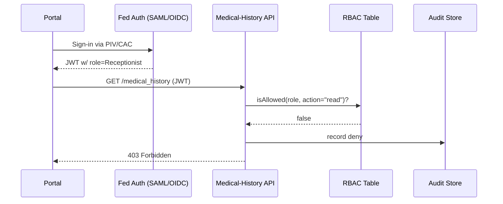

# Chapter 4: Role-Based Access Control (RBAC)  
*(File: 04_role_based_access_control__rbac__.md)*  

[← Back to Security & Compliance Framework](03_security___compliance_framework_.md)

---

## 1. Why RBAC? — A 60-Second Story

A hospital receptionist (Jane) is helping a veteran schedule a flu-shot appointment.  
On her screen is a tempting “View Full Medical History” button.

• Jane only needs the veteran’s contact info.  
• A **Claims Examiner** needs disability records.  
• An **Auditor** needs everything—*after* signing off on strict logging.

If we don’t gate the button by **role**, we either leak private data or block staff who legitimately need it.  
**Role-Based Access Control (RBAC)** solves this by mapping:

```
SCREEN or API ➜ is visible only to ➜ specific ROLE(s)
```

---

## 2. High-Level Goal for This Chapter

You will build a tiny “Medical-History” API that:  
1. Authenticates users with a federal PIV/CAC card or SAML/OIDC token.  
2. Checks the user’s role against an RBAC table.  
3. Returns data **only if** the role is allowed—while logging the decision for auditors.

By the end, Jane (receptionist) will get a polite “🚫 403 Forbidden,” whereas an Auditor will see the payload.

---

## 3. Key Concepts in Plain English

| Term | What it really means | Friendly analogy |
|------|----------------------|------------------|
| Role | A job function like `Receptionist`, `ClaimsExaminer`, `Auditor` | Color wristband at a concert |
| Permission | Allowed *action* (read, write, delete) on a *resource* | Back-stage pass lets you enter green room |
| Resource | Anything protected: screen, API, or dataset | The green room itself |
| Authentication | Proving **who** you are (PIV/CAC, SAML/OIDC) | Showing your government ID |
| Authorization | Proving **what** you can do (RBAC) | Security guard checks wristband color |
| Session | Time-boxed context where authz decisions are cached | Your venue wristband remains valid all night |

Keep two words apart:  
• **Authentication** = identity check (Chapter 3 already set up SAML/OIDC).  
• **Authorization** = role check (what we add now).

---

## 4. Quick-Start: Protect an API in 10 Lines

### 4.1 Define Roles & Permissions

```python
# file: rbac_table.py
RBAC = {
  "Receptionist":   {"medical_history": []},
  "ClaimsExaminer": {"medical_history": ["read"]},
  "Auditor":        {"medical_history": ["read","export"]}
}
```

Explanation  
• Keys are roles.  
• Each role maps to a resource (`medical_history`) and allowed actions.

### 4.2 Wrap Your Endpoint

```python
# file: api.py
from rbac_table import RBAC
from external_auth import current_user   # returns {"id":..,"role":..}

def view_med_history(vet_id):
    user = current_user()                # 1️⃣ Authentication
    if "read" in RBAC[user["role"]].get("medical_history", []):
        return _fetch_history(vet_id)    # 2️⃣ Authorization OK
    return {"error":"Forbidden"}, 403    # 3️⃣ Block & log
```

What happens?  
1. `current_user` comes from the SAML/OIDC layer set up in [Chapter 3](03_security___compliance_framework_.md).  
2. The role is looked up in `RBAC`.  
3. If permission missing, function returns HTTP 403 (and we’ll log it next).

---

## 5. Adding Compliance: Log Every Decision

```python
# file: rbac_utils.py
import json, time

def log_access(user, action, resource, allowed):
    evt = {
      "ts": time.time(),
      "user": user["id"],
      "role": user["role"],
      "action": action,
      "resource": resource,
      "allowed": allowed
    }
    open("rbac_audit.log","a").write(json.dumps(evt)+"\n")
```

Modify `view_med_history`:

```python
allowed = "read" in RBAC[user["role"]].get("medical_history",[])
log_access(user, "read", "medical_history", allowed)
return _fetch_history(vet_id) if allowed else ({"error":"Forbidden"},403)
```

Now every allow/deny event is shipped to the same evidence bucket the Security Framework already uses. 🎉

---

## 6. PIV/CAC & Zero-Trust in One Sentence Each

• **PIV/CAC**: a smart-card that plugs into the browser; the certificate inside becomes the SAML/OIDC login, giving us the **role claim** securely.  
• **Zero Trust**: never assume the network is safe—our RBAC check is executed **every request**, not just at login.

---

## 7. End-to-End Flow (Bird-Eye View)



Five participants, five easy steps—notice *deny* is logged just like *allow*.

---

## 8. Under the Hood: Tiny RBAC Engine

File: `hms_rbac/engine.py`

```python
class RBACEngine:
    def __init__(self, table):
        self.table = table

    def allowed(self, role, action, resource):
        return action in self.table.get(role, {}).get(resource, [])
```

Usage in your service:

```python
from hms_rbac.engine import RBACEngine
from rbac_table import RBAC

engine = RBACEngine(RBAC)
if engine.allowed(user["role"], "read", "medical_history"):
    ...
```

All under 10 lines—beginners can read it at a glance.

---

## 9. Frequently Asked (Beginner) Questions

| Question | Short Answer |
|----------|--------------|
| “Where does the role value come from?” | The SAML/OIDC token includes a `role` claim issued by your agency’s Identity Provider after the PIV/CAC check. |
| “Do I need RBAC if I already have policies in HMS-GOV?” | Yes—[Governance Layer](01_governance_layer__hms_gov__.md) answers **“Should this action ever be possible?”**. RBAC answers **“Is this particular user allowed right now?”** |
| “What about multi-role users?” | Store `roles: ["Auditor","Doctor"]` in the token; allow if *any* role passes. |
| “Does RBAC handle row-level filters?” | No, that’s in [Policy & Process Engine](10_policy___process_engine_.md). RBAC is coarse-grained. |

---

## 10. Try It Yourself

1. Clone the repo and copy `rbac_table.py` into `examples/`.  
2. Run `python api.py` and call `GET /medical_history` with a token that has role `Receptionist`; expect **403**.  
3. Change the token to role `Auditor`; expect JSON medical history.  
4. Open `rbac_audit.log` to see both events.

---

## 11. What You Learned

✓ The problem RBAC solves (right people, right screens).  
✓ How roles, resources, and permissions link together.  
✓ How authentication (PIV/CAC, SAML/OIDC) feeds into authorization.  
✓ A 10-line RBAC engine you can extend later.  
✓ How audit logging keeps us compliant with NIST 800-63 and Zero Trust mandates.

Next, we’ll see how roles shape what the user actually *sees* on the screen in the **Interface Layer**.

[Continue to Interface Layer (HMS-MFE / Portals)](05_interface_layer__hms_mfe___portals__.md)

---

Generated by [AI Codebase Knowledge Builder](https://github.com/The-Pocket/Tutorial-Codebase-Knowledge)