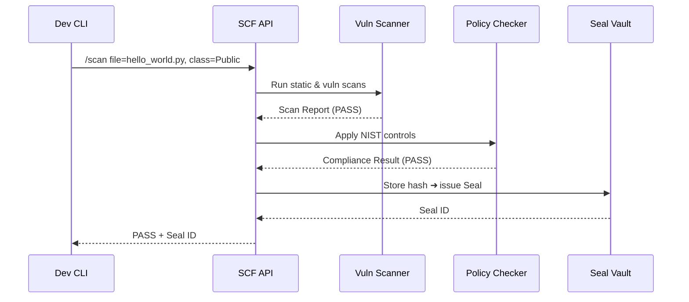

# Chapter 4: Security & Compliance Framework  
*[Link back to Chapter 3: Versioning & Rollback Mechanism](03_versioning___rollback_mechanism_.md)*  

---

## 1. Why Another Layer? (The 60-Second Pitch)  

Central use-case  
• A psychologist at the **National Institutes of Health (NIH)** uploads a new ML model that predicts PTSD risk.  
• The code touches highly sensitive mental-health records.  
• If that code contains a hidden “phone-home” function, citizen data could leak in seconds and NIH would violate **NIST 800-53** controls, failing its **FedRAMP** Moderate authorization.

The **Security & Compliance Framework (SCF)** is the platform’s *TSA checkpoint*:  
1. Confirms **who** is acting (identity).  
2. **Scans** every artifact for “contraband” (malware, PII leaks, policy violations).  
3. **Locks down** sensitive data with FedRAMP-approved encryption and audit trails.

No artifact—code, container, or dataset—reaches production ETL pipelines without passing through SCF.

---

## 2. Key Concepts (Plain-English Cheat-Sheet)

| Term | Airport Analogy | Why It Matters |
|------|-----------------|----------------|
| Control Baseline | TSA rulebook | Maps to NIST 800-53 families (AC, AU, etc.) |
| Security Scan | Baggage X-ray | Finds secrets, malware, license issues |
| Data Classification | “Carry-on” vs “Checked” | E.g., Public, Internal, PII, PHI |
| Seal | Tamper-evident sticker | Cryptographic hash proving artifact unchanged |
| Exception Waiver | TSA Pre✓ | Time-boxed, logged bypass for emergencies |

---

## 3. 5-Minute Walk-Through  

### Scenario: Publishing the PTSD Model  

1. **Developer** pushes `ptsd_model.py` to Git.  
2. CI pipeline calls **SCF**:  
   `hms_sec.scan --file ptsd_model.py --classification PHI`  
3. SCF runs static & vuln scans, plus NIST control checks.  
4. On **PASS**, SCF returns a **Seal ID** (think “cleared stamp”).  
5. The Seal ID is embedded in the artifact’s metadata and stored alongside the version tag from [Chapter 3](03_versioning___rollback_mechanism_.md).  
6. Downstream ETL jobs will refuse to run the model unless the Seal is present and valid.

Outcome: NIH deploys safely, audit teams sleep well.

---

## 4. Hands-On: Your First Security Scan (≤ 15 lines)

```bash
# 1. Install CLI once
pip install hms-sec-cli

# 2. Scan a tiny script
hms_sec scan --file demo/hello_world.py --classification Public
```

Expected output (truncated):

```
✔ Loaded baseline: NIST 800-53 (Low)
✔ Static analysis...                   PASS
✔ Dependency licenses...               PASS
✔ Sensitive keywords (ssn, dob)...     PASS
Seal ID: SEAL-9f2c5b
```

Explanation  
• SCF auto-selects the correct control set based on data classification.  
• A unique **Seal ID** (`SEAL-9f2c5b`) is your proof the file is unchanged since the scan.

---

## 5. What Happens Under the Hood?



Only five moving parts—fast enough for every commit.

---

## 6. Peek at the Source (All ≤ 20 lines)

### 6.1 API Entry Point — `scf/api.py`

```python
from fastapi import FastAPI, File, UploadFile
from scf.core import scan_file

app = FastAPI()

@app.post("/scan")
async def scan(file: UploadFile = File(...), classification: str = "Public"):
    report = scan_file(await file.read(), classification)
    return report   # {'status': 'PASS', 'seal': 'SEAL-xx'}
```

Tiny wrapper that forwards the bytes to the core scanner.

### 6.2 Core Scan Logic — `scf/core.py` (simplified)

```python
import hashlib, time
from scf.checks import run_checks

def scan_file(raw: bytes, classification: str):
    checks = run_checks(raw, classification)
    if checks["status"] != "PASS":
        return checks
    seal = f"SEAL-{hashlib.sha1(raw).hexdigest()[:6]}"
    # pretend to store seal + timestamp somewhere durable
    return {"status": "PASS", "seal": seal, "ts": time.time()}
```

Explanation  
1. `run_checks` bundles static, license, and compliance tests.  
2. A short SHA-1 hash serves as the **Seal ID**.  
3. Result is immediately JSON-serializable for pipelines.

---

## 7. How SCF Hooks Into Other Layers

• **Upstream**:  
  – Governance tickets (see [Governance Layer](01_governance_layer__hms_gov__.md)) require a Seal ID before approval.  

• **Side-by-Side**:  
  – [Policy & Process Engine](02_policy___process_engine_.md) embeds SCF rules so that “scan on commit” is always enforced.  

• **Downstream**:  
  – ETL jobs in [HMS-ETL](09_etl___data_pipeline__hms_etl__.md) call `hms_sec.verify(seal_id)` before loading sensitive datasets.  
  – Future Identity checks live in [Access & Identity Management](05_access___identity_management_.md).  

---

## 8. Common Pitfalls & Quick Fixes

| Oops! | Root Cause | Quick Fix |
|-------|-----------|-----------|
| “Scan passes locally but fails in CI” | Different baseline selected | Pin `--baseline FedRAMP-Moderate` in CLI. |
| “Seal ID missing in prod” | Artifact rebuilt after scan | Treat build + scan as one immutable step; block re-builds. |
| “Too many false positives” | Over-aggressive secret scanner | Add safe patterns to `allowlist.yaml`, checked into repo. |

---

## 9. Mini-Lab: Catch a Secret Before It Ships  

1. Create `oops.py` containing `AWS_SECRET="ABCD1234"`.  
2. Run `hms_sec scan --file oops.py`.  
3. Observe `❌ Sensitive keyword found: AWS_SECRET`.  
4. Remove the secret, scan again → PASS.  
5. Commit only after you get a Seal ID.

Congratulations—you prevented a breach in under 2 minutes!

---

## 10. What You Learned

✓ Why NIST 800-53 and FedRAMP matter for any federal data platform.  
✓ Core ideas: baselines, scans, seals, and waivers.  
✓ How to run a security scan from the CLI and understand its output.  
✓ Internals: the five-hop flow that issues a Seal.  
✓ How SCF collaborates with Governance, Process Engine, and ETL.

Ready to dive deeper into *who* is allowed to do *what* after an artifact is sealed?  
Continue to [Chapter 5: Access & Identity Management](05_access___identity_management_.md).

---

Generated by [AI Codebase Knowledge Builder](https://github.com/The-Pocket/Tutorial-Codebase-Knowledge)