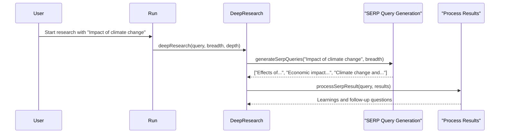

# Chapter 4: SERP Query Generation

In the previous chapter, [Iterative Deepening](03_iterative_deepening_.md), we learned how to control the "depth" of our research.  Now, let's explore how the Deep Research Agent figures out *what* to search for using *SERP Query Generation*.

Imagine you ask a librarian for help researching "the impact of climate change."  They wouldn't just type that exact phrase into the library catalog. They might ask clarifying questions, like "Are you interested in the impact on specific ecosystems?" or "Do you want to focus on the economic consequences?"  Similarly, the Deep Research Agent needs to generate intelligent search queries to explore different facets of your research topic.

## What is SERP Query Generation?

SERP (Search Engine Results Page) Query Generation is the process of transforming your initial research question into a set of targeted search queries.  It's like a librarian helping you find the right keywords for your research.  This ensures the agent explores different aspects of the topic and gathers more comprehensive information.

## Using SERP Query Generation

Let's continue with our climate change example. If your initial question is "What is the impact of climate change?", the SERP Query Generation process might produce the following queries:

- "Effects of climate change on coastal communities"
- "Economic impact of global warming"
- "Climate change and biodiversity loss"

These more specific queries allow the agent to explore different facets of climate change, leading to a more comprehensive understanding.

## Inside the Deep Research Agent with SERP Query Generation

Here's a simplified sequence diagram showing how SERP Query Generation fits into the research process:



1. You provide the initial query ("Impact of climate change").
2. The `deepResearch` function calls `generateSerpQueries`.
3. `generateSerpQueries` uses AI (specifically, the [AI Model Provider](08_ai_model_provider_.md)) to generate a set of related search queries.  The [Research Breadth](02_research_breadth_.md) parameter determines how many queries are generated.
4. These queries are then used to fetch search results and extract learnings using [Learning Extraction](05_learning_extraction_.md).

## Diving Deeper into `generateSerpQueries`

The `generateSerpQueries` function is the heart of SERP Query Generation. Here's a simplified version:

```typescript
// src/deep-research.ts
async function generateSerpQueries({ query, numQueries = 3 }) {
  // ... (Uses AI to generate numQueries unique queries related to the input query)
  const res = await generateObject({
    // ... (parameters for the AI model)
    prompt: `Given the following prompt from the user, generate a list of SERP queries...\n<prompt>${query}</prompt>`,
    // ... (schema to structure the output)
  });
  return res.object.queries;
}
```

This function takes your initial query and the desired number of SERP queries as input. It then uses the `generateObject` function from the [AI Model Provider](08_ai_model_provider_.md) to generate a list of related queries.  The prompt instructs the AI to create unique and relevant search queries based on your input.  The `generateObject` function also uses a schema to ensure the output is structured correctly.

## Conclusion

This chapter explained how SERP Query Generation helps the Deep Research Agent explore a topic from multiple angles by generating intelligent search queries. In the next chapter, [Learning Extraction](05_learning_extraction_.md), we'll learn how the agent extracts key information from the search results obtained using these generated queries.


---

Generated by [AI Codebase Knowledge Builder](https://github.com/The-Pocket/Tutorial-Codebase-Knowledge)