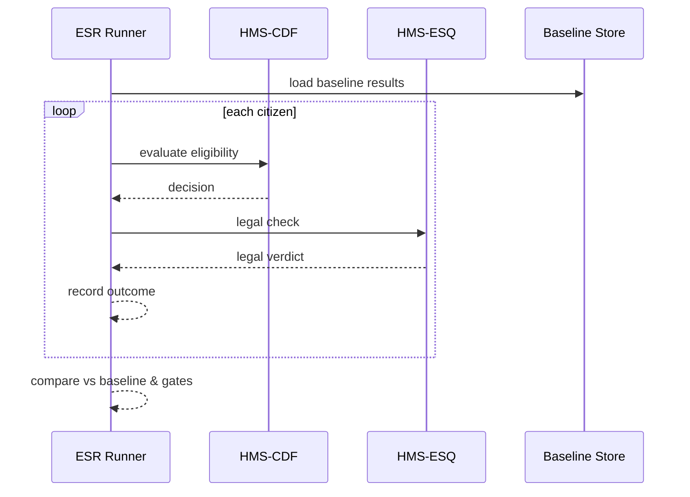

# Chapter 4: Simulation & Testing Sandbox (HMS-ESR)

*(Link back to the previous chapter: [Compliance & Legal Reasoning (HMS-ESQ)](03_compliance___legal_reasoning__hms_esq__.md))*  

---

## 1. Why Do We Need a “Policy Flight-Simulator”?

Imagine the **U.S. Fire Administration (USFA)** is about to change the *Fire-Safety Grant* rules:

* Old rule: “Household income ≤ $65 k qualifies.”
* New draft rule: “Household income ≤ $80 k qualifies.”

Great news for citizens—but are we sure this doesn’t break audits, budgets, or legal clauses reviewed in HMS-ESQ?

Instead of flipping the switch in production and hoping for the best, **HMS-ESR** lets us:

1. **Rewind** history (load past citizen applications).  
2. **Replay** them through the *new* policy snapshot.  
3. **Compare** outcomes (approvals, denials, dollar amounts).  
4. **Report** anything that drifts (budget overruns, legal conflicts, runtime errors).  

Think of it as a flight-simulator for rules: crash in the lab, not with real citizens in the cabin.

---

## 2. Key Concepts (Plain English)

| Term | Beginner-Friendly Definition |
|------|-----------------------------|
| Scenario | A “what-if” file describing the draft policy snapshot + the dataset to replay. |
| Synthetic Citizen | A fake but realistic record (name, income, household, etc.). |
| Replay Engine | Tiny service that feeds each citizen into HMS-CDF & HMS-ESQ, then records results. |
| Baseline | Results produced by the *current* production policy—used for comparison. |
| Drift Report | Side-by-side diff: *“23 % more households approved, budget +\$4.2 M.”* |
| Safety Gate | Auto-fail rule: e.g., “Budget may grow ≤ 5 % OR simulation blocks deployment.” |

---

## 3. Running Your First Simulation in 5 Minutes

### 3.1 Prepare a Draft Rule (from Chapter 2)

We assume a draft bill already lives inside HMS-CDF:

```
id: FSG-2024-B2
income_cap_usd: 80000
```

### 3.2 Create a Scenario File

```yaml
# scenarios/fsg_income_raise.yaml
id: scenario_fsg_001
policy_snapshot: FSG-2024-B2      # the draft bill
dataset: data/usfa_2023_apps.csv  # past applications
safety_gates:
  max_budget_increase_pct: 5
  max_denial_reversal_pct: 3
```

Explanation  
• One YAML = one experiment.  
• We specify **where** to find the citizens and **which** gates must hold.

### 3.3 Minimal Code to Launch the Simulator

```python
# run_sim.py  (17 lines)
import esr

report = esr.run("scenarios/fsg_income_raise.yaml")
if report["passed"]:
    print("✅ All gates green! Ready for rollout.")
else:
    print("⚠️  Simulation failed:")
    for err in report["violations"]:
        print("-", err)
```

What happens?  
1. `esr.run()` loads the scenario.  
2. Feeds each row of `usfa_2023_apps.csv` through **HMS-CDF** (policy) + **HMS-ESQ** (legal).  
3. Compares to baseline.  
4. Checks safety gates and returns a summary dict.

### 3.4 Sample Output

```text
⚠️  Simulation failed:
- Budget increase 6.4 % exceeds 5 % gate
- Denial reversals 3.2 % exceeds 3 % gate
```

Nothing was harmed—only our hypothesis. We can now tweak the bill or budget before production.

---

## 4. What Happens Inside? (Step-by-Step)



Only four moving parts—easy to reason about!

---

## 5. Under the Hood (Tiny Code Peeks)

Folder layout:

```
hms-esr/
 ├─ __init__.py
 ├─ engine.py
 ├─ gates.py
 └─ scenarios/
     └─ fsg_income_raise.yaml
```

### 5.1 The Public `run()` Function

```python
# engine.py (19 lines)
import yaml, csv, requests, gates

def run(scenario_path):
    scn = yaml.safe_load(open(scenario_path))
    base = load_baseline(scn["dataset"])
    new  = replay(scn, scn["dataset"])
    report = gates.check(base, new, scn["safety_gates"])
    return report
```

Explanation  
1. Reads the YAML.  
2. Gets **baseline** (current prod decisions).  
3. **Replays** with the draft snapshot.  
4. Runs safety gates and returns a dict.

### 5.2 Replaying One Citizen

```python
# engine.py (continued, 14 lines)
def eval_citizen(row, snapshot):
    r = requests.post(
        "http://localhost:7000/cdf/validate",
        json={"snapshot": snapshot, "action": "grant_check", "data": row}
    )
    law = requests.post(
        "http://localhost:8000/esq/validate",
        json={"action": "grant_check", "payload": row}
    )
    return {
        "policy": r.json(),
        "legal":  law.json()
    }
```

### 5.3 Safety Gates (Budget Example)

```python
# gates.py (16 lines)
def check(base, new, rules):
    delta_budget = pct(change(sum(b["award"] for b in base),
                              sum(n["award"] for n in new)))
    delta_denial = pct(change(count_denials(base), count_denials(new)))

    violations = []
    if delta_budget > rules["max_budget_increase_pct"]:
        violations.append(f"Budget increase {delta_budget}% exceeds {rules['max_budget_increase_pct']}% gate")
    if delta_denial > rules["max_denial_reversal_pct"]:
        violations.append(f"Denial reversals {delta_denial}% exceeds {rules['max_denial_reversal_pct']}% gate")

    return {"passed": not violations, "violations": violations}
```

Small, readable, and easy to extend.

---

## 6. Hands-On Exercise

1. Install dependencies:

```bash
pip install fastapi uvicorn pyyaml requests
```

2. Start **HMS-CDF** & **HMS-ESQ** in dev mode (see earlier chapters).  
3. Place a CSV in `data/usfa_2023_apps.csv` with columns: `id,income,requested_amount`.  
4. Run:

```bash
python run_sim.py
```

5. Tweak `safety_gates` in the YAML and observe different outcomes—no databases harmed!

---

## 7. Common Questions

**Q: Do I need big data frameworks?**  
No. CSV + Python loops work for thousands of rows; plug in Spark later if needed.

**Q: Can I create *synthetic* citizens instead of real data?**  
Yes—add `generate: true` in the scenario. ESR ships with a tiny faker module.

**Q: Where are reports stored?**  
In the **Secure Data Repository**—see [Secure Data Repository (HMS-DTA)](13_secure_data_repository__hms_dta__.md).

**Q: How do I block deployment if gates fail?**  
CI pipelines call `esr.run()`; a non-zero exit or `"passed": false` aborts the build.

---

## 8. Recap & What’s Next

You learned:

* HMS-ESR is a **sandbox** that replays past (or synthetic) citizen data through *draft* policies.  
* Safety gates protect budgets, legal constraints, and user experience before any real rollout.  
* Running a simulation is as simple as one YAML file and a 17-line script.

Ready to let virtual citizens chat with our system? In the next chapter we’ll meet their digital alter-ego: [AI Representative Agent (HMS-AGT / HMS-AGX)](05_ai_representative_agent__hms_agt___hms_agx__.md).

---

Generated by [AI Codebase Knowledge Builder](https://github.com/The-Pocket/Tutorial-Codebase-Knowledge)