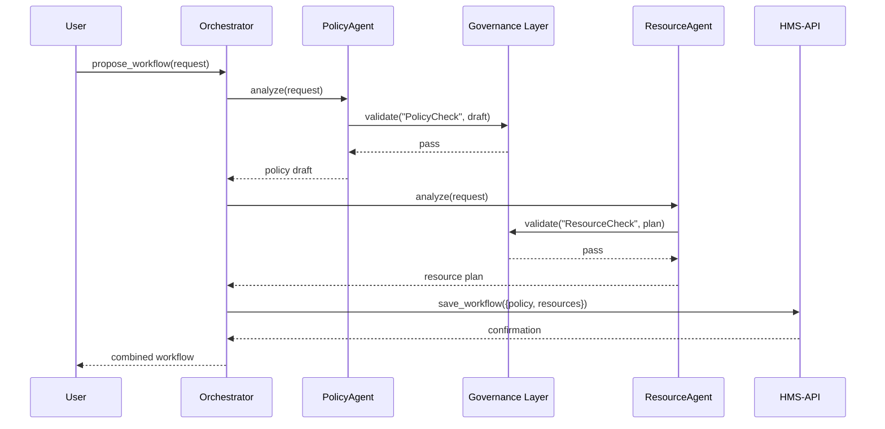

# Chapter 4: Specialized AI Agents (HMS-A2A)

Welcome back! In [Chapter 3: Backend API (HMS-API / HMS-SVC)](03_backend_api__hms_api___hms_svc__.md) we saw how clients and AI agents talk to HMS-API to create or update policies and processes. Now, let’s meet the “smart experts”—our **Specialized AI Agents**—each tuned for a domain, working together under governance to propose optimized workflows.

---

## 4.1 Why Specialized AI Agents?

Imagine the **Veterans Health Administration** wants to automate how it:

1. **Drafts new care‐policy language** (e.g., benefits updates).  
2. **Allocates clinician time** across clinics.  
3. **Schedules follow-up appointments** for veterans.

Instead of one giant AI, HMS-A2A gives you **multiple small experts**:

- **PolicyDraftAgent**: Crafts policy text.  
- **ResourceAllocAgent**: Distributes staff hours.  
- **SchedulerAgent**: Builds appointment calendars.  

They each know their specialty, then **collaborate** under the **Governance Layer** so every proposal is compliant and logged.

---

## 4.2 Key Concepts

1. Domain-Specific Agents  
   Each AI agent focuses on one task (drafting, scheduling, compliance).

2. Governance Rules  
   Before returning a proposal, an agent asks the [Governance Layer](01_governance_layer_.md) to **validate** its output.

3. Orchestration  
   An **AgentOrchestrator** calls each agent in turn, gathers their proposals, and sends a combined workflow to HMS-API.

4. Workflow Proposal  
   The final result is a JSON “workflow” combining policy drafts, resource plans, and schedules.

---

## 4.3 Using HMS-A2A: A Simple Example

Below is how a client would ask for an optimized veteran‐care workflow:

```python
# 1. Initialize agents and orchestrator
from agents.policy_draft_agent import PolicyDraftAgent
from agents.resource_alloc_agent import ResourceAllocAgent
from orchestrator import AgentOrchestrator
from hms_mcp import ApiClient

api = ApiClient(base_url="https://api.fed-agency.gov")
agents = {
    "policy": PolicyDraftAgent(),
    "resources": ResourceAllocAgent()
}
orch = AgentOrchestrator(agents=agents, api_client=api)

# 2. Input: a new benefit update request
request = {"topic": "mental_health_support", "veterans": 1200}

# 3. Get an optimized workflow
workflow = orch.propose_workflow(request)
print(workflow)
```

Explanation:  
- We wire up two agents and an orchestrator.  
- We pass in a request about “mental_health_support.”  
- `propose_workflow` returns each agent’s compliant proposal and saves it via HMS-API.

---

## 4.4 What Happens Under the Hood

Here’s a step-by-step flow when `propose_workflow` is called:



1. **Orchestrator** asks each agent to `analyze(...)`.  
2. Agents run domain logic, then call **Governance Layer** to validate.  
3. Approved proposals flow back to the orchestrator.  
4. Orchestrator calls **HMS-API** to persist the workflow.  
5. The user receives a final, compliant workflow JSON.

---

## 4.5 Inside the Code

### File: orchestrator.py

```python
# orchestrator.py
class AgentOrchestrator:
    def __init__(self, agents, api_client):
        self.agents = agents
        self.api = api_client

    def propose_workflow(self, request):
        results = {}
        for key, agent in self.agents.items():
            results[key] = agent.analyze(request)
        self.api.save_workflow(results)   # POST /workflows
        return results
```
This class loops through each agent, gathers their outputs, and saves via HMS-API.

### File: agents/policy_draft_agent.py

```python
# agents/policy_draft_agent.py
from governance_layer import GovernanceLayer

class PolicyDraftAgent:
    def __init__(self):
        self.gov = GovernanceLayer()

    def analyze(self, request):
        draft = f"Policy update on {request['topic']}"
        ok, msg = self.gov.validate("PolicyCheck", {"data": draft})
        return draft if ok else f"Error: {msg}"
```
The agent creates a short policy draft, then asks the Governance Layer to approve it.

### File: agents/resource_alloc_agent.py

```python
# agents/resource_alloc_agent.py
from governance_layer import GovernanceLayer

class ResourceAllocAgent:
    def __init__(self):
        self.gov = GovernanceLayer()

    def analyze(self, request):
        plan = {"team": "CareTeam1", "hours": 8 * request["veterans"]//100}
        ok, msg = self.gov.validate("ResourceCheck", {"data": plan})
        return plan if ok else {"error": msg}
```
This agent builds a mock resource plan, then validates it before returning.

---

## 4.6 Summary & Next Steps

In this chapter you learned how **HMS-A2A**:

- Defines **domain-specific agents** for policy drafting and resource allocation.  
- Uses the **Governance Layer** to validate each agent’s output.  
- Leverages an **AgentOrchestrator** to combine proposals and save them via [HMS-API](03_backend_api__hms_api___hms_svc__.md).

Next up: adding **Human-in-the-Loop (HITL) Oversight** so experts can review and refine AI proposals.  
[Chapter 5: Human-in-the-Loop (HITL) Oversight](05_human_in_the_loop__hitl__oversight_.md)

---

Generated by [AI Codebase Knowledge Builder](https://github.com/The-Pocket/Tutorial-Codebase-Knowledge)