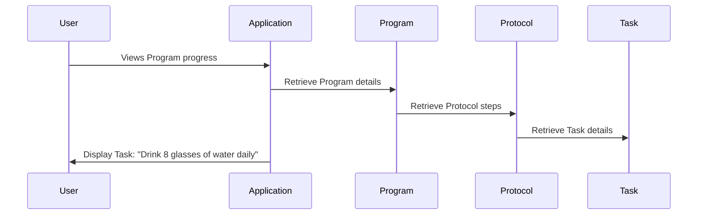

# Chapter 4: Task

In the previous chapter, [Protocol](03_protocol.md), we learned about the blueprint for a [Program](02_program.md). Now, let's dive into the individual building blocks of a protocol: Tasks.

## What is a Task?

Imagine you're following a recipe. Each instruction, like "Preheat the oven to 350°F" or "Mix flour and sugar," is a task.  A task is a single action within a [Protocol](03_protocol.md) or [Module](05_module.md). It's a specific instruction that a user needs to complete as part of a [Program](02_program.md).

## Key Concepts

* **Actionable:** A Task represents a concrete action a user should take.
* **Granular:** Tasks are the smallest units of action within a [Protocol](03_protocol.md).
* **Sequential:** Tasks are typically performed in a specific order within a [Protocol](03_protocol.md).

## Using a Task

Let's continue with our "Weight Loss Protocol" example.  One task could be "Drink 8 glasses of water daily."  Within the application, this task would be defined and associated with the protocol.

```php
// Simplified example of adding a task to a protocol
$protocol = Protocol::find(1); // Find the Weight Loss Protocol

$task = new Task();
$task->description = "Drink 8 glasses of water daily";
// ... other properties like due date, reminders, etc.

$protocol->addTask($task); // Simplified - actual implementation may vary
```

This code snippet finds the "Weight Loss Protocol" and adds a new task to it.  The `addTask` function (simplified here) would handle the database operations to link the task to the protocol.

## Under the Hood

When a user enrolls in a [Program](02_program.md) based on the "Weight Loss Protocol," the application presents them with the tasks defined in the protocol, one by one.  The user can then mark tasks as complete as they progress through the program.



### Internal Implementation

The `Protocol` model manages the tasks through the `chain` relationship, which uses the `ProtocolChain` model as an intermediary.

```php
// Inside the Protocol model (simplified)
public function chain()
{
    return $this->hasMany(ProtocolChain::class);
}
```

The `ProtocolChain` model then links to the actual tasks:

```php
// Inside the ProtocolChain model (simplified)
public function task()
{
    return $this->hasOne(Task::class); // Assuming a one-to-one relationship for simplicity
}
```

This structure allows for flexible ordering and management of tasks within a protocol.  The `PlannedTask` model, as seen in `Unit/Models/PlannedTaskTest.php`, handles the scheduling and execution of tasks.  It interacts with the queue system to trigger actions at specific times.  For example, a reminder for the "Drink water" task could be scheduled using this model.


## Conclusion

In this chapter, we explored the concept of a Task, the fundamental building block of a [Protocol](03_protocol.md). We learned how tasks represent individual actions, are organized within a protocol, and are presented to users within a [Program](02_program.md). In the next chapter, we'll learn about [Modules](05_module.md), which are pre-built groups of tasks that can be incorporated into protocols.


---

Generated by [AI Codebase Knowledge Builder](https://github.com/The-Pocket/Tutorial-Codebase-Knowledge)