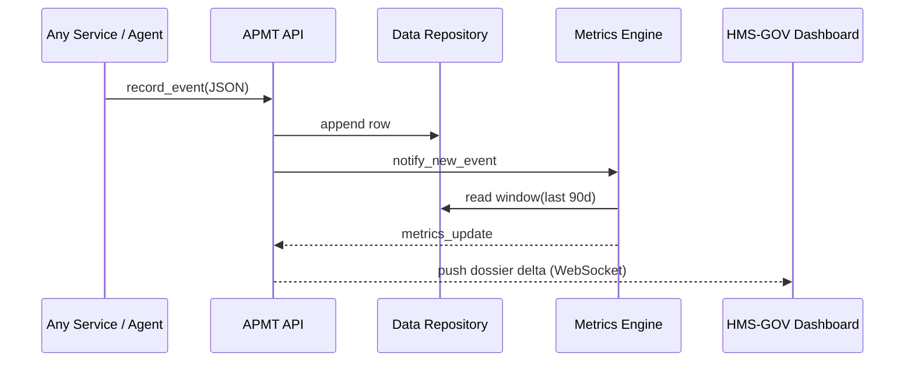

# Chapter 5: Accountability & Performance Metrics Tracker  

*(linked from [Human-in-the-Loop Oversight (HITL)](04_human_in_the_loop_oversight__hitl__.md))*  

---

## 1. Why Do We Need a “Scoreboard” for Humans *and* Machines?

Picture the **Small Business Administration (SBA)**.  
Citizens file digital loan-forgiveness requests, an AI agent recommends “Approve,” and a human loan officer can:

* Accept the suggestion.  
* Override it with “Reject.”  
* Take days to respond.

If the **same officer** keeps rejecting well-supported AI approvals—or simply sits on them—citizens wait, trust erodes, and Congress asks for explanations.

**Accountability & Performance Metrics Tracker (APMT)** is that explanation:

1. Pulls raw events from the agent layer ([HMS-ACT](10_agent_orchestration__hms_act__.md)).  
2. Stores them in the central lake ([HMS-DTA](07_central_data_repository__hms_dta__.md)).  
3. Correlates **user-satisfaction surveys**, **processing times**, and **override rates**.  
4. Raises a flag (think “federal Performance-Improvement Plan”) when a human or agent chronically under-delivers.

---

## 2. Key Concepts (Plain-English Cheat-Sheet)

| Concept | What It Really Means | Government Analogy |
|---------|---------------------|--------------------|
| Satisfaction Score | 1–5 star rating a citizen clicks after an interaction. | “How was your DMV visit?” card. |
| SLA Clock | Timer that starts when a ticket lands in a human/agent queue. | FOIA’s 20-day response clock. |
| Override Rate | % of times a human reverses an AI’s evidence-based suggestion. | Judge overturning parole board recs. |
| Performance Dossier | Live dashboard per employee/agent. | Personnel file in HR. |
| PIP Trigger | Auto-generated alert recommending training or reassignment. | Federal performance-improvement plan letter. |

---

## 3. A Three-Minute Walk-Through

### 3.1 Recording Raw Events (Agents OR UI)

```python
# file: log_events.py
from hms_apmt_client import record_event

# 1. Citizen rates the online form     (★ ★ ★ ☆ ☆ = 3)
record_event({
    "type": "SAT_SCORE",
    "value": 3,
    "case_id": "CLAIM_9001"
})

# 2. Loan officer overrides AI
record_event({
    "type": "OVERRIDE",
    "actor": "officer_anne@sba.gov",
    "case_id": "CLAIM_9001",
    "ai_recommendation": "APPROVE",
    "human_verdict": "REJECT"
})
```

Explanation (≤10 lines total!):

* `record_event` is the **only** public write API—easy to embed in forms, agents, or mobile apps.  
* Each call lands as JSON in the data lake; no extra fields required for the tutorial.

### 3.2 Fetching a Performance Snapshot

```python
# file: peek_dossier.py
from hms_apmt_client import get_dossier

dossier = get_dossier("officer_anne@sba.gov")
print(dossier["override_rate"])   # => 42 %
print(dossier["avg_processing_hours"])  # => 54.2
print(dossier["pip_recommended"])  # => True
```

Output (high level):

```
{
  "override_rate": 0.42,
  "avg_processing_hours": 54.2,
  "sat_score_mean": 2.1,
  "pip_recommended": true
}
```

If `pip_recommended` is `true`, HMS-GOV shows a red banner to the supervisor.

---

## 4. What Happens Under the Hood?

### 4.1 Bird’s-Eye Sequence



Only **five participants** keep the mental model simple.

### 4.2 Internal Flow in Words

1. **Ingest** – events enter via a tiny HTTP endpoint.  
2. **Store** – raw rows live in a “metrics” table inside HMS-DTA.  
3. **Crunch** – a stateless job recalculates rolling metrics (means, medians, percentiles).  
4. **Evaluate Rules** – simple YAML rules decide if someone/thing is “at risk.”  
5. **Notify** – HMS-GOV UI subscribes for live dossier updates; supervisors receive email if a PIP is suggested.

---

## 5. Peeking at the Code (Tiny & Friendly)

### 5.1 API Skeleton (`apmt/api.py`)

```python
from fastapi import FastAPI
from uuid import uuid4
app = FastAPI()
EVENTS = []     # temp in-memory store
DOSSIERS = {}   # actor_email -> metrics dict

@app.post("/event")
def record_event(evt: dict):
    evt["id"] = uuid4().hex
    EVENTS.append(evt)
    recalc(evt.get("actor"))
    return {"ok": True, "stored_id": evt["id"]}

@app.get("/dossier/{actor}")
def get_dossier(actor: str):
    return DOSSIERS.get(actor, default_metrics())
```

Less than 15 lines; the real math hides in `recalc`.

### 5.2 Metric Logic (`apmt/metrics.py`)

```python
def recalc(actor):
    rows = [e for e in EVENTS if e.get("actor") == actor]
    overrides = [1 for r in rows if r["type"] == "OVERRIDE"]
    total_decisions = [1 for r in rows if r["type"] == "OVERRIDE" or r["type"] == "DECISION"]
    rate = len(overrides) / max(1, len(total_decisions))

    sat = [r["value"] for r in rows if r["type"] == "SAT_SCORE"]
    mean_sat = sum(sat) / len(sat) if sat else None

    DOSSIERS[actor] = {
        "override_rate": round(rate, 2),
        "sat_score_mean": mean_sat,
        "pip_recommended": rate > 0.3 and (mean_sat or 5) < 3
    }
```

Highlights:

* **Override Rule** is just `> 30 %` *and* low satisfaction → flag.  
* Replace with formal policy later; demo logic fits on a napkin.

---

## 6. Dashboards & Alerts (Zero Coding!)

Managers open **HMS-GOV → “Performance” tab** and see:

| Actor | Avg Hours | Override % | SAT ★ | Status |
|-------|-----------|------------|-------|--------|
| officer_anne@sba | 54.2 | **42 %** | 2.1 | 🚨 PIP |
| officer_bob@sba  | 12.3 |  8 % | 4.4 | ✅ Good |

Clicking a row reveals the full dossier plus a “Start Improvement Plan” button that pre-fills HR forms.

---

## 7. Hands-On Exercise (5 Minutes)

1. `git clone https://github.com/example/hms-nfo.git`  
2. `python -m apmt.mock_server`  
3. `curl -X POST localhost:9300/event -d '{"type":"OVERRIDE","actor":"test@agency.gov"}'`  
4. `curl localhost:9300/dossier/test@agency.gov` – watch metrics update in real time.  

Try posting 10 overrides vs. 10 approvals and see when `pip_recommended` flips!

---

## 8. Recap

* **APMT** turns raw interaction events into actionable performance dashboards.  
* Correlates satisfaction, speed, and override behaviour—no more cherry-picked stats.  
* Auto-flags chronic issues, mirroring federal **Performance-Improvement Plan** workflows.  
* Plugs directly into [HMS-DTA](07_central_data_repository__hms_dta__.md) for storage and surfaces results inside [HMS-GOV](01_governance_layer__hms_gov__.md).

Ready to see the plumbing that lets *all* these services talk lightning-fast?  
Jump ahead to [Core Backend Services (HMS-SVC)](06_core_backend_services__hms_svc__.md) – the next chapter!

---

Generated by [AI Codebase Knowledge Builder](https://github.com/The-Pocket/Tutorial-Codebase-Knowledge)