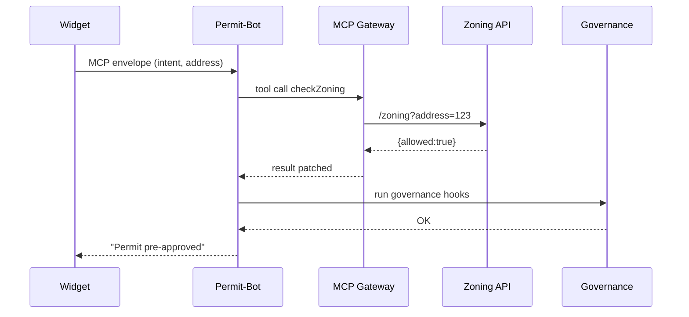

# Chapter 5: Agent Framework (HMS-AGT)
*A uniform, badge, and training academy for your digital civil servants*

[← Back to Chapter&nbsp;4: Model Context Protocol (HMS-MCP)](04_model_context_protocol__hms_mcp__.md)

---

## 1 — Why do we need an Agent Framework?

Imagine the City of Springfield wants an online **Community-Garden Permit** flow.  
They hire two beginner developers who quickly wire together:

* a GPT-4 prompt,  
* a couple REST calls to the zoning API,  
* some ad-hoc logs.

Three months later…

* A new law demands stricter privacy logs.  
* The team that wrote the code left.  
* A second bot (“Audit-Bot” for federal **NSF** grants) is requested.

Result: copy-paste chaos.

**HMS-AGT** ends the chaos by giving every bot the **same starter kit**:

```
┌───────────────────────────┐
│  Security badge           │  (OAuth, rate-limits)
│  Conversation skills       │  (handles follow-ups)
│  Governance hooks          │  (Chapter 1 checks)
│  Logging & metrics         │  (Chapter 13 feeds)
└───────────────────────────┘
```

Teams focus on *mission logic* (“evaluate permit”, “audit grant”)—not plumbing.

---

## 2 — High-Level Use Case

We will build a **Permit-Bot** that:

1. Receives a citizen’s intent `apply_permit` (handed over via [HMS-MCP](04_model_context_protocol__hms_mcp__.md)).  
2. Checks zoning rules.  
3. Returns an approval or “needs review” decision.  
4. Logs every step in a standard format.

Goal: under 40 lines of real code.

---

## 3 — Core Concepts (Plain-English Cheatsheet)

| Term | What it really means | Quick Analogy |
|------|---------------------|---------------|
| Agent Blueprint | JSON/YAML file that registers a bot. | HR record for a new hire. |
| Capability Mix-in | Reusable module you attach (logging, security). | Extra training courses. |
| Lifecycle Hooks | `on_start`, `on_message`, `on_retire`. | First day, daily work, retirement party. |
| Badge Token | OAuth + governance fingerprint issued at birth. | Staff ID card. |
| Retirement Registry | Table of inactive agents. | HR archive of ex-employees. |

Remember these five items; the rest is sugar.

---

## 4 — Hands-On: Create Your First Agent

### 4.1 Scaffold (1 command)

```bash
$ hms-agt init permit-bot
```

Generated files:

```
permit-bot/
 ├─ blueprint.yml        # HR record
 └─ handler.py           # mission logic
```

### 4.2 The Blueprint (≤15 lines)

```yaml
# permit-bot/blueprint.yml
name: permit-bot
description: "Evaluates community-garden permit requests"
version: 0.1.0
mixins:
  - LogMixin
  - SecureMixin
  - GovCheckMixin
entrypoint: handler.handle
```

Explanation:  
Just five keys. `mixins` auto-add logging, OAuth, and Chapter 1 governance vetting.

### 4.3 Mission Logic (`handler.py`, 18 lines)

```python
from hms_agt import AgentEnv, tool

# Toy zoning API.
def zoning_check(address: str) -> bool:
    return "residential" in address.lower()

@tool(name="checkZoning")          # <— auto-exposed to LLM
def check_zoning(env: AgentEnv, address: str):
    ok = zoning_check(address)
    env.log("Zoning OK" if ok else "Zoning FAIL")
    return {"allowed": ok}

def handle(env: AgentEnv):
    addr = env.prompt["address"]
    ok   = check_zoning(env, addr)["allowed"]
    if ok:
        return "✅ Permit pre-approved. Submit fee to finalize."
    else:
        env.flag_for_review("Zoning conflict")   # HITL next chapter
        return "🚫 Zoning conflict—sent to human reviewer."
```

What you wrote:

1. Declared **one** tool (`checkZoning`).  
2. Logged a line.  
3. Flagged HITL if needed.  
Everything else (auth, governance, metrics) is inherited.

### 4.4 Run a Test (CLI, 2 lines)

```bash
$ hms-agt run permit-bot '{"address":"123 Residential Ave"}'
✅  Permit pre-approved. Submit fee to finalize.
```

Congrats—an HMS-certified agent in under a minute!

---

## 5 — Under the Hood (No-Fear Walkthrough)



Only **five actors**; AGT hides the glue code.

---

## 6 — Inside HMS-AGT: Tiny Code Peeks

### 6.1 Agent Loader (12 lines)

```python
# hms_agt/loader.py
import yaml, importlib

def load(path):
    bp = yaml.safe_load(open(f"{path}/blueprint.yml"))
    mod = importlib.import_module(bp["entrypoint"].rsplit(".",1)[0])
    fn  = getattr(mod, bp["entrypoint"].split(".")[-1])
    return Agent(fn, bp)
```

Loads the YAML, then imports your `handle` function—nothing scary.

### 6.2 Mix-in Merger (15 lines)

```python
# hms_agt/mixins.py
BASE = {"log": lambda *a,**k: None,
        "auth": lambda: "anon"}

def apply_mixins(agent, mixin_names):
    for name in mixin_names:
        mixin = __import__(f"hms_agt.mixins.{name}", fromlist=[""])
        for k,v in mixin.__dict__.items():
            if not k.startswith("_"):
                setattr(agent, k, v.__get__(agent))
    for k,v in BASE.items():               # defaults
        setattr(agent, k, getattr(agent,k,v))
```

Takeaway: Mix-ins simply monkey-patch helper methods onto your agent.

### 6.3 Lifecycle Runner (≤20 lines)

```python
# hms_agt/runtime.py
def run(agent, env_dict):
    env = AgentEnv(env_dict)          # wraps MCP envelope
    agent.log("start")
    try:
        reply = agent.handle(env)
        agent.log("done")
        return reply
    finally:
        if env.retired:               # e.g., version end-of-life
            archive(agent)
```

Brainless: call `handle`, ensure logs, archive on retirement.

---

## 7 — How HMS-AGT Ties Into Other Layers

* Receives/returns **MCP envelopes** from [Chapter 4](04_model_context_protocol__hms_mcp__.md).  
* Governance hooks reuse the **5 core values** from [Chapter 1](01_governance_layer__ai_governance_values__.md).  
* UI widgets spawn agents through **micro-frontends** (Chapter 3).  
* Complex multi-step missions are scheduled by [Agent Orchestration & Workflow Engine](06_agent_orchestration___workflow_engine__hms_act__.md) — next chapter.  
* Human reviewers step in via [HITL](07_human_in_the_loop_oversight__hitl__.md) when `env.flag_for_review()` is called.  
* Logs stream to [Operations Suite](13_operations___monitoring_suite__hms_ops__.md).

---

## 8 — Frequently Asked Questions

**Q1. Can I use a different LLM?**  
Yes. HMS-AGT is model-agnostic because it only cares about MCP envelopes.

**Q2. How do I retire an agent?**  
Run `hms-agt retire permit-bot --reason "Superseded v0.2"`—it moves to the retirement registry; requests now 404.

**Q3. Can two agents share code?**  
Absolutely. Put shared logic in a mix-in or common Python module; reference it from both blueprints.

---

## 9 — Try It Yourself (2-Step Exercise)

1. `hms-agt init audit-bot` and change the description to “Audits NSF grant spending”.  
2. In `handler.py`, call the (mock) `nsf.getTransactions(grantId)` tool and flag any item > $10 000 without receipt.

Run:

```bash
$ hms-agt run audit-bot '{"grantId":"NSF-42"}'
```

You’ve just spun up a *second* compliant digital civil servant in minutes.

---

## 10 — What You Learned

* HMS-AGT gives every bot a standard **blueprint**, **mix-ins**, and **lifecycle**.  
* You wrote <20 lines of mission logic; HMS-AGT handled the rest.  
* Agents automatically align with governance, logging, HITL, and orchestration layers.

Ready to chain multiple agents into full workflows (e.g., permit → payment → notification)?  
Continue to [Chapter&nbsp;6: Agent Orchestration & Workflow Engine (HMS-ACT)](06_agent_orchestration___workflow_engine__hms_act__.md)

---

Generated by [AI Codebase Knowledge Builder](https://github.com/The-Pocket/Tutorial-Codebase-Knowledge)