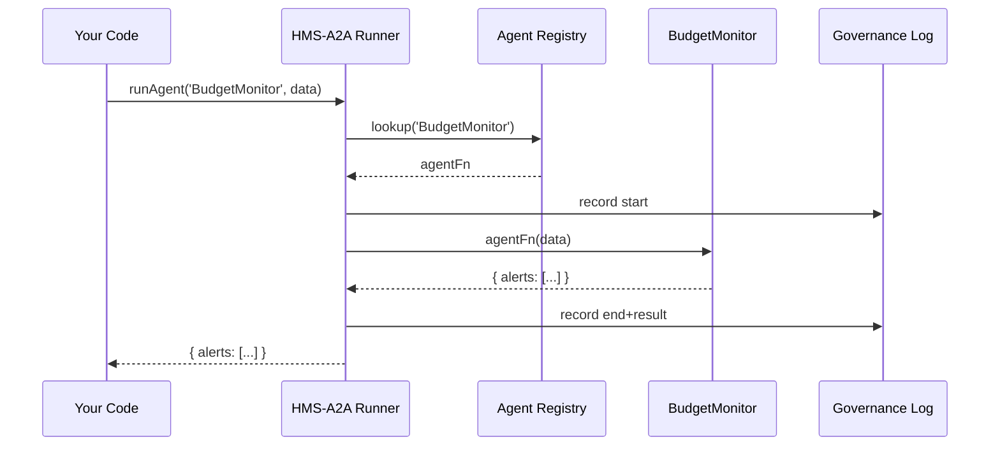

# Chapter 5: AI Agent Framework (HMS-A2A)

Building on our optimizations in [Chapter 4: Process Optimization Module (HMS-MCP)](04_process_optimization_module__hms_mcp__.md), we now introduce the **AI Agent Framework**—a set of smart “digital assistants” that tackle tasks like policy drafting, anomaly detection, and user support, all under a transparent governance umbrella.

---

## 1. Motivation & Central Use Case

Think of HMS-A2A as a team of specialized helpers:

- An **OMB Budget Monitor Agent** that watches spending logs and flags overruns.
- A **Policy Drafting Agent** that generates a first-pass permit policy.
- A **User Support Agent** that answers common citizen questions.

**Central Use Case:** The Office of Management and Budget wants to detect real-time budget overspends across agencies. Instead of a human scanning spreadsheets, our **Budget Monitor Agent**:

1. Loads recent expense data.
2. Analyzes for any line items exceeding thresholds.
3. Reports alerts or pushes recommendations back to the governance portal.

This turns manual review into fully automated, reversible suggestions—always with an audit trail.

---

## 2. Key Concepts

1. **Agent**  
   A small program (module) trained or coded for one task (e.g., anomaly detection).

2. **Registry**  
   A central list where agents register themselves under a unique name.

3. **Runner**  
   The core engine that loads, executes, and coordinates agents.

4. **Governance Wrapper**  
   A safety layer ensuring each agent’s actions are logged, ethical, and reversible.

5. **Payload**  
   The data or context passed into an agent (e.g., JSON expense logs).

---

## 3. Hands-On: Creating & Running a Budget Monitor Agent

### 3.1 Define the Agent Module

File: `budget-monitor-agent.js`
```js
// 1) Declare metadata
export const name = 'BudgetMonitor';

// 2) Agent entry point
export async function run(payload) {
  const alerts = payload.items.filter(i => i.amount > payload.threshold);
  return { alerts };
}
```
> Here, `run()` receives `{ items: [...], threshold: 10000 }` and returns any overspend alerts.

### 3.2 Register the Agent

File: `agents.js`
```js
import * as Budget from './budget-monitor-agent.js';
const registry = {};
export function registerAgent(agent) {
  registry[agent.name] = agent.run;
}
// Register at startup
registerAgent(Budget);
export function getAgent(name) {
  return registry[name];
}
```
> We store `BudgetMonitor` in `registry` for later lookup by name.

### 3.3 Build the Runner

File: `hms-a2a.js`
```js
import { getAgent } from './agents.js';
export async function runAgent(name, payload) {
  // 1) Fetch the agent function
  const agentFn = getAgent(name);
  // 2) Wrap with governance checks (omitted here)
  return agentFn(payload);
}
```
> `runAgent()` loads our agent by name and calls its `run()` with data.

### 3.4 Trigger the Agent

```js
import { runAgent } from './hms-a2a.js';

const sampleData = {
  items: [
    { dept: 'Health', amount: 12000 },
    { dept: 'Edu',   amount: 8000 }
  ],
  threshold: 10000
};

runAgent('BudgetMonitor', sampleData)
  .then(result => console.log('Result:', result));
```
> Output will be:
> `{ alerts: [ { dept: 'Health', amount: 12000 } ] }`

---

## 4. What Happens Under the Hood?



---

## 5. Internal Implementation Walkthrough

### 5.1 Non-Code Steps

1. **Registration:** Each agent module calls `registerAgent()` on load.  
2. **Invocation:** Client calls `runAgent(name, payload)`.  
3. **Lookup:** Runner finds the agent in the registry.  
4. **Governance:** Actions are logged for transparency and audit.  
5. **Execution:** Runner invokes `agent.run(payload)` and returns results.

### 5.2 Core Files

#### agents.js (Registry)
```js
const registry = {};
export function registerAgent({ name, run }) {
  registry[name] = run;
}
export function getAgent(name) {
  return registry[name];
}
```

#### hms-a2a.js (Runner with Governance Stub)
```js
import { getAgent } from './agents.js';

export async function runAgent(name, payload) {
  console.log(`[Governance] Starting ${name}`);
  const result = await getAgent(name)(payload);
  console.log(`[Governance] Completed ${name}`, result);
  return result;
}
```

> In a full system, `console.log` would call an audit service and enforce ethical guardrails.

---

## 6. Summary & Next Steps

In this chapter, you learned how HMS-A2A:

- Defines **agents** as lightweight modules  
- Uses a **registry** to keep track of available agents  
- Runs agents under a **governance wrapper** for transparency  
- Passes **payloads** in and returns structured results  

Next up, we’ll connect these agents to real data and services in the [Backend API Layer (HMS-API/HMS-MKT)](06_backend_api_layer__hms_api_hms_mkt__.md).

---

Generated by [AI Codebase Knowledge Builder](https://github.com/The-Pocket/Tutorial-Codebase-Knowledge)