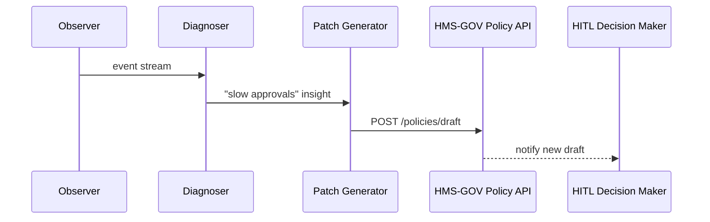
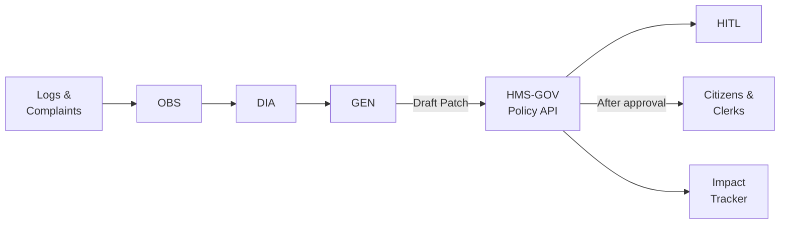

# Chapter 5: AI Representative Agent  
*(part of the HMS-CUR tutorial series)*  

[⬅ Back to Chapter&nbsp;4: Intent-Driven Navigation Framework](04_intent_driven_navigation_framework_.md)

---

## 0. Why Do We Need a “Robot Civil-Servant”?

Imagine Alex has finally submitted his **community-garden permit**.  
Two weeks pass—nothing happens. Frustrated, he files a complaint:

> “Status still says *Pending Residency Check*!”

By breakfast the next morning an invisible assistant has:  

1. Read Alex’s complaint **and** 4,000 similar log lines.  
2. Discovered the residency-check microservice times out for ZIP codes starting with “97”.  
3. Drafted a one-line policy patch: “Skip remote ZIP validation when *proof-of-residence.pdf* is already approved.”  
4. Sent the patch to a clerk for one-click approval.

That tireless helper is the **AI Representative Agent** (AIRA).

---

## 1. What Exactly *Is* AIRA?

Think of AIRA as a 24/7 **policy analyst bot** sitting between:

* Citizens & Clerks (front-door feedback)  
* System Logs & Telemetry (back-door signals)  
* APIs (where changes actually get deployed)

Its job:  
turn raw events → insight → self-deploying policy updates.

### 1.1 Key Concepts (City-Hall Analogies)

| City-Hall Analogy            | AIRA Component            | 1-Line Description                           |
|------------------------------|---------------------------|----------------------------------------------|
| Suggestion Box               | Observer                  | Reads forms, logs, complaints in real time. |
| Senior Analyst               | Diagnoser                 | Spots patterns (“ZIP 97… always fails”).    |
| Policy Drafting Desk         | Patch Generator           | Creates YAML/JSON rule changes.             |
| Scoreboard on the Wall       | Impact Tracker            | Measures if the patch actually helped.      |

Keep these four boxes in mind; everything else is plumbing.

---

## 2. A Five-Minute “Hello, AIRA” Walk-Through

We will let AIRA:

1. Detect slow approvals (>3 days).  
2. Propose a 24-hour deadline rule.  
3. Hand the draft to the **Human-in-the-Loop Decision Maker** (next chapter).

### 2.1 Feed AIRA Some Events

```python
# scripts/send_events.py
import requests, json, random, time
EVENTS = [
  {"type": "permit_submitted", "permitId": 1, "ts": 0},
  {"type": "status_update", "permitId": 1, "status": "pending", "ts": 3*24*3600},
]
for e in EVENTS:
    requests.post("http://localhost:4100/aira/events", json=e)
```

Explanation  
1. We send two toy events: submission and a “still pending” status after 3 days.  
2. Endpoint `/aira/events` is AIRA’s **Observer** intake.

### 2.2 Watch AIRA Propose a Patch

```bash
$ curl http://localhost:4100/aira/proposals/latest
```

Output

```json
{
  "proposalId": "P-23",
  "summary": "Permits pending >24h violate SLA",
  "patch": {
    "target": "garden-permit.v1",
    "add_rule": "auto-escalate-after: 24h"
  },
  "confidence": 0.82
}
```

AIRA says: “Add rule: auto-escalate after 24 h.”

### 2.3 Push Patch Into Staging

```python
# scripts/apply_patch.py
resp = requests.post(
  "http://localhost:4000/policies/draft",
  json=proposal["patch"],
  headers={"Authorization": "Bearer <clerk_jwt>"}
)
print(resp.json())
```

The draft now awaits human review (handled in [Human-in-the-Loop (HITL) Decision Maker](06_human_in_the_loop__hitl__decision_maker_.md)).

---

## 3. How Does AIRA Work Behind the Curtain?

### 3.1 Bird’s-Eye Sequence



Five arrows, that’s it!

### 3.2 Internal Folder Map

```
aira/
 ├─ observer.py
 ├─ diagnoser.py
 ├─ generator.py
 ├─ tracker.py
 └─ models/
     └─ sla_detector.pkl
```

### 3.3 Tiny Code Peeks

#### a) Observer (reads any JSON event)

```python
# observer.py (≤20 lines)
from flask import Flask, request
import queue, threading
bus = queue.Queue()
app = Flask(__name__)

@app.post("/events")
def ingest():
    bus.put(request.json)       # push into in-memory queue
    return "", 204

def start():
    app.run(port=4100)
```

Beginners’ note: we drop each event into `bus`; the Diagnoser will read from it.

#### b) Diagnoser (simple rule, no ML yet)

```python
# diagnoser.py (≤20 lines)
import time, queue, collections, generator
SLOW = 24*3600  # 24 h
pending = collections.defaultdict(float)

def run(bus: queue.Queue):
    while True:
        e = bus.get()
        if e["type"] == "permit_submitted":
            pending[e["permitId"]] = e["ts"]
        if e["type"] == "status_update" and e["status"] == "pending":
            age = e["ts"] - pending[e["permitId"]]
            if age > SLOW:
                generator.propose(e["permitId"], age)
```

Explanation  
• Tracks submit time vs. latest status; if age >24 h, trigger Generator.

#### c) Generator (drafts YAML patch)

```python
# generator.py (≤15 lines)
import requests, uuid, json, time
def propose(permit_id, age):
    patch = {
        "target": "garden-permit.v1",
        "add_rule": "auto-escalate-after: 24h"
    }
    body = {
        "proposalId": str(uuid.uuid4()),
        "summary": f"Permits pending >24h (ex: {permit_id})",
        "patch": patch,
        "confidence": round(1 - 0.5*age/86400, 2)
    }
    requests.post("http://localhost:4100/aira/proposals", json=body)
```

Under 20 lines—yay!

---

## 4. Gluing AIRA to the Rest of HMS



1. **Observer** is a tiny Web API; feed it anything—logs, emails, SSE.  
2. **Diagnoser** can be a rule engine or ML model.  
3. **Patch Generator** writes to HMS-GOV’s `/policies/draft`.  
4. **HITL** (next chapter) gives the final green-light.  
5. **Impact Tracker** later checks if wait times drop.

---

## 5. Frequently Asked Questions

**Q: Is this safe? What if the AI goes rogue?**  
A: AIRA only writes **draft** patches. Nothing ships to production until a human in [Human-in-the-Loop (HITL) Decision Maker](06_human_in_the_loop__hitl__decision_maker_.md) signs off.

**Q: Do I need fancy ML?**  
A: No. Start with simple thresholds (as we did). Swap in a model later; interfaces stay the same.

**Q: Where are patches stored?**  
A: In the same Policy Registry used in [Core System Platform (HMS-GOV)](01_core_system_platform__hms_gov__.md) under a `drafts/` namespace.

**Q: How does AIRA know a patch helped?**  
A: The Impact Tracker listens for KPI events (e.g., average approval time). If metrics improve, the patch gains “proven” status; otherwise it’s rolled back.

---

## 6. Recap

You now know:

✓ AIRA listens to every nook and cranny of HMS, finds pain points, and drafts fixes.  
✓ It is composed of four little boxes—Observer, Diagnoser, Patch Generator, Impact Tracker.  
✓ All patches are **draft-only** until a human approves.  
✓ The whole thing can be prototyped with <60 lines of Python.

Next we’ll give the human reviewer their starring role. Grab a coffee and continue to [Human-in-the-Loop (HITL) Decision Maker](06_human_in_the_loop__hitl__decision_maker_.md).

---

Generated by [AI Codebase Knowledge Builder](https://github.com/The-Pocket/Tutorial-Codebase-Knowledge)