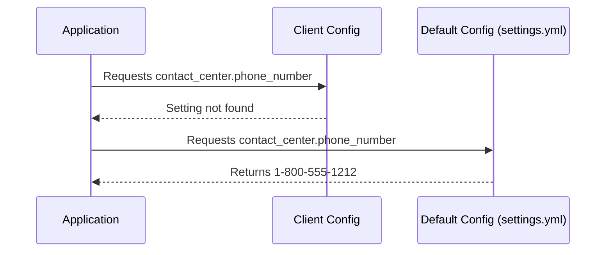

# Chapter 5: Application Configuration (`settings.yml`)

In the previous chapter, [Feature Toggles (EnrollRegistry)](04_feature_toggles__enrollregistry_.md), we learned how to selectively enable or disable features. Now, let's consider how we manage the overall settings for our application, such as contact information, ACA settings, and notice configurations.  Our central use case is displaying the correct contact information for our application, regardless of the client. This is where the `settings.yml` file comes in.  It acts as the default control panel for the entire system.

## `settings.yml`: Your Application's Default Control Panel

The `settings.yml` file, located in the `config` directory, stores global settings for your application.  It's like the basic settings on your phone that apply to all profiles.  These settings are used when a client-specific setting isn't found in the [Client Configuration (`client_config`)](03_client_configuration__client_config_.md).

## Example: Default Contact Information

Let's say we want to set a default phone number for our application:

```yaml
# config/settings.yml
contact_center:
  phone_number: '1-800-555-1212'
  # ... other settings
```

This sets the default `contact_center.phone_number` to `1-800-555-1212`.

## How `settings.yml` Works with Client Configuration

When the application needs a setting, it first checks the client-specific `settings.yml` file (if one exists). If the setting is found there, it uses that value. Otherwise, it falls back to the default `settings.yml` file in the `config` directory.



In this example, the application requests the `contact_center.phone_number`. The Client Config doesn't have this setting, so the application checks the `settings.yml` file and retrieves the default value.

## Accessing Settings in Your Application

You can access settings defined in `settings.yml` using the `Settings` constant:

```ruby
# app/controllers/application_controller.rb
def contact_info
  phone_number = Settings.contact_center.phone_number
  # ... use the phone number ...
end
```

This code retrieves the `phone_number` from the `contact_center` section of the settings.

## Internal Implementation

The `config/initializers/config.rb` file initializes the `Settings` constant using the `config` gem. This gem loads the `settings.yml` file and makes its contents accessible through the `Settings` constant.

```ruby
# config/initializers/config.rb
Config.setup do |config|
  config.const_name = "Settings"
end
```

The `config` gem then parses the YAML file and creates a nested object structure that mirrors the structure of the YAML file.

## Conclusion

In this chapter, we learned how the `settings.yml` file acts as the default control panel for our application, storing global settings that are used when client-specific settings aren't available. We saw how to define settings in the `settings.yml` file and how to access them in our application code.  This provides a centralized location for managing application-wide configurations.

Next, we'll explore how to define the structure of our data using [Models (Mongoid)](06_models__mongoid_.md).


---

Generated by [AI Codebase Knowledge Builder](https://github.com/The-Pocket/Tutorial-Codebase-Knowledge)