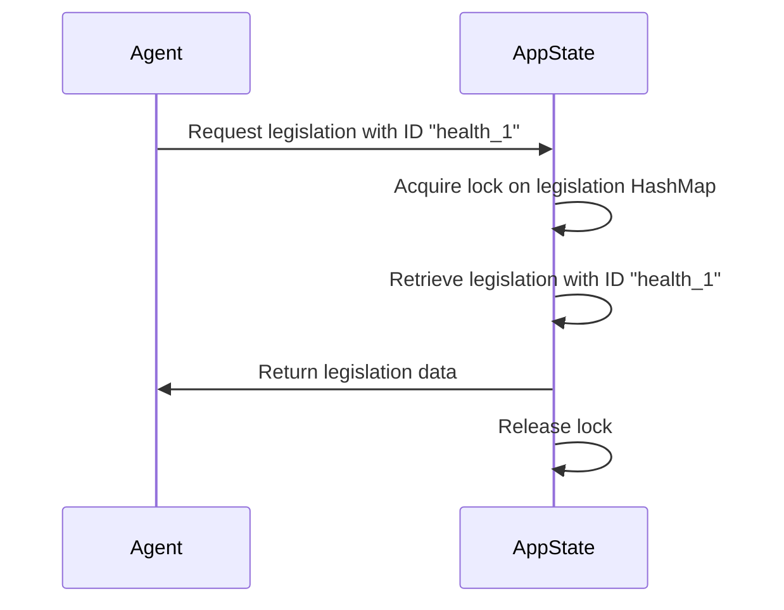

# Chapter 5: AppState

Following on from our understanding of [Agents](04_agent.md), we'll now explore the `AppState`.

Imagine our legislative simulation as a bustling factory.  We have [Stakeholders](01_stakeholder.md) providing input, [Legislation Processes](02_legislation_process.md) and [Deal Processes](03_deal_process.md) underway, and [Agents](04_agent.md) working diligently.  But where is all the information about the factory's current operations stored?  That's where the `AppState` comes in.  It's the central control room, holding all the key information about the current state of everything happening in our simulation.

Let's say we want to find out the status of a specific piece of legislation.  How do we access that information?  The `AppState` holds the answer.

## Understanding AppState

The `AppState` is a struct that holds all the data related to our simulation.  Think of it as a container.  In our simplified example, it contains two key pieces of information:

* **legislation:** A collection of all the [Legislation Processes](02_legislation_process.md) currently in the system.
* **stakeholders:** A collection of all the [Stakeholders](01_stakeholder.md) involved.

This information is stored using `HashMaps`, which allow us to quickly access data by its ID.  For example, if we know the ID of a piece of legislation, we can quickly retrieve all its details from the `AppState`.

## Using AppState

Let's look at a simplified example of how the `AppState` is used to retrieve the title of a specific piece of legislation:

```rust
use std::sync::{Arc, Mutex};
use std::collections::HashMap;

// ... other code ...

#[derive(Debug, Clone)]
pub struct AppState {
    pub legislation: Arc<Mutex<HashMap<String, Legislation>>>,
    // ... other fields ...
}

// ... other code ...

let app_state = create_test_state(); // Assume this function creates a populated AppState

let legislation_id = "health_1".to_string();

// Access the legislation HashMap within the AppState
let legislation_map = app_state.legislation.lock().unwrap();

// Retrieve the legislation using its ID
if let Some(legislation) = legislation_map.get(&legislation_id) {
    println!("Legislation title: {}", legislation.title);
} else {
    println!("Legislation not found!");
}

```

In this example, we first acquire a lock on the `legislation` HashMap. This is important because it prevents multiple parts of the program from modifying the data at the same time.  Then, we use the `get()` method to retrieve the legislation with the given ID.  If the legislation is found, we print its title.

## Inside AppState

Internally, the `AppState` uses `Arc` and `Mutex` to manage the data.

* **`Arc` (Atomically Reference Counted):**  Allows multiple parts of the program to share the same data without copying it.  Think of it as a shared whiteboard that everyone can read and write on.
* **`Mutex` (Mutual Exclusion):** Ensures that only one part of the program can modify the data at a time, preventing conflicts.  Think of it as a lock on the whiteboard that only one person can hold at a time.

Here's a simplified sequence diagram showing how the `AppState` is used to access data:



The `AppState` is defined in `tests/lib.rs` and `src/lib.rs` (and used in `src/main.rs`). The `create_test_state()` function in `tests/lib.rs` provides sample data for testing.

```rust
// tests/lib.rs
pub fn create_test_state() -> Arc<AppState> {
    // ... code to create sample legislation and stakeholders ...
}
```

## Conclusion

The `AppState` acts as the central repository for all data in our legislative simulation, allowing different components to access and interact with the information.  Understanding the `AppState` is crucial for working with the HMS-CDF project. Next, we'll explore how [Routes](06_routes.md) are used to interact with the `AppState`.


---

Generated by [AI Codebase Knowledge Builder](https://github.com/The-Pocket/Tutorial-Codebase-Knowledge)