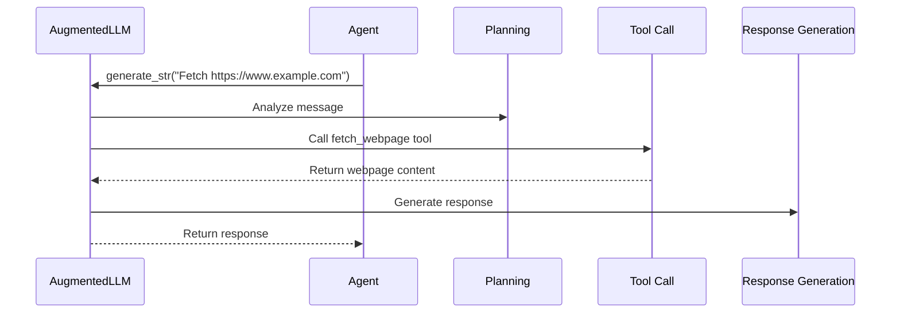

# Chapter 5: AugmentedLLM

In the previous chapter, [MCP Server](04_mcp_server.md), we learned about the toolboxes our AI agents use. Now, let's see how our agents actually *use* those tools with the `AugmentedLLM`.

## What problem does an AugmentedLLM solve?

Imagine our news summarization assistant.  The `fetch_agent` can now connect to the "fetch" MCP Server, but how does it *ask* the server to download a webpage?  The `AugmentedLLM` is like a skilled craftsman who knows how to use the tools in the toolbox.  It acts as a bridge between the agent (who has the task) and the MCP Servers (which have the tools).

## Key Concepts

An `AugmentedLLM` is an LLM (Large Language Model) with the ability to use tools.  It has two key aspects:

1. **LLM for Reasoning:** This is the core LLM that thinks, plans, and generates text.  It's the craftsman's brain.

2. **Tool Use Capability:** This allows the LLM to interact with tools provided by [MCP Servers](04_mcp_server.md). It's the craftsman's hands.

## Using an AugmentedLLM

You typically interact with an `AugmentedLLM` through an [Agent](02_agent.md).  Let's revisit our `fetch_agent` example:

```python
from mcp_agent.agents.agent import Agent
from mcp_agent.workflows.llm.augmented_llm_openai import OpenAIAugmentedLLM

fetch_agent = Agent(name="fetch_agent", instruction="Fetch a webpage.", server_names=["fetch"])

async with fetch_agent:
    llm = await fetch_agent.attach_llm(OpenAIAugmentedLLM)
    webpage_content = await llm.generate_str(message="Fetch the content of https://www.example.com")
    print(webpage_content) # Output: (The content of the webpage)
```

This code attaches an `OpenAIAugmentedLLM` to the `fetch_agent`.  The `generate_str` function then instructs the LLM to fetch the webpage.  The `AugmentedLLM` figures out which tool (from the "fetch" server) to use and how to use it.

## Internal Implementation

When `generate_str` is called, the `AugmentedLLM` performs the following steps:

1. **Planning:** The LLM analyzes the message and determines which tool is needed. The craftsman looks at the blueprint and decides which tool to use.

2. **Tool Call:** The LLM calls the appropriate tool with the necessary arguments. The craftsman uses the chosen tool.

3. **Response Generation:** The LLM receives the tool's output and generates a response. The craftsman examines the result and makes adjustments as needed.



Here's a simplified look at the `generate` function from `src/mcp_agent/workflows/llm/augmented_llm_openai.py`:

```python
async def generate(self, message, request_params=None):
    # ... setup ...
    for i in range(params.max_iterations):
        # ... LLM call ...
        if choice.finish_reason == "tool_calls" and message.tool_calls:
            tool_results = await self.executor.execute(
                *[self.execute_tool_call(tool_call) for tool_call in message.tool_calls]
            )
            # ... process tool results ...
    # ... generate response ...
    return responses
```

The `execute_tool_call` function handles the actual interaction with the [MCP Server](04_mcp_server.md) through the [MCPAggregator](07_mcpaggregator.md).

```python
async def execute_tool_call(self, tool_call):
    # ... extract tool name and arguments ...
    result = await self.call_tool(
        request=CallToolRequest(
            method="tools/call",
            params=CallToolRequestParams(name=tool_name, arguments=tool_args),
        ),
        tool_call_id=tool_call.id,
    )
    # ... process tool result ...
```

## Conclusion

The `AugmentedLLM` empowers LLMs to use tools, enabling them to interact with the world and perform complex tasks.  It bridges the gap between the [Agent](02_agent.md) and the [MCP Server](04_mcp_server.md), allowing agents to leverage the tools provided by the servers. In the next chapter, [MCPConnectionManager](06_mcpconnectionmanager.md), we'll delve into how the `MCPApp` manages connections to these MCP Servers.


---

Generated by [AI Codebase Knowledge Builder](https://github.com/The-Pocket/Tutorial-Codebase-Knowledge)