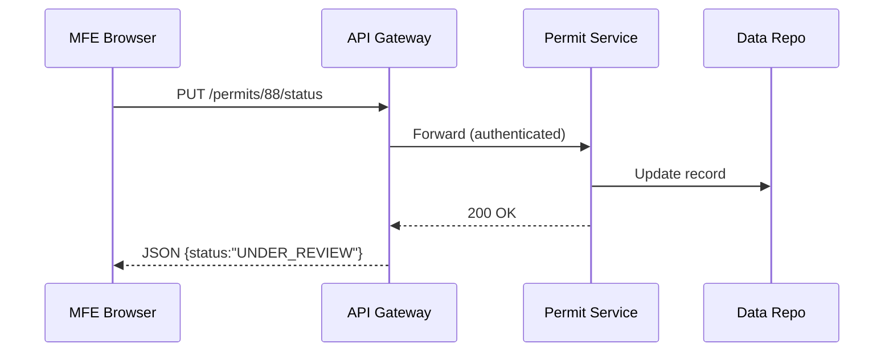

# Chapter 5: Backend Service Layer & APIs (HMS-SVC)

*[Jump back to Chapter 4: Micro-Frontend Interface Library (HMS-MFE)](04_micro_frontend_interface_library__hms_mfe__.md)*  

---

## 1. Why Do We Need HMS-SVC?

Imagine a citizen, Malik, applies online for a **Historic-District Building Permit**.  
On screen (built with HMS-MFE) he clicks **Submit**. Behind that single click:

1. The request must be validated against zoning rules.  
2. Pending fees must be calculated.  
3. The workflow status must be stored and auditable.  
4. An email confirmation should be sent.  

All these steps are invisible to Malik **and** to the browser.  
They live in the **Backend Service Layer & APIs (HMS-SVC)**—the government’s “inter-office mailroom” that moves sealed envelopes of data between departments safely and quickly.

---

## 2. Key Concepts in Plain English

| Term | Analogy |
|------|---------|
| **Service** | A dedicated clerk (e.g., “Permit Clerk”) who only does one type of task. |
| **API Gateway** | The reception desk that checks ID badges before letting you talk to a clerk. |
| **Secure Route** | The locked pneumatic tube that carries an envelope between offices. |
| **Event / Message Bus** | The PA system: “Permit #123 approved—billing, you’re up next!” |
| **Data Contract (DTO)** | A government form template everyone agrees on. |

> Remember: HMS-SVC is not one big program.  
> It is a family of **small, single-purpose services** that talk through well-defined, well-guarded roads.

---

## 3. A 3-Minute Hands-On Tour

Let’s update Malik’s permit status from **PENDING** → **UNDER REVIEW**.

### 3.1 Frontend Call (MFE)

```js
// permitClient.js   (≤10 lines)
export async function markUnderReview(id) {
  const res = await fetch(`/api/permits/${id}/status`, {
    method: 'PUT',
    headers: { 'Content-Type': 'application/json' },
    body: JSON.stringify({ status: 'UNDER_REVIEW' })
  });
  return res.json();          // { id: 88, status: "UNDER_REVIEW" }
}
```

**What happened?**  
The browser hit a single REST route exposed by HMS-SVC. No database credentials in sight—security lives server-side.

### 3.2 Minimal Service Route

```js
// services/permit/routes.js   (≤18 lines)
const router = require('express').Router();

router.put('/:id/status', async (req, res) => {
  const id     = req.params.id;
  const status = req.body.status;                  // "UNDER_REVIEW"

  // 1 — validate allowed transitions
  if (!['UNDER_REVIEW','APPROVED','DENIED'].includes(status))
      return res.status(422).send('bad status');

  // 2 — store in Central Data Repo
  await DTA.update('permits', id, { status });

  // 3 — broadcast event
  Bus.publish('permit.status.changed', { id, status });

  res.json({ id, status });
});

module.exports = router;
```

Explanation (super-short):

1. Check the requested status is legal.  
2. Write the change to [Central Data Repository (HMS-DTA)](07_central_data_repository__hms_dta__.md).  
3. Announce it on the message bus so billing or notifications can react.

---

## 4. Step-By-Step: What Happens Behind the Curtain?



1. **API Gateway** checks Malik’s session token.  
2. It forwards the request only if scopes allow `permits.write`.  
3. The Permit Service updates storage and emits an event.  
4. The gateway relays the clean JSON back to the browser.

---

## 5. Inside HMS-SVC: Mini Architecture

```
services/
 ├─ gateway/            # single entrypoint (Node.js)
 ├─ permit/             # example microservice
 ├─ billing/
 ├─ notifications/
 └─ common/             # shared libs (auth, bus)
```

### 5.1 Tiny Gateway Policy (YAML, 8 lines)

```yaml
# gateway/routes.yaml
- path: /api/permits/**
  service: permit
  auth:
    scopes: ["permits.read", "permits.write"]
```

**Plain English:**  
Any `/api/permits/*` call is forwarded to the **permit** service only if the user has the listed scopes.

### 5.2 Event Listener Sample (Billing)

```python
# services/billing/handlers.py  (≤15 lines)
from bus import subscribe, charge_fee

@subscribe("permit.status.changed")
def on_status(payload):
    if payload["status"] == "APPROVED":
        charge_fee(payload["id"], amount=150)
```

Now the billing service wakes up **only** when relevant—zero direct coupling to the Permit Service.

---

## 6. How Other Layers Plug In

| Layer | Relationship to HMS-SVC |
|-------|-------------------------|
| [HMS-MFE](04_micro_frontend_interface_library__hms_mfe__.md) | Sends REST/GraphQL calls to the API Gateway. |
| [HMS-AGX](02_ai_representative_agent__hms_agx__.md) | Creates backend tasks by publishing events the services listen to. |
| [HITL](03_human_in_the_loop__hitl__oversight_.md) | Approves drafts which are then executed via service endpoints. |
| [HMS-OPS](12_operational_monitoring___logging__hms_ops__.md) | Subscribes to the event bus for live health metrics. |

---

## 7. Frequently Asked Questions

**Q: Are these services serverless or containerized?**  
Either works. The tutorial examples assume a small Docker container per service, but you can deploy to AWS Lambda, Azure Functions, or on-prem VM.

**Q: Do I need one database per service?**  
Recommended. Each service owns its tables to avoid “tug-of-war” migrations. Cross-service queries happen via events or read-only replicas.

**Q: How is security enforced?**  
OAuth2 tokens are validated at the API Gateway; internal service-to-service calls use mutual TLS.

---

## 8. What You Learned

• HMS-SVC is the **hidden postal system** that securely delivers data envelopes between modules.  
• You updated a permit’s status with a **10-line** frontend call and an **18-line** backend route.  
• The API Gateway guards routes; services stay small and focused; events keep them loosely coupled.

Ready to see how complex, multi-step tasks (like “Send crew, bill fees, notify citizen”) are coordinated?  
Continue to [Agent Orchestration Engine (HMS-ACT)](06_agent_orchestration_engine__hms_act__.md).

---

Generated by [AI Codebase Knowledge Builder](https://github.com/The-Pocket/Tutorial-Codebase-Knowledge)