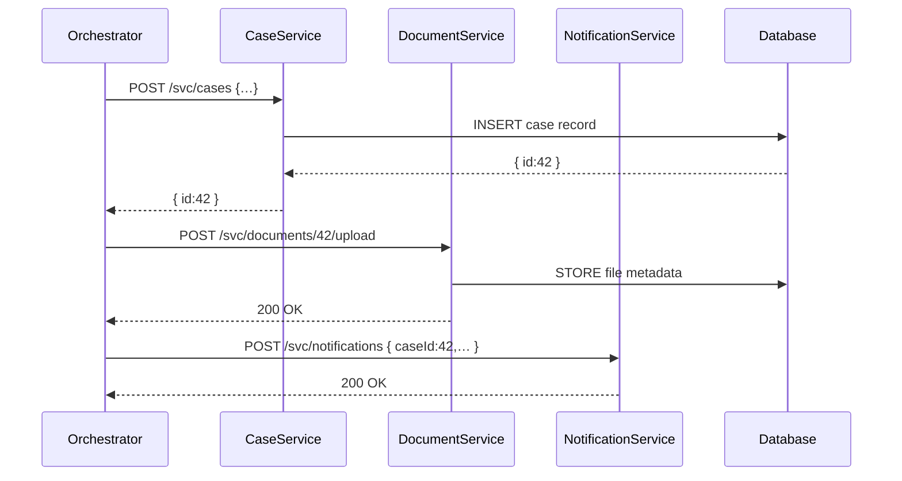

# Chapter 5: Backend Services (HMS-SVC)

In [Chapter 4: Management Layer (Service Orchestration)](04_management_layer__service_orchestration__.md) we saw how workflows call multiple APIs in sequence. Now it’s time to look inside those APIs—our **Backend Services**. Each one encapsulates a slice of business logic (case management, notifications, document storage) and exposes clear REST endpoints. Think of each service as its own specialized government office—like Tax Assessment or Permits—ready to do one job very well.

## Why Backend Services?

Imagine you file a public records request. Behind the scenes:
1. A **Case Management Service** creates your request record.  
2. A **Document Storage Service** saves any PDFs or images you upload.  
3. A **Notification Service** emails you when staff update your request.  

By splitting responsibilities, each “office” can be built, tested, and scaled independently.

### Central Use Case: Filing a Juvenile Justice Case

A caseworker wants to register a new juvenile justice case, attach an intake form PDF, and notify the court clerk:

1. The **Orchestrator** (from [Chapter 4](04_management_layer__service_orchestration__.md)) starts the workflow.  
2. It calls the **Case Service** to create a record.  
3. It calls the **Document Service** to store the intake form.  
4. It calls the **Notification Service** to alert the clerk.  

Below we’ll see how each service works, how to call it, and what happens inside.

---

## Key Concepts

1. **Microservice**  
   A small app with its own database and API.  
2. **Service Interface**  
   Well-defined REST endpoints (e.g., `POST /svc/cases`).  
3. **Specialization**  
   Each service does one domain job: cases, docs, or notifications.  
4. **Independent Deployment**  
   You can update Document Service without touching Case Service.  
5. **HTTP Contracts**  
   JSON schemas define inputs and outputs.

---

## Calling HMS-SVC in Code

Below is a minimal JavaScript example showing how our orchestrator might call each service.

```js
// 1. Create a new case
const caseRes = await fetch('/svc/cases', {
  method: 'POST',
  headers: {'Content-Type':'application/json'},
  body: JSON.stringify({ clientName: 'Jane Doe', type: 'JuvenileJustice' })
});
const { id: caseId } = await caseRes.json();  // e.g. { id: 42 }
```
*We POST to Case Service and get back a new case ID.*  

```js
// 2. Upload an intake form
await fetch(`/svc/documents/${caseId}/upload`, {
  method: 'POST',
  body: yourPdfFile  // FormData with file
});
```
*We attach a PDF to that case.*  

```js
// 3. Notify the court clerk
await fetch('/svc/notifications', {
  method: 'POST',
  headers: {'Content-Type':'application/json'},
  body: JSON.stringify({
    caseId,
    recipient: 'clerk@court.gov',
    message: 'New juvenile justice case created.'
  })
});
```
*An email or in-app alert goes out.*

---

## What Really Happens? (Sequence Diagram)



1. **Create case** → stored in DB → return `caseId`.  
2. **Upload file** → metadata saved.  
3. **Send notification** → clerk is alerted.

---

## Under the Hood: Service Examples

### Case Service

File: `src/services/case/routes.js`

```js
const router = require('express').Router();

// POST /svc/cases
router.post('/', (req, res) => {
  // 1. Validate input (omitted)
  // 2. Save to DB (pseudo)
  const newCase = { id: Math.floor(Math.random()*1000) };
  res.status(201).json(newCase);
});

module.exports = router;
```
*This service assigns a case ID and returns it.*

### Document Service

File: `src/services/document/routes.js`

```js
const router = require('express').Router();

// POST /svc/documents/:caseId/upload
router.post('/:caseId/upload', (req, res) => {
  // Store file (omitted)
  res.sendStatus(200);
});

module.exports = router;
```
*Simply accepts a file and links it to `caseId`.*

### Notification Service

File: `src/services/notifications/routes.js`

```js
const router = require('express').Router();

// POST /svc/notifications
router.post('/', (req, res) => {
  const { recipient, message } = req.body;
  // Send email or in-app alert (omitted)
  res.sendStatus(200);
});

module.exports = router;
```
*Delivers messages to users or systems.*

---

## Conclusion

You’ve learned how **Backend Services (HMS-SVC)** break business logic into specialized microservices—each with its own REST API and database. We saw how to call Case, Document, and Notification services, and what happens inside. Next up is handling money flows and payments in [Chapter 6: Financial System (HMS-ACH)](06_financial_system__hms_ach__.md).

---

Generated by [AI Codebase Knowledge Builder](https://github.com/The-Pocket/Tutorial-Codebase-Knowledge)