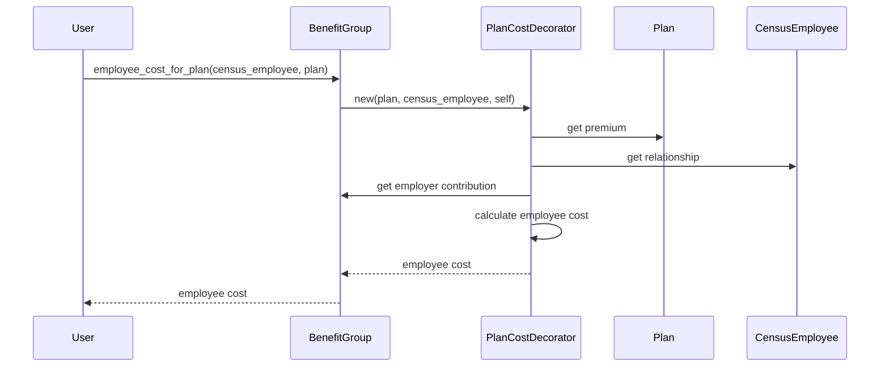

# Chapter 5: BenefitGroup

In the previous chapter, [PlanYear](04_planyear.md), we learned how an employer's annual benefits cycle is represented. This chapter introduces the `BenefitGroup` concept, which represents a set of health and/or dental plans offered within a specific [PlanYear](04_planyear.md).

## What problem does `BenefitGroup` solve?

Imagine Acme Corp wants to offer different health plan options to its employees during their 2024 [PlanYear](04_planyear.md). Some employees might prefer a plan with a lower premium but higher out-of-pocket costs, while others might prefer the opposite. How do we represent these different plan choices within the [PlanYear](04_planyear.md)?  The `BenefitGroup` model solves this. It's like a menu of health plan options from which employees can choose.

## Key Concepts:

1. **Plan Options:** A `BenefitGroup` contains a list of health plans offered by the employer.  These plans can vary in coverage levels (e.g., Bronze, Silver, Gold) and costs.  Employees can choose one plan from the available options within the `BenefitGroup`.

2. **Reference Plan:**  Each `BenefitGroup` has a designated `reference_plan`. This plan is used as a benchmark for calculating employer contributions.  Think of it as the default plan against which other plans are compared.

3. **Relationship Benefits:**  A `BenefitGroup` defines how much the employer contributes towards the cost of the plan for different family members (e.g., employee, spouse, child). This is represented by `relationship_benefits`.

4. **Dental Plans (Optional):** A `BenefitGroup` can also include dental plans.  Similar to health plans, employees can choose a dental plan from the available options.

## Using the `BenefitGroup` model

Let's say we want to find the employee's cost for a specific plan within a `BenefitGroup`:

```ruby
# ... other code ...

benefit_group = BenefitGroup.find(benefit_group_id) # Assuming benefit_group_id is known
plan = Plan.find(plan_id) # Assuming plan_id is known
census_employee = CensusEmployee.find(census_employee_id) # Assuming census_employee_id is known

employee_cost = benefit_group.employee_cost_for_plan(census_employee, plan)

puts "Employee cost for the plan: #{employee_cost}"

# ... other code ...
```

This code finds the `BenefitGroup`, the specific `Plan`, and the `CensusEmployee`.  It then calculates the employee's cost for that plan using the `employee_cost_for_plan` method.

## Under the Hood

When you call `benefit_group.employee_cost_for_plan`, the following happens:

1. **Plan Cost Decorator:** It creates a `PlanCostDecorator` object. This object wraps the `Plan` object and adds methods for calculating costs based on the `BenefitGroup` and `CensusEmployee`.

2. **Cost Calculation:** The `PlanCostDecorator` calculates the employee's cost based on the plan's premium, the employer's contribution, and the employee's relationship (e.g., employee, spouse).



The code for `employee_cost_for_plan` is in `benefit_group.rb`:

```ruby
# benefit_group.rb
class BenefitGroup
  # ... other code ...

  def employee_cost_for_plan(ce, plan = reference_plan)
    # ... other code (simplified for brevity) ...
    pcd = PlanCostDecorator.new(plan, ce, self, reference_plan)
    pcd.total_employee_cost
  end

  # ... other code ...
end
```

This simplified code snippet shows how the `employee_cost_for_plan` method creates a `PlanCostDecorator` and uses it to calculate the total employee cost.

## Conclusion

This chapter introduced the `BenefitGroup` model, which represents a set of health and dental plan options offered to employees. We learned about its key concepts and how it's used to calculate employee costs. In the next chapter, we'll explore [HbxEnrollment](06_hbxenrollment.md), which represents an employee's enrollment in a specific health plan.


---

Generated by [AI Codebase Knowledge Builder](https://github.com/The-Pocket/Tutorial-Codebase-Knowledge)