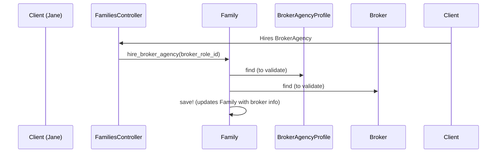

# Chapter 5: Broker/BrokerAgency/BrokerAgencyProfile

In the previous chapter, [HbxEnrollment](04_hbxenrollment_.md), we learned how employees enroll in health plans. Now, let's explore the role of brokers in helping people navigate the health insurance marketplace using the `Broker`, `BrokerAgency`, and `BrokerAgencyProfile` concepts.

## Why do we need these concepts?

Imagine Jane Doe wants help choosing a health plan. She contacts a broker at "Acme Insurance Brokers" for assistance. We need a way to represent the broker, their agency, and how they interact with our system.

## Key Concepts

* **Broker:** A `Broker` represents a licensed insurance broker, like the one Jane contacted.  It stores information like their name, license number (NPN), and contact information. Think of it as the broker's individual profile in our system.

* **BrokerAgency:** A `BrokerAgency` represents a company that employs brokers, like "Acme Insurance Brokers". It stores information about the agency, such as its name, address, and contact information.

* **BrokerAgencyProfile:** A `BrokerAgencyProfile` is the agency's profile *within our system*. It links the `BrokerAgency` to our platform and stores additional information relevant to our application, such as their status (e.g., active, pending) and any system-specific settings.

## Solving the Use Case: Jane Getting Help from a Broker

1. **Find the BrokerAgencyProfile:** Jane tells us she's working with "Acme Insurance Brokers". We find their `BrokerAgencyProfile` in our system.

2. **Find the Broker:** We identify the specific `Broker` Jane is working with within "Acme Insurance Brokers".

3. **Connect Jane and the Broker:** We record that this `Broker` is assisting Jane. This allows us to track who is helping whom.

```ruby
# Simplified example (actual implementation is more complex)

acme_agency_profile = BrokerAgencyProfile.find_by(name: "Acme Insurance Brokers")

jane_broker = acme_agency_profile.brokers.find_by(npn: "1234567") # Example NPN

jane.family.hire_broker_agency(jane_broker.broker_role) # Link Jane's family to the broker

jane.family.save!
```

This code finds the `BrokerAgencyProfile`, identifies the `Broker`, and links them to Jane's [Family](01_person_family_familymember_.md).

## Internal Implementation

When Jane's family hires a broker agency, the system updates the family's record to reflect this relationship.



1. The `families_controller.rb` (or a similar controller like `employers/broker_agency_controller.rb`) receives the request.

2. The `Family` model's `hire_broker_agency` method is called.

3. This method validates the `BrokerAgencyProfile` and `Broker` exist.

4. The `Family` object is updated with the `broker_role_id`, linking the family to the broker.

The relevant code can be found in `families_controller.rb`, `employers/broker_agency_controller.rb`, the `Family` model, and the `BrokerAgency` related models.

```ruby
# families_controller.rb (simplified)
def update
  @family = Family.find(params[:id])
  @family.hire_broker_agency(params[:broker_role_id])
  @family.save!
end
```

## Conclusion

This chapter introduced `Broker`, `BrokerAgency`, and `BrokerAgencyProfile`, explaining how they represent brokers and their agencies within our system. We used the example of Jane Doe getting help from a broker to illustrate how these concepts work. We also looked at the internal implementation to understand the process of linking a family to a broker.

Next, we'll explore Qualifying Life Events (QLEs) and Special Enrollment Periods (SEPs) with [QualifyingLifeEventKind (QLE) / SpecialEnrollmentPeriod (SEP)](06_qualifyinglifeeventkind__qle____specialenrollmentperiod__sep__.md).


---

Generated by [AI Codebase Knowledge Builder](https://github.com/The-Pocket/Tutorial-Codebase-Knowledge)