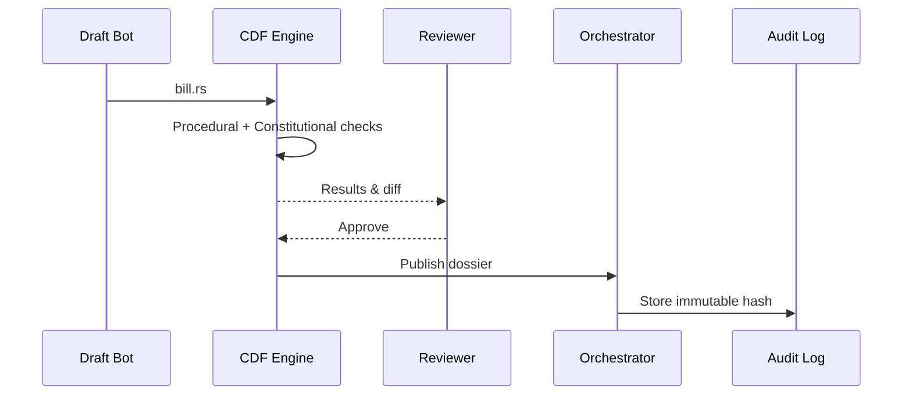

# Chapter 5: Codified Democracy Foundation Engine (HMS-CDF)

[← Back to Chapter&nbsp;4: Human-in-the-Loop (HITL) Oversight](04_human_in_the_loop__hitl__oversight_.md)

---

## 1. Why do we need a “compiler” for democracy?

Imagine Representative Diaz wants to introduce the **“Rural Broadband Now Act.”**

1. Her staff uploads the draft bill (PDF).  
2. Lobbyists suggest an amendment.  
3. Congressional rules require a cost estimate **before** the floor vote.  
4. Constitutional lawyers must confirm it respects the Commerce Clause.

Today that back-and-forth takes **weeks**.

With HMS-CDF the same workflow is *code*:

*Draft ➜ Amend ➜ Validate ➜ Simulate Vote ➜ Publish*  
All automated, but still reviewable by humans (see Chapter 4).

Think of CDF as **Rust’s `cargo check` … for public policy.**

---

## 2. Key ideas in plain English

| Term | Think of it as… |
|------|-----------------|
| **Bill Module** | A `.rs` file that describes the proposed law in code + metadata. |
| **Procedural Guard** | Little gatekeepers that enforce “committee first”, “budget score needed”, etc. |
| **Constitutional Validator** | A spell-checker for the U.S. Constitution; flags clause conflicts. |
| **Simulation Runner** | A video-game preview—shows what happens 1, 5, 10 years after enactment. |
| **Dossier** | A PDF (and JSON) bundle: diff, budget score, legal citations—ready for clerks. |

If you can run `cargo test` on Rust, you can run **`cdf test`** on a bill.

---

## 3. Quick start – 12 lines

Below we codify a *very* tiny broadband grant bill.

```rust
// file: bills/rural_broadband.rs
use hms_cdf::*;

bill!("Rural Broadband Now Act", 2024, sponsor: "Rep. Diaz");

section!("Grant Program", |s| {
    s.appropriation(500_000_000);          // $500 M
    s.recipient("FCC");
    s.purpose("Build fiber in census tracts with <10 Mbps");
});
```

Compile & test:

```bash
$ cdf test bills/rural_broadband.rs
✓ Procedural checks passed (committee: Energy & Commerce)
✓ Constitutional scan passed
✓ Budget score: $510M (incl. overhead)
```

What happened?

1. **Procedural Guards** ensured the Energy & Commerce committee owns telecom.  
2. **Validator** scanned text vs. Commerce Clause jurisprudence.  
3. **Simulation Runner** produced a budget score.

No human typed a single Excel sheet.

---

## 4. One-minute look under the hood



Five actors, zero mystery.

---

## 5. Inside the CDF Engine (super-mini Rust)

```rust
// file: cdf/src/engine.rs  (excerpt)
pub fn test(path: &str) -> Result<Report> {
    let ast = parse_bill(path)?;
    procedural::check(&ast)?;
    constitutional::lint(&ast)?;
    let budget = simulate::score(&ast)?;
    Ok(Report::new(budget))
}
```

Explanation:

• `parse_bill` turns the Rust DSL into an AST (abstract syntax tree).  
• `procedural::check` = committee rules, vote order.  
• `constitutional::lint` = text vs. knowledge base cases.  
• `simulate::score` = calls the [Policy & Regulatory Knowledge Base](06_policy___regulatory_knowledge_base__hms_edu___esq__.md) for cost models.  
• Returns a `Report` consumed by Chapter 4’s HITL Gateway.

All under 15 lines—real engine adds caching and concurrency.

---

## 6. Adding a procedural guard in 5 lines

Need a *“public comment period ≥ 30 days”* rule? Just add:

```rust
procedural::add_guard("public_comment_30d", |bill| {
    bill.comment_period >= 30
});
```

Now every bill failing that guard is blocked *before* it hits the floor.

---

## 7. Watching the simulation

```bash
$ cdf sim bills/rural_broadband.rs --years 10 --graph
```

Outputs a micro-frontend chart (Chapter 2 brick) showing:

• Households covered  
• Cost burn-down  
• Projected GDP lift

Graphs embed directly in the congressional intranet.

---

## 8. Where does the legal knowledge live?

All precedent citations, constitutional clauses, and historical committee rules sit in the **EDU + ESQ Knowledge Base** (next chapter). CDF only calls:

```
kb.query("commerce_clause cases after 2000")
```

…then reasons locally. Details in  
[Chapter 6: Policy & Regulatory Knowledge Base (HMS-EDU + ESQ)](06_policy___regulatory_knowledge_base__hms_edu___esq__.md).

---

## 9. FAQ

**Q: Do lawmakers have to learn Rust?**  
No. Staffers use a form that auto-generates the DSL. Developers can still tweak the code.

**Q: What if a rule changes (e.g., new House rules)?**  
Upload a new guard file—everything re-tests automatically.

**Q: Can CDF model amendments?**  
Yes. Call `cdf diff original.rs amended.rs` to auto-re-run checks on only the changed lines.

**Q: Is this legally binding?**  
CDF is **advisory**. Final authority rests with elected officials, but the engine produces an auditable record.

---

## 10. You learned

• Why codifying bills speeds up (and secures) the legislative pipeline.  
• The five pillars: Bill Module, Procedural Guards, Constitutional Validator, Simulation Runner, Dossier.  
• How to write, compile, and test a policy in <15 lines.  
• How CDF talks to the knowledge base and the HITL Gateway.

Ready to explore the **brains** that feed CDF the legal facts and budget models?  
Continue to [Chapter 6: Policy & Regulatory Knowledge Base (HMS-EDU + ESQ)](06_policy___regulatory_knowledge_base__hms_edu___esq__.md)

---

Generated by [AI Codebase Knowledge Builder](https://github.com/The-Pocket/Tutorial-Codebase-Knowledge)