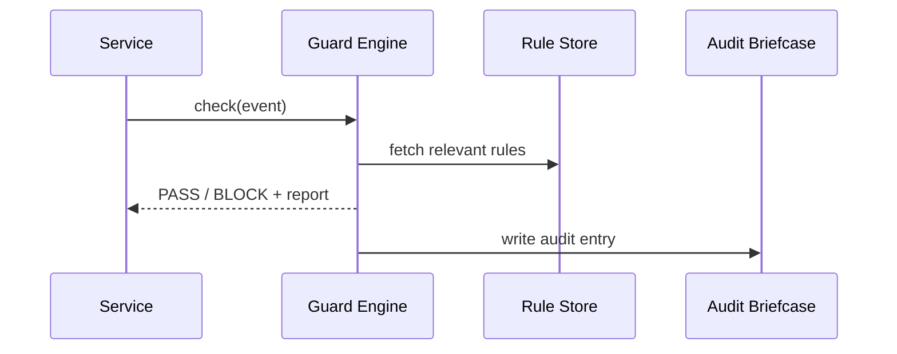

# Chapter 5: Compliance Guardrail Framework (HMS-ESQ)

[← Back to Chapter 4: Policy Deployment Pipeline (CI/CD for Rules)](04_policy_deployment_pipeline__ci_cd_for_rules__.md)

---

## 1. Why Another Guardrail?

Imagine the Centers for Medicare & Medicaid Services (CMS) launches a chatbot that lets citizens download **their own** medical history.  
A junior developer adds this one-liner:

```python
export_all_tables("patient_records")
```

Overnight the bot tries to e-mail **every record—names, diagnoses, SSNs—to a third-party vendor** that promised “free analytics.”  
No evil intent, just an honest mistake.

HMS-ESQ is the tire-screeching **in-house counsel that never sleeps**:

1. Reads the data-share request.  
2. Looks up HIPAA & FOIA constraints.  
3. Sees the vendor contract is unsigned.  
4. **Blocks the export**, attaches the legal citation, and writes an audit entry.

Result: citizens stay protected, the agency avoids fines, and the developer learns instantly what went wrong.

---

## 2. High-Level Use Case We’ll Build

Goal: add a single function call to any Python service so that **every outgoing action** is pre-checked by ESQ.

We will:

1. Define two tiny compliance rules in YAML.  
2. Call `esq.guard(event)` from a mock service.  
3. Watch ESQ return **PASS** or **BLOCK + reason**.

All code snippets are ≤ 20 lines. No legal degree required.

---

## 3. Key Concepts (One-Sentence Friendly)

| Piece | Analogy | Job |
|-------|---------|-----|
| Statute Parser | Law librarian | Converts statutes/EOs into machine-readable tests. |
| Rule Store | Cookbook | Holds all parsed rules in YAML/JSON. |
| Guard Engine | Traffic light | Decides **GO / STOP / REDLINE** for each action. |
| Redline Report | Teacher’s red pen | Shows exactly which clause failed and why. |
| Audit Briefcase | Court stenographer | Immutable log for inspectors general. |

---

## 4. Writing Your First Two Rules

Create `rules/` with this **10-line YAML**:

```yaml
# file: rules/hipaa_foia.yml
- name: hipaa_min_window
  when: "action == 'share_data' and 'HIPAA' in tags"
  must: "foia_window_days >= 30"
  cite: "45 CFR §164.524"
- name: unsigned_vendor_block
  when: "action == 'share_data' and vendor_signed == False"
  must: "False"          # always illegal
  cite: "41 U.S.C. §3301"
```

Readable even by non-developers: _“If you share HIPAA data, the FOIA window must be ≥ 30 days; also, no data can go to unsigned vendors.”_

---

## 5. Guarding a Service Call (Hands-On)

```python
# file: data_portal.py   (≤ 20 lines)
from esq.guard import Guard

esq = Guard("./rules")          # point to YAML folder

def export_patient_records():
    event = {
        "action": "share_data",
        "dataset": "patient_records",
        "tags": ["HIPAA", "PII"],
        "foia_window_days": 14,   # 🚨 too short
        "vendor_signed": False    # 🚨 unsigned
    }
    ok, report = esq.check(event)
    if not ok:
        print("BLOCKED!\n", report)
        return
    # real export would happen here
    print("Export succeeded.")

if __name__ == "__main__":
    export_patient_records()
```

Run it:

```
$ python data_portal.py
BLOCKED!
 - hipaa_min_window  (45 CFR §164.524)
 - unsigned_vendor_block  (41 U.S.C. §3301)
```

ESQ saved you **two** violations before any data left the building. 🎉

---

## 6. What Happens Behind the Scenes?



Less than 0.05 s, zero humans needed.

---

## 7. Peek Inside HMS-ESQ (Tiny Implementation)

### 7.1 The Guard Engine

```python
# file: esq/guard.py  (18 lines)
import yaml, time, json, ast

class Guard:
    def __init__(self, rule_dir):
        self.rules = []
        for f in [rule_dir + "/hipaa_foia.yml"]:
            self.rules += yaml.safe_load(open(f))

    def _eval(self, expr, ctx):
        return ast.literal_eval(str(eval(expr, {}, ctx)))

    def check(self, event):
        violations = []
        for r in self.rules:
            if self._eval(r["when"], event) and not self._eval(r["must"], event):
                violations.append(f"{r['name']}  ({r['cite']})")
        self._audit(event, violations)
        return (len(violations) == 0, violations)

    def _audit(self, event, v):
        entry = {"ts": time.time(), "event": event, "violations": v}
        print("AUDIT:", json.dumps(entry))     # prod → Ops Center
```

Explanation—line by line:

1-4: Load YAML once at startup.  
6-7: Safe(ish) mini expression evaluator.  
9-13: Loop rules → collect violations.  
14-17: Every decision is dumped to the audit log.

### 7.2 Audit Entry Example

```
AUDIT: {"ts": 1710632400.1,
        "event": {"action":"share_data",...},
        "violations":["hipaa_min_window","unsigned_vendor_block"]}
```

Stored forever, searchable during OIG or GAO audits.

---

## 8. 60-Second Lab

1. Copy the YAML and Python files above.  
2. Change `foia_window_days` from **14** to **45** but keep `vendor_signed = False`.  
3. Run again—you’ll see only the vendor violation reported.  
4. Flip `vendor_signed = True` → ESQ returns **PASS**, and `"Export succeeded."` prints.

You just edited a rule, reran the check, and proved compliance without redeploying the whole service.

---

## 9. How HMS-ESQ Fits with Other Layers

* Rules **arrive automatically** from the [Policy Deployment Pipeline (CI/CD for Rules)](04_policy_deployment_pipeline__ci_cd_for_rules__.md).  
* Violations can trigger a **HITL override** in exceptional humanitarian cases—see [Human-in-the-Loop Oversight](02_human_in_the_loop__hitl__oversight_mechanism_.md).  
* Continuous metrics flow into [System Observability & Ops Center](19_system_observability___ops_center__hms_ops__.md).  
* You can replay historical events in the upcoming [Simulation & Testing Sandbox (HMS-ESR)](06_simulation___testing_sandbox__hms_esr__.md) to stress-test new rules.

---

## 10. Recap & Next Steps

In this chapter you learned:

1. HMS-ESQ is the **always-on legal counsel** guarding every action.  
2. Compliance rules live as human-readable YAML.  
3. A single `esq.check(event)` call yields instant **PASS / BLOCK** decisions plus legal citations.  
4. All outcomes drop into an immutable audit trail for future inspectors.

Next we’ll play in a safe playground to **simulate disasters, edge cases, and high-traffic spikes** before touching production.  
Continue to → [Simulation & Testing Sandbox (HMS-ESR)](06_simulation___testing_sandbox__hms_esr__.md)

---

---

Generated by [AI Codebase Knowledge Builder](https://github.com/The-Pocket/Tutorial-Codebase-Knowledge)