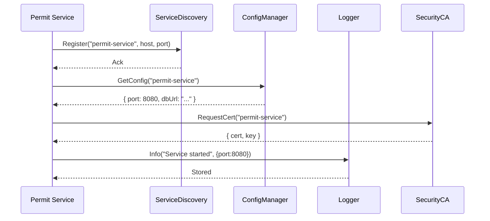

# Chapter 5: Core Infrastructure (HMS-SYS)

Welcome back! In [Chapter 4: Backend API / API Gateway](04_backend_api___api_gateway_.md) we saw how requests flow through a secure front door. Now we’ll build the **backbone** under everything—our Core Infrastructure, HMS-SYS. Think of it like the federal government’s shared data centers, network backbones, and security services that all agencies rely on.

---

## Why Core Infrastructure?

Imagine you’re launching a new “Permit Application Service” for a city. You need to:
1. Let clients discover your service endpoint
2. Keep credentials and URLs in a central config store
3. Record all events in a unified log
4. Secure traffic with certificates and manage identities

Rather than re-inventing these features for each microservice, HMS-SYS provides them out of the box. Once you plug into HMS-SYS, you get:

- Service discovery (so clients find you)  
- Configuration management (so you don’t hard-code URLs or secrets)  
- Centralized logging (so ops can monitor everything)  
- Security primitives (identity, encryption, certificates)

---

## Central Use Case: Bootstrapping a Permit Service

Let’s walk through how a new **Permit Service** uses HMS-SYS:

1. **Startup**  
   - Service registers itself with the discovery system.  
   - Fetches its configuration (DB credentials, feature flags).  
   - Retrieves its TLS certificate to start an HTTPS server.  
2. **Runtime**  
   - When handling requests, it logs events via the central logger.  
   - If it needs to call another service, it discovers its endpoint.  
   - All traffic is encrypted and authenticated automatically.

---

## Key Concepts

1. **Service Discovery**  
   A directory where services register their address (IP, port) so others can find them.

2. **Configuration Management**  
   A secure store for environment-specific settings: database URLs, API keys, toggles.

3. **Logging**  
   A unified logger that sends events to a central aggregator (for dashboards, alerts).

4. **Security Primitives**  
   Identity management, certificate issuance, encryption/decryption tools.

---

## How to Use HMS-SYS in Your Service

Below is a minimal example showing how a Permit Service boots up with HMS-SYS.

```js
// permit-service/index.js
import sys from 'hms-sys';

async function start() {
  await sys.init();                                       // 1. Connect to SYS
  const config = await sys.config.get('permit-service'); // 2. Load config
  await sys.discovery.register('permit-service', config.port);
  const cert = await sys.security.getCertificate('permit-service');
  sys.logging.info('Permit Service starting on port', config.port);
  // ... start HTTPS server using cert and config.port ...
}

start().catch(err => sys.logging.error(err));
```

Explanation:
- `sys.init()` connects to all HMS-SYS sub-systems.  
- `sys.config.get()` retrieves settings.  
- `sys.discovery.register()` makes your service discoverable.  
- `sys.security.getCertificate()` fetches TLS materials.  
- `sys.logging` writes to the central log store.

---

## Under the Hood: Startup Sequence



1. **Register** the service endpoint  
2. **Fetch** its own configuration  
3. **Get** a TLS certificate  
4. **Log** the startup event  

---

## HMS-SYS File Structure

```
/hms-sys
  index.js               # sys.init() and high-level API
  service-discovery.js   # register(), discover()
  config.js              # get(), watch()
  logging.js             # info(), warn(), error()
  security.js            # getCertificate(), encrypt(), decrypt()
```

---

## Peek Inside: Service Discovery

```js
// hms-sys/service-discovery.js
const registry = {};               // In-memory for demo
export async function register(name, port) {
  registry[name] = `https://${name}.local:${port}`;
}
export function discover(name) {
  return registry[name];           // Returns the stored URL
}
```

Explanation:
- A simple object holds service names → URLs  
- `register()` adds your service  
- `discover()` lets clients find you

---

## Peek Inside: Config Manager

```js
// hms-sys/config.js
import fs from 'fs';
export async function get(serviceName) {
  const raw = await fs.promises.readFile('config.json', 'utf8');
  const all = JSON.parse(raw);
  return all[serviceName] || {};
}
```

Explanation:
- Reads a shared `config.json` file  
- Returns only the section for your service

---

## Peek Inside: Logging

```js
// hms-sys/logging.js
export function info(...args)  { console.log('[INFO]', ...args); }
export function warn(...args)  { console.warn('[WARN]', ...args); }
export function error(...args) { console.error('[ERROR]', ...args); }
```

Explanation:
- A thin wrapper over console methods  
- In real life, this would send logs to Splunk, ELK, or CloudWatch

---

## Peek Inside: Security CA

```js
// hms-sys/security.js
export async function getCertificate(serviceName) {
  // Demo: return self-signed
  return { cert: '---cert---', key: '---key---' };
}
// encrypt(), decrypt() would use these keys internally
```

Explanation:
- Issues or retrieves certificates for TLS  
- Also offers encryption/decryption helpers

---

## Conclusion

In this chapter you learned how **HMS-SYS** provides the shared backbone for service discovery, configuration, logging, and security. Armed with these primitives, every microservice can:

- Be discoverable by others  
- Keep settings in one place  
- Log events uniformly  
- Use managed certificates and encryption

Next up, we’ll explore the **Management Layer**, where operators monitor and scale all these services.  
[Next Chapter: Management Layer](06_management_layer_.md)

---

Generated by [AI Codebase Knowledge Builder](https://github.com/The-Pocket/Tutorial-Codebase-Knowledge)