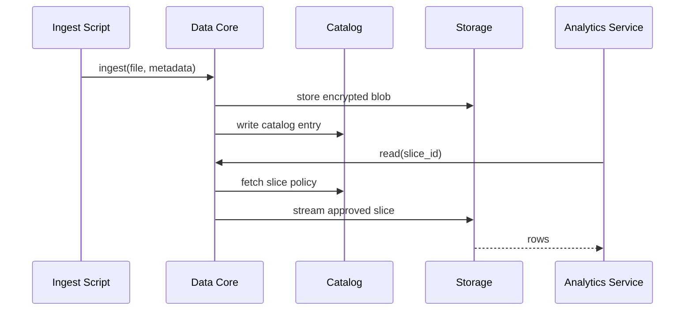

# Chapter 5: Data Core (HMS-DTA)

*(picks up from [Chapter 4: Compliance & Legal Reasoner (HMS-ESQ)](04_compliance___legal_reasoner__hms_esq__.md))*  

---

## 1  Why do we need HMS-DTA?

Picture the **Centers for Disease Control and Prevention (CDC)** preparing a real-time flu-tracking dashboard:

1. It needs hospital admission feeds (hourly).  
2. It needs pharmacy sales (daily).  
3. It must never expose a patient’s name.  
4. Data must stay on U.S. soil and be deleted after 5 years.

Without a single “source of truth,” every micro-team might copy data into its own database—creating privacy leaks and compliance nightmares.

**HMS-DTA** is the **“national archive + public library”** for digital government:  
* one place to store anything,  
* clear rules for who may read a *slice*,  
* automatic enforcement of residency, retention, encryption, and cataloging.

Throughout this chapter we will:

1. Ingest a small CSV of patient encounters.  
2. Register its metadata in the catalog.  
3. Let an analytics service “check out” only anonymous, aggregated counts.

---

## 2  Key Concepts (Beginner Friendly)

| Term | Analogy | Why it matters |
|------|---------|----------------|
| **Dataset** | A book on a shelf | Raw file, table, or stream. |
| **Catalog** | Library index card | Describes where the data lives, who owns it, and rules. |
| **Slice** | Photocopy of just one chapter | The exact rows/columns a service is allowed to read. |
| **Residency Zone** | Bookshelf room | Physical/cloud region (e.g., *us-gov-west*). |
| **Retention Bucket** | Return-by date | Auto-deletes data after N days/years. |
| **Entitlement** | Library card | Grants read/write access to a slice. |

Keep these six words in mind—90 % of HMS-DTA is just making them play nicely together.

---

## 3  Quick-Start: From Raw CSV to Safe Slice

### 3.1  Install the tiny SDK

```bash
pip install hms-dta
```

### 3.2  Ingest the dataset

```python
# file: ingest.py  (18 lines)
from hms_dta import DTAClient

dta = DTAClient(agency="CDC")

dataset_id = dta.ingest(
    path="flu_encounters_2024Q1.csv",
    metadata={
        "name": "Flu hospital encounters Q1-2024",
        "schema": {"patient_id":"str","age":"int","state":"str","admission":"date"},
        "retention": "5y",
        "residency": "us-gov-west",
        "sensitivity": "PHI"  # Protected Health Info
    }
)

print("Dataset stored as:", dataset_id)
```

Explanation  
1. `ingest()` uploads the file into an encrypted bucket in the chosen **Residency Zone**.  
2. A catalog entry is created with the retention timer already ticking.  
3. We receive a unique identifier like `dset_cdc_8421`.

### 3.3  Define a slice for analytics

```python
# file: slice.py  (14 lines)
slice_id = dta.create_slice(
    source=dataset_id,
    projection=["state"],              # keep only the `state` column
    transform="COUNT(*) as cases",     # simple aggregation
    row_filter="age >= 0",             # everyone
    name="Flu case counts by state",
    entitlement={"role": "CDC.Analyst"}
)

print("Slice ready:", slice_id)
```

Explanation  
• No personally identifiable info (PII) leaves the core—only aggregated counts.  
• The slice is tagged so only users with the **CDC.Analyst** role can read it.

### 3.4  Consume the slice in another service

```python
# file: read_slice.py  (12 lines)
from hms_dta import DTAClient

svc = DTAClient(service_account="flu-dashboard")

for row in svc.read(slice_id):
    print(row)           # e.g., {'state':'CA', 'cases': 1893}
```

Behind the scenes HMS-DTA checks:

1. Is `flu-dashboard` entitled?  
2. Has the slice expired?  
3. Is the caller’s region allowed?

If any answer is “no,” the read is blocked and an audit log is written.

---

## 4  What Happens Under the Hood?



Step-by-step (plain English):

1. The file lands in **Storage** with server-side encryption.  
2. **Catalog** keeps a JSON record (`dataset.json`).  
3. When another service requests the slice, DTA checks entitlements & residency before streaming only the approved columns/rows.

---

## 5  Peek Inside the Implementation

### 5.1  Catalog entry (simplified)

```json
{
  "id": "dset_cdc_8421",
  "owner": "cdc-data@agency.gov",
  "schema": {"patient_id":"str","age":"int","state":"str","admission":"date"},
  "retention": "5y",
  "residency": "us-gov-west",
  "sensitivity": "PHI",
  "created": "2024-04-02T17:30Z"
}
```

A plain JSON document stored in a small key-value store (`/var/dta/catalog/`).

### 5.2  Retention janitor (Python, 15 lines)

```python
# file: janitor.py
import time, dta_storage

def sweep():
    while True:
        for entry in catalog.all():
            if entry.is_expired():
                dta_storage.delete(entry.id)
                catalog.mark_deleted(entry.id)
        time.sleep(24*3600)  # run daily
```

A cron-like loop deletes objects past their retention date.

### 5.3  Entitlement check (simplified)

```python
def can_read(caller, slice_meta):
    return (
        caller.region in slice_meta["allowed_regions"]
        and caller.role   in slice_meta["entitlement"]["role"]
    )
```

If the check fails, HMS-DTA raises `AccessDenied` and records the attempt.

---

## 6  How HMS-DTA Connects to the Bigger Picture

```
Citizen Portal ─┐
                ▼
        [Governance Layer – HMS-GOV] ── ensures request is legal
                                      ▼
                             [Data Core – HMS-DTA]
                                      ▼
                  Micro-services observed by [HMS-OPS]
```

• **HMS-GOV** tags every incoming request; DTA uses those tags to verify entitlements.  
• **HMS-ESQ** (previous chapter) can scan retention settings right from the catalog to flag legal risks.  
• Upcoming **Workflow Orchestrator** (see next chapter) will chain DTA reads/writes into long-running citizen workflows.

---

## 7  Beginner FAQ

**Q:** Do I need to manage encryption keys?  
**A:** No. DTA uses the platform key-vault; keys rotate automatically.

**Q:** Can I version datasets?  
Yes. Pass `version="v2"` to `ingest()`. Previous versions stay read-only until their retention clock expires.

**Q:** How big can a dataset be?  
Up to 5 TB per file; streams are unbounded.

---

## 8  Recap

In this chapter you:

1. Ingested a raw dataset into HMS-DTA.  
2. Created an aggregated, privacy-safe slice.  
3. Read the slice from another service with automatic residency, retention, and entitlement enforcement.  
4. Peeked at the simple code that powers cataloging and janitorial cleanup.

Ready to see how services are actually deployed and wired together on top of this data foundation? Continue to [Chapter 6: Management & Service Layer (HMS-SVC / OMS / ACT)](06_management___service_layer__hms_svc___oms___act__.md).

---

Generated by [AI Codebase Knowledge Builder](https://github.com/The-Pocket/Tutorial-Codebase-Knowledge)