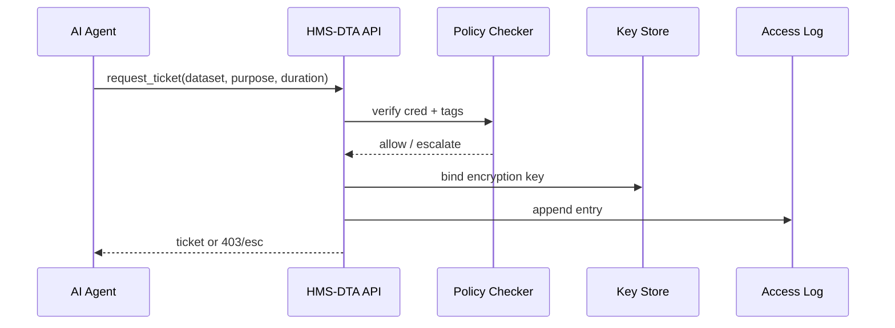

# Chapter 5: Data & Privacy Management Hub (HMS-DTA)


[← Back to Chapter 4: Compliance & Legal Reasoning Engine (HMS-ESQ)](04_compliance___legal_reasoning_engine__hms_esq__.md)

---

## 1. Why Do We Need a “Digital Records Room”?

Imagine the **Office of Natural Resources Revenue (ONRR)** runs an AI that spots suspicious royalty reports from oil platforms.  
The AI needs three totally different data sets:

1. Real-time **energy-grid telemetry** (low-sensitivity).  
2. **Passport applications** of the platform’s crew (very sensitive PII).  
3. Historical **lease contracts** (public documents but long-term retention).

If a single intern could download all of that in one click, we’d violate:

* HIPAA (health info of crew)  
* FedRAMP & FISMA (cloud storage rules)  
* The Privacy Act (unencrypted PII)

**HMS-DTA** is the **librarian + vault** that prevents such nightmares.  
It decides *who* can open *which* cabinet, *for how long*, and *logs* every peek.

---

## 2. The 5 Key Concepts (Plain English)

| Concept | Think of it as… | One-line definition |
|---------|-----------------|---------------------|
| Dataset Vault | The locked filing cabinet | Physical/object store that holds the raw bytes. |
| Sensitivity Tag | Color sticker on the folder | `public`, `controlled`, `restricted`, `secret`. |
| Retention Rule | Shred-after date stamp | How long the data may legally live. |
| Encryption Keyring | The key on the librarian’s belt | KMS key ID that encrypts this dataset. |
| Data Ticket | A library checkout slip | Time-boxed request to read/write a dataset. |

> Remember: **No ticket → no data.**

---

## 3. A 60-Second Tour: Granting an AI Read Access

Below is a minimal end-to-end example using the Python SDK `hms-dta`.  
All code blocks stay **under 20 lines**.

### 3.1 Agent Requests a Ticket

```python
# file: agt_energy_audit.py  (HMS-AGT will be Chapter 6)
from hms_dta import DTAClient      # pip install hms-dta

dta = DTAClient(base_url="http://localhost:8020")

ticket = dta.request_ticket(
    dataset="grid-telemetry-2024",
    purpose="anomaly_detection",
    duration="2h"
)
print(ticket.id)          # e.g., "TCK-9ab1..."
```

What happened?  
1. The agent sends *why* it needs the data (`purpose`).  
2. HMS-DTA checks the **Sensitivity Tag** (`public`) → auto-approves.  
3. A **Data Ticket** is issued for 2 hours.

### 3.2 Agent Downloads Data

```python
data = dta.fetch(ticket.id, slice="2024-04-01T00:00Z/24h")
# → returns Pandas DataFrame
```

If the agent tries this **after 2 hours**, HMS-DTA replies `403 Ticket Expired`.

### 3.3 Passport Data? Not So Fast!

```python
try:
    dta.request_ticket("passport-applications-2024", "crew_check", "2h")
except dta.NeedsHumanReview as e:
    print(e.reason)   # "restricted PII – escalated to Governance Queue"
```

Because the dataset is tagged `restricted`, the request is forwarded to the  
[Governance Layer & HITL](03_governance_layer___human_in_the_loop__hitl__.md) for a human decision.

---

## 4. What Happens Under the Hood?



Only **5 actors** keep the flow beginner-friendly:

1. **AI Agent** asks.  
2. **HMS-DTA** is the messenger.  
3. **Policy Checker** enforces tags & statutes.  
4. **KMS** guards the key.  
5. **Access Log** records every move.

---

## 5. Peeking at the Code Internals

### 5.1 Ticket Schema (`hms_dta/models.py`, 12 lines)

```python
class DataTicket(BaseModel):
    id: str            # "TCK-uuid"
    dataset: str
    owner: str         # requester email or agent id
    scope: str         # read | write | delete
    expires_at: datetime
    issued_at: datetime = Field(default_factory=datetime.utcnow)
```

### 5.2 Ultra-Tiny Access Checker (`hms_dta/access.py`, 14 lines)

```python
def check_access(user, dataset, purpose):
    meta = db.get_dataset_meta(dataset)
    if meta.tag == "public":
        return "auto"
    if meta.tag == "controlled" and user in meta.allowed_roles:
        return "auto"
    # Restricted or unknown → need human
    gov.submit({
        "action": "approve_data_access",
        "dataset": dataset,
        "user": user,
        "reason": purpose
    })
    raise NeedsHumanReview("Dataset is restricted")
```

Key points:

* **public / controlled** tags can be self-served.  
* All else is **escalated** to the Governance queue.  
* Every path calls `gov.submit`, keeping us consistent with Chapter 3.

---

## 6. Storing (Ingesting) a New Dataset

```python
# file: ingest_passport_batch.py
meta = {
  "dataset": "passport-applications-2024",
  "tag": "restricted",
  "retention": "10y",
  "encryption_key": "kms://pci/ppii-key-1"
}
dta.register_dataset(meta, file_path="batch_001.csv")
```

Explanation:

1. `register_dataset` writes metadata to the **Dataset Vault**.  
2. File is uploaded & encrypted with the given KMS key.  
3. Retention rule (`10y`) is stored for scheduled deletion.

---

## 7. Where Does HMS-DTA Live in the 3-Floor Architecture?

| Floor | What’s Here | Example Files |
|-------|-------------|---------------|
| Basement (HMS-SYS) | Object store, KMS, metadata DB | `docker/minio`, `docker/postgres` |
| Middle (HMS-SVC)   | REST/GraphQL API + Policy Checker | `hms_dta/access.py`, `hms_dta/api.py` |
| Top (HMS-MFE)      | Librarian UI, Audit dashboard | `mfe/DataVault.jsx` |

*Nothing* touches the Basement storage directly—everything flows through the Middle API.

---

## 8. Hands-On: Spin It Up Locally in 90 Seconds

```bash
git clone hms-utl
cd hms-utl/demo
docker compose up dta   # Postgres + MinIO + FastAPI
python sample_ingest.py # registers 2 datasets
python agt_energy_audit.py
```

Open `http://localhost:8020/audit` to see every ticket and download, sortable by user or dataset.

---

## 9. Recap & What’s Next

You now know:

✓ How HMS-DTA **classifies, encrypts, and retains** government data  
✓ The life-cycle of a **Data Ticket**—from request to expiration  
✓ How HMS-DTA cooperates with the [Governance Layer](03_governance_layer___human_in_the_loop__hitl__.md) for sensitive cases  
✓ Where the hub sits inside our **three-floor** architecture  

Ready to build the AI agents that will *use* those tickets responsibly?  
Jump ahead to [Chapter 6: AI Agent Framework (HMS-AGT / HMS-AGX)](06_ai_agent_framework__hms_agt___hms_agx__.md).

---

Generated by [AI Codebase Knowledge Builder](https://github.com/The-Pocket/Tutorial-Codebase-Knowledge)