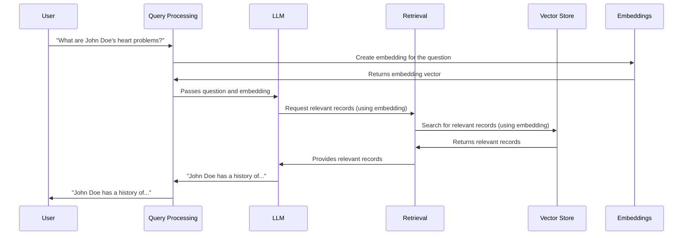

# Chapter 5: Embeddings

In the previous chapter, [Retrieval](04_retrieval.md), we learned how HMS-MED finds relevant information. Now, let's explore how HMS-MED understands the *meaning* of text, both in your questions and in the medical records. This is where *Embeddings* come in.

Imagine you want to find all records related to "heart problems".  Some records might mention "cardiac issues", while others might say "cardiovascular disease".  Embeddings help HMS-MED understand that these phrases are related, even though the exact words are different.

## What Problem Do Embeddings Solve?

Embeddings allow us to represent words and phrases as numerical vectors (lists of numbers).  This allows computers to understand the relationships between words.  Similar words will have similar vectors, and dissimilar words will have very different vectors.

## How Embeddings Work

Think of embeddings as turning words into coordinates on a map.  Similar words cluster together, allowing the system to understand the "meaning" of text by its location on this map.

For example, "heart problems", "cardiac issues", and "cardiovascular disease" would be located close to each other on this "meaning map".  Words like "apple" or "car" would be located far away.

## Using Embeddings in HMS-MED

When you ask a question like "What are John Doe's heart problems?", HMS-MED uses embeddings in two ways:

1. **Understanding your question:**  It converts your question into an embedding.

2. **Searching for relevant records:** It compares your question's embedding to the embeddings of the medical records in the [Vector Store](06_vector_store.md). Records with embeddings close to your question's embedding are considered more relevant.

## Internal Implementation

Here's a simplified view of how embeddings are used within HMS-MED:



The code for generating embeddings can be found in `HMS-EHR/backend/embeddings.py`.  Here's a simplified example:

```python
from langchain_core.embeddings import Embeddings
from langchain_openai import OpenAIEmbeddings

def get_embeddings_model() -> Embeddings:
    return OpenAIEmbeddings(model="text-embedding-3-small", chunk_size=200)

# Example usage:
embeddings_model = get_embeddings_model()
question_embedding = embeddings_model.embed_query("What are John Doe's heart problems?")

# question_embedding will now contain a list of numbers representing the question's meaning.
```

This code snippet shows how to initialize and use an embeddings model. The `embed_query` function takes text as input and returns an embedding vector.  The `HMS-EHR/backend/ingest.py` file also uses embeddings to store the vector representation of each document in the [Vector Store](06_vector_store.md) during the [Ingestion](07_ingestion.md) process.

## Conclusion

Embeddings are a powerful tool for representing the meaning of text, allowing HMS-MED to understand the relationships between words and phrases. This enables more accurate and relevant retrieval of medical information. Now, let's explore where these embeddings are stored and how they are accessed: [Vector Store](06_vector_store.md).


---

Generated by [AI Codebase Knowledge Builder](https://github.com/The-Pocket/Tutorial-Codebase-Knowledge)