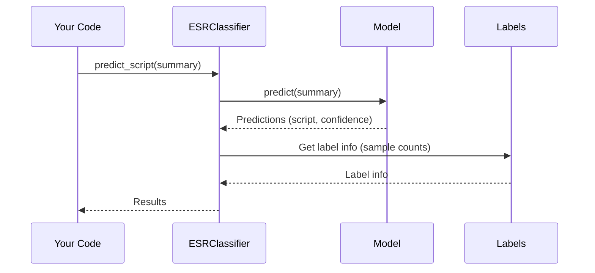

# Chapter 5: ESRClassifier (Machine Learning for ESRs)

Coming from our understanding of how the [AsyncProcessor (Background Task Management)](04_asyncprocessor__background_task_management__.md) helps us run long tasks efficiently, let's explore how we can use machine learning to make our ESR handling even smarter. Imagine a user reports a problem with logging in.  Instead of manually searching for solutions, wouldn't it be great if the system could automatically suggest relevant scripts or actions based on past similar ESRs? That's exactly what the `ESRClassifier` does.

## What is ESRClassifier?

The `ESRClassifier` is like a smart assistant that learns from past experiences. It uses machine learning, specifically a technique called text classification, to understand and categorize ESRs.  It learns from past ESR summaries and descriptions, along with the scripts that were used to resolve them.  Then, when a new ESR comes in, it can predict which script is most likely to solve the problem.

## Key Concepts

1. **Training Data:**  Just like a student needs textbooks to learn, the `ESRClassifier` needs training data. This data consists of examples of past ESRs and their corresponding resolution scripts.

2. **Model:** The "model" is the brain of the `ESRClassifier`. It's built by learning from the training data. Think of it as a set of rules the classifier uses to make predictions.

3. **Prediction:** When a new ESR arrives, the classifier uses its model to predict which script is most likely to resolve the issue.

## Use Case: Recommending a Script

Let's say we have a new ESR with the summary "User cannot reset password."  Here's how we can use the `ESRClassifier` to recommend a script:

```ruby
require_relative 'esr_classifier'

success, results, message = ESRClassifier.predict_script("User cannot reset password")

if success
  top_recommendation = results.first
  puts "Recommended script: #{top_recommendation[:script]}" # Output: reset_password (example)
  puts "Confidence: #{top_recommendation[:confidence]}" # Output: 0.85 (example)
else
  puts "Error: #{message}"
end
```

**Explanation:**

1. We call `ESRClassifier.predict_script` with the ESR summary.
2. The classifier uses its model to make a prediction.
3. The result includes the recommended script and a confidence score (how sure the classifier is about its prediction).

## Internal Implementation

Here's a simplified sequence diagram showing how `predict_script` works:



The `ESRClassifier` loads the trained model and uses it to predict the script. It also retrieves information about the labels (scripts) from a separate file to provide additional context.

## Code Example: `esr_classifier.rb`

Let's look at a simplified snippet from `esr_classifier.rb`:

```ruby
# File: esr_classifier.rb (simplified)
module ESRClassifier
  def self.predict_script(summary, description = '')
    # ... (Load the model) ...
    prediction = model.predict(summary) # Predict the script
    # ... (Format the results) ...
  end
end
```

The `predict_script` method loads the trained model and uses it to predict the most likely script based on the provided summary and description.

## Training the Model

The model needs to be trained before it can make predictions.  This is typically done using historical ESR data.  The `HMS-ESR Library` provides a method for training the model:

```ruby
# File: esr_classifier.rb (simplified)
module ESRClassifier
  def self.train_model_from_xml(xml_file_path)
    # ... (Parse XML and extract training data) ...
    model = FastText.train_supervised(input: training_data) # Train the model
    # ... (Save the model) ...
  end
end
```

This method takes a path to an XML file containing historical ESR data, extracts the relevant information, and uses it to train a new model.  This process is usually done offline and can take some time depending on the size of the data.  You'll learn more about how to use this method in later chapters.

## Conclusion

In this chapter, we learned about the `ESRClassifier` and how it uses machine learning to recommend scripts for resolving ESRs. We saw how to use `predict_script` to get recommendations and explored the internal implementation. In the next chapter, we'll discuss the [AutoResponder (Automated ESR Responses)](06_autoresponder__automated_esr_responses__.md), which uses the `ESRClassifier` to automatically respond to new ESRs.


---

Generated by [AI Codebase Knowledge Builder](https://github.com/The-Pocket/Tutorial-Codebase-Knowledge)