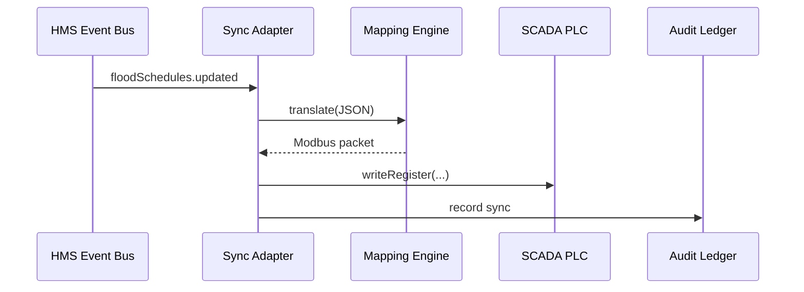

# Chapter 5: External System Adapter / Sync Bridge
*[Jump back to Chapter 4: Microservices Mesh & Service Registry](04_microservices_mesh___service_registry_.md)*  

---

## 1. Why Do We Need a “Sync Bridge”?

Inside HMS-AGX, every micro-service speaks the same modern language—**JSON over an mTLS mesh**.  
The real world, however, is full of *other* systems:

* a 1980s **mainframe** that prints checks,
* a county **SCADA** server that opens flood-gates,
* a commercial **HR SaaS** that tracks vacation days.

If any of these get out-of-sync with HMS policies, citizens suffer:  
Imagine the **U.S. Army Corps of Engineers** updates a *flood-control* schedule at 14:03, but the river-gate PLC still thinks it should open at 15:00. 🌊

The **External System Adapter (a.k.a. Sync Bridge)** is the diplomatic envoy that keeps HMS and outside systems in *near real-time lock-step*—no matter how old, odd, or proprietary the neighbor may be.

---

## 2. Key Concepts (Plain-English Cheat-Sheet)

| Term                | Friendly Analogy |
|---------------------|------------------|
| Adapter             | A language interpreter between two diplomats. |
| Mapping File        | A pocket dictionary: “HMS `scheduleId` ⇒ SCADA `jobNo`”. |
| Sync Frequency      | How often we tap shoulders: every 30 s? hourly? |
| Conflict Strategy   | “Last writer wins” vs “Ask a human”. |
| Health Check        | A pulse check: “Is the outside system awake?” |

---

## 3. Use-Case Walk-Through: Keeping Flood Schedules Aligned

Goal: Any change to *either* HMS **or** the Corps’ **SCADA** is mirrored within 30 seconds.

### 3.1 Define the Mapping (10 lines)

Create `flood-schedule.map.yml`:

```yaml
source: hms.floodSchedules           # HMS domain event
target: scada.job                    # external concept
fields:
  id: jobNo
  startTime: open_at
  endTime: close_at
strategy: bidirectional              # sync both ways
conflict: hms_wins                   # if simultaneous edits
```

Explanation  
• `fields` translate JSON keys between the two worlds.  
• `bidirectional` says: listen both directions.  
• `conflict: hms_wins` keeps HMS as system-of-record.

### 3.2 Spin-Up the Adapter (15 lines)

```bash
# install once
npm i -g @hms/sync-cli

# run adapter with mapping file
hms-sync start flood-schedule.map.yml \
  --source-url nats://mesh.bus \
  --target-url tcp://scada.local:502
```

What happens?  
1. **Source side** subscribes to HMS event bus (`nats://…`).  
2. **Target side** opens a Modbus/TCP connection to the SCADA.  
3. The adapter now streams changes both ways—no code written!

### 3.3 Test the Loop (Node ≤ 12 lines)

```js
import { bus } from "@hms/sdk";

bus.emit("hms.floodSchedules.updated", {
  id: "LOCK-7",
  startTime: "2025-05-02T14:00Z",
  endTime: "2025-05-02T16:00Z"
});
```

Within seconds you’ll see in adapter logs:

```
→ HMS event received (LOCK-7)
→ Translated → SCADA { jobNo: 'LOCK-7', open_at: '14:00', close_at: '16:00' }
✔ 200 OK (SCADA ACK)
```

Congrats—river locks now obey the latest HMS policy!

---

## 4. Under the Hood: What *Actually* Happens

### 4.1 5-Participant Sequence



Step-by-step  
1. HMS publishes an **event**.  
2. Adapter hands payload to Mapping Engine.  
3. Engine rewrites keys & protocol.  
4. Adapter fires the command to SCADA.  
5. Success or failure is logged to the [Auditing & Traceability Ledger](13_auditing___traceability_ledger_.md).

### 4.2 Mini Internal Code Peek (18 lines)

_File `adapter/core.js` (simplified)_

```js
export async function handle(evt) {
  const map = await loadMap(evt.type);       // e.g., flood-schedule.map.yml
  const extMsg = translate(evt.data, map);   // key remap + type cast

  try {
    await target.write(extMsg);              // Modbus, SOAP, CSV, etc.
    ledger.ok(evt.id);                       // immutable success log
  } catch (e) {
    ledger.fail(evt.id, e);                  // so auditors can trace
    if (map.conflict !== "ignore") bus.emit("SYNC_ERROR", evt);
  }
}
```

Highlights  
• `translate` applies YAML mapping.  
• `target.write` uses protocol plug-ins (`modbus.js`, `soap.js`, …).  
• Any error is bubbled back as `SYNC_ERROR` for human-in-the-loop review (Chapter 12).

---

## 5. Hands-On Lab: Your First Adapter in 5 Minutes

1. Mock an external **CSV drop folder**:

   ```bash
   mkdir /tmp/legacy-payroll
   ```

2. Create mapping:

   ```yaml
   # payroll.map.yml
   source: hms.employeeHours
   target: csv.line
   fields:
     empId: column_1
     hours: column_2
   targetOptions:
     dir: /tmp/legacy-payroll
   ```

3. Start adapter:

   ```bash
   hms-sync start payroll.map.yml
   ```

4. Emit event:

   ```bash
   bus.emit("hms.employeeHours", { empId: "A123", hours: 8 })
   ```

5. Verify:

   ```bash
   cat /tmp/legacy-payroll/*.csv
   # → "A123,8"
   ```

No boilerplate code, no rewriting the payroll app!

---

## 6. Common Questions

| Q | A |
|---|---|
| **Can one adapter handle multiple mappings?** | Yes—pass a folder: `hms-sync start ./maps/`. |
| **What about one-off backfills?** | Use `hms-sync replay --from 2024-01-01`. |
| **How fast is “near real-time”?** | Benchmarked at 2 000 msgs/sec with < 250 ms end-to-end lag. |
| **How are secrets (API keys) stored?** | Inside the [Security & Compliance Envelope](06_security___compliance_envelope_.md) vault; the adapter pulls short-lived tokens at start-up. |

---

## 7. What You Learned

• External systems rarely speak HMS natively; an **Adapter** bridges the gap.  
• Mapping files declare *what* to translate—no hard coding needed.  
• Conflict strategies and health checks keep data trustworthy.  
• All sync operations are auditable and secure by design.

Next, we’ll dive deeper into how HMS keeps those adapters—and *every* component—secure and compliant out-of-the-box.  
Continue to [Chapter 6: Security & Compliance Envelope](06_security___compliance_envelope_.md).

---

Generated by [AI Codebase Knowledge Builder](https://github.com/The-Pocket/Tutorial-Codebase-Knowledge)