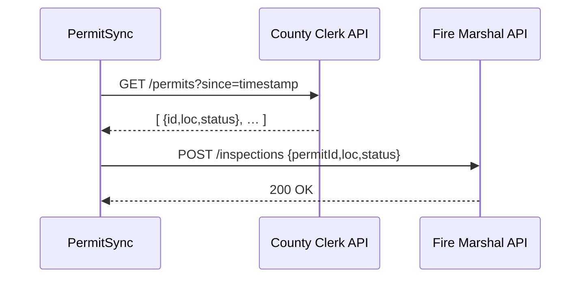

# Chapter 5: External System Synchronization

Welcome back! In [Chapter 4: Financial Services Module (HMS-ACH)](04_financial_services_module__hms_ach__.md) we saw how to handle payments inside HMS. Sometimes we also need to keep **external platforms**—like scheduling systems, document repositories, or CRMs—in lockstep with our HMS data. That’s where **External System Synchronization** comes in.

---

## 1. Why Synchronize with Third-Party Systems?

Imagine a county clerk’s office that issues building permits and a fire marshal’s inspection team that needs those permits in real time:

 1. Clerk posts a new permit  
 2. Fire marshal’s schedule must update within seconds  
 3. If one system goes down, updates must retry later  
 4. Conflicts (e.g., permit revoked) must resolve correctly  

Without a sync layer, you’d write brittle scripts or manual exports. Our **synchronization connector** handles polling, webhooks, conflict resolution, and retries—so both systems stay in perfect harmony.

---

## 2. Key Concepts

1. **Source Connector**  
   Defines where to read changes (e.g., County Clerk API).  
2. **Polling vs. Webhooks**  
   - *Polling*: Regularly ask “What changed?”  
   - *Webhooks*: Receive pushes when data changes.  
3. **Target Connector**  
   Specifies where to send updates (e.g., Fire Marshal API).  
4. **Conflict Resolution**  
   Rules for “which change wins” when both sides update the same record.  
5. **Retry Strategy**  
   Automatic back-off and retries if the network or API fails.

---

## 3. Using the Sync Module

Below is a simple **building permit sync** that polls every 5 minutes:

```javascript
// file: sync/buildingPermitSync.js
const sync = require('hms-sync').init({ name: 'PermitSync' })

sync.source('CountyClerkAPI')
  .poll('/permits', { interval: 300 })        // seconds
  .onChange(async (permit) => {
    // map clerk record → marshal inspection request
    await sync.target('FireMarshalAPI').post('/inspections', {
      permitId: permit.id,
      address: permit.location,
      status: permit.status
    })
  })
  .start()
```

Explanation:

- `init` wires in logging, error-handling, and retry logic.  
- `source('…').poll` sets up a regular HTTP GET.  
- `onChange` fires for each new or updated permit.  
- `target('…').post` delivers updates to the fire marshal’s system.  
- `start` launches the connector loop.

---

## 4. Step-by-Step Workflow

Here’s what happens whenever the poll runs:



1. **Poll**: `PermitSync` asks the clerk for changes since last run.  
2. **Receive**: Clerk returns a list of new/updated permits.  
3. **Push**: For each permit, `PermitSync` calls the marshal’s API.  
4. **Acknowledge**: On success, updates are marked complete.  

Retries happen automatically if the marshal’s API is down.

---

## 5. Under the Hood: Core Implementation

Let’s peek at a simplified version of the core `hms-sync` library.

### 5.1 Initialization & Connector Registration

```javascript
// file: hms-sync/core.js
exports.init = ({ name }) => {
  const jobs = []
  return {
    source: (apiName) => {
      const job = { apiName }
      jobs.push(job)
      return {
        poll: (path, opts) => {
          job.path = path
          job.interval = opts.interval
          return {
            onChange: (handler) => {
              job.handler = handler
              return { start: () => runJob(job) }
            }
          }
        }
      }
    },
    target: (apiName) => ({ post: (path, data) => makeHttpCall(apiName, 'POST', path, data) })
  }
}
```

- We collect each **job** with source, path, interval, and handler.  
- `start` calls `runJob(job)` (shown next).  
- `target(...).post` is a thin wrapper over your HTTP client.

### 5.2 Job Runner & Retry Logic

```javascript
// same file, continuation
async function runJob(job) {
  setInterval(async () => {
    try {
      const items = await makeHttpCall(job.apiName, 'GET', job.path + `?since=${job.last}`)
      for (const item of items) {
        await job.handler(item)
      }
      job.last = Date.now()
    } catch (err) {
      console.error(`Sync error on ${job.apiName}:`, err)
      // retry logic could go here (exponential back-off, dead letter queue, etc.)
    }
  }, job.interval * 1000)
}
```

1. **setInterval** triggers every `interval` seconds.  
2. **GET** fetches new records since the last timestamp.  
3. **handler** sends each change to the target.  
4. Errors are caught, logged, and retried later.

---

## 6. Summary

In this chapter you learned:

- **Why** External System Synchronization keeps third-party platforms (schedulers, CRMs, repos) in sync with HMS data.  
- **Key concepts**: polling, webhooks, conflict resolution, retries.  
- **How to** define a connector that polls the County Clerk API and posts to the Fire Marshal API.  
- **What happens under the hood**: scheduling jobs, HTTP calls, automatic retries.

Up next, we’ll build dashboards and management APIs so your administrators can monitor and control these sync jobs.  
[Chapter 6: Management Layer](06_management_layer_.md)

---

Generated by [AI Codebase Knowledge Builder](https://github.com/The-Pocket/Tutorial-Codebase-Knowledge)