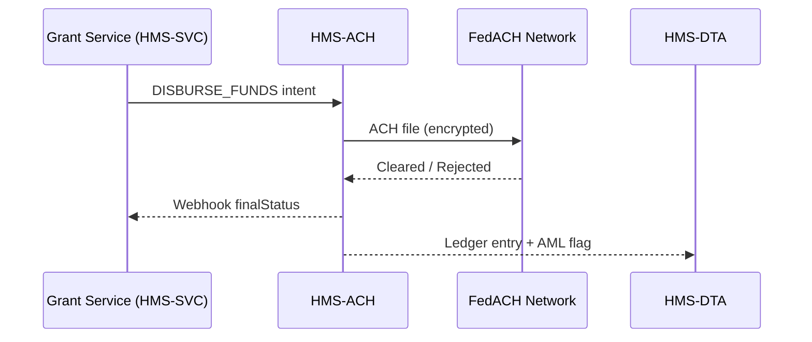

# Chapter 5: Financial Transaction Core (HMS-ACH)

*(a.k.a. “The Treasury’s invisible vault where every cent is checked, cleared, and counted.”)*  

[← Back to Chapter 4: Governance Gateway (HMS-GOV)](04_governance_gateway__hms_gov__.md)

---

## 0. Why Do We Need HMS-ACH?

### A quick citizen story  
Tanya wins a $1,200 community-arts grant from the National Endowment for the Arts (NEA).  
Across town, Malik cancels his $25 park-permit and expects a refund.

Both payments—one **outbound**, one **inbound**—must:

1. Land in the right bank account (routing number is real).  
2. Pass anti-money-laundering (AML) checks.  
3. Update the government’s ledgers so audits balance to the penny.  

The **Financial Transaction Core (HMS-ACH)** is the module that makes all three happen automatically, safely, and in a PCI-compliant manner.

---

## 1. What Exactly Does HMS-ACH Do?

| Think of it as… | Official term | One-line job description |
|-----------------|--------------|--------------------------|
| Airport TSA | Routing Number Validator | Confirms the bank/credit-union exists. |
| Air-traffic tower | Payment Clearing Engine | Sends/receives ACH files, waits for “cleared” signals. |
| Accountant | Ledger Reconciler | Writes matching debit/credit lines into Treasury books. |
| Customs dog | AML Guard | Flags suspicious patterns over $10k or rapid transfers. |
| Locked vault | PCI Token Vault | Encrypts and stores account numbers & card PANs. |

---

## 2. Talking to HMS-ACH in Three Steps

We’ll send Tanya’s $1,200 grant payment from an HMS-SVC micro-service.

```js
// grantDisbursement.js   (12 lines)
import { achRequest } from '@hms/ach-sdk'

export async function payGrant(grant) {
  const res = await achRequest({
    intent:   'DISBURSE_FUNDS',
    amount:   1200_00,             // cents to avoid floats
    currency: 'USD',
    recipient: {
      name:        'Tanya Alvarez',
      routing:     '031000503',
      accountLast4:'1234'
    },
    meta: { program: 'NEA-Community-Arts' }
  })
  return res.status           // ➜ 'QUEUED'
}
```

Explanation  
1. **intent** tells ACH which flow to run (`DISBURSE_FUNDS` vs `COLLECT_REFUND`).  
2. Amount is sent in *cents* to dodge floating-point bugs.  
3. We pass only the **last 4** of the account—full PAN lives in the PCI Token Vault.  
4. The promise resolves instantly with `QUEUED`; final clearance happens asynchronously.

---

## 3. Receiving Status Updates

Your service can listen for webhook callbacks (or poll):

```js
// webhook handler (9 lines)
app.post('/webhooks/ach', (req, res) => {
  const { id, finalStatus } = req.body
  if (finalStatus === 'CLEARED')
    markGrantPaid(id)
  else if (finalStatus === 'FAILED')
    notifyFinanceTeam(id)
  res.sendStatus(200)      // ACK
})
```

Typical statuses: `QUEUED → SENT → CLEARED` or `QUEUED → REJECTED`.

---

## 4. What Happens Under the Hood?



1. Service calls HMS-ACH over the internal network.  
2. ACH batches the payment into a nightly FedACH file.  
3. Cleared status triggers two writes:  
   • **Webhook** to the originating service.  
   • **Ledger & telemetry** to [Data & Telemetry Hub (HMS-DTA)](06_data___telemetry_hub__hms_dta__.md).  

---

## 5. A Peek at the Code (Simplified)

### 5.1 Routing Number Check (10 lines)

```js
// validation/routing.js
import abaTable from './abaRegistry.json' // offline copy

export function validateRouting(rt) {
  return abaTable.includes(rt)
        ? { ok: true }
        : { ok: false, error: 'Unknown routing number' }
}
```

Called on **every** inbound/outbound payment before queuing.

### 5.2 Minimal AML Guard (14 lines)

```js
// aml/guard.js
let dailyTotals = new Map()

export function amlCheck({ amount, recipient }) {
  const total = (dailyTotals.get(recipient) || 0) + amount
  dailyTotals.set(recipient, total)

  if (amount >= 10_000_00 || total >= 20_000_00)
    return { ok: false, code: 'AML_THRESHOLD' }

  return { ok: true }
}
```

Real deployments integrate with FinCEN watch lists, but the idea is the same.

### 5.3 Ledger Write (15 lines)

```js
// ledger/posting.js
import { insert } from '../db.js'

export async function post(entry) {
  /* entry = {
       type:'debit', amount:1200_00,
       account:'Treasury.Main', counterAccount:'Tanya'
     } */
  await insert('ledger', {
    ...entry,
    ts: Date.now(),
    ref: crypto.randomUUID()
  })
}
```

A matching **credit** is posted on clearance; reconciliation jobs ensure sums zero out.

---

## 6. Common “Uh-oh” Moments & Fixes

| Issue | Quick fix |
|-------|-----------|
| `REJECTED` with reason `INVALID_ROUTING` | Re-validate user input; many typos start with “0” dropping. |
| Webhook not firing | Ensure your service’s URL is whitelisted in HMS-OPS firewall. |
| “AML_THRESHOLD” blocks small refund | Daily cumulative total may have tripped the rule; reset map at UTC midnight or use long-term store. |
| Ledger unbalanced at day-end | Run `npm run ach:reconcile` or check for missing clearance events. |

---

## 7. Where HMS-ACH Sits in the Stack

```
Citizen Browser
  ↓            (UI)
HMS-MFE + UIL
  ↓            (API)
HMS-SVC
  ↓            (external calls)
HMS-GOV
  ↓            (money)
HMS-ACH  ← you are here
  ↓
Banks / FedACH
  ↓
HMS-DTA & HMS-OPS (logs, metrics)
```

---

## 8. Recap

You now know:

* Why the **Financial Transaction Core** is the single vault for every dollar moving through the platform.  
* The five mini-roles inside HMS-ACH: Validator, Clearing Engine, Reconciler, AML Guard, PCI Vault.  
* How to queue a payment, listen for clearance, and understand the behind-the-scenes flow.  
* Where to look when something fails (routing check, AML, ledger).

Money is flowing, books are balanced, and auditors are happy.  
Next, let’s learn how all those payment events—and everything else—get stored and analyzed in the [Data & Telemetry Hub (HMS-DTA)](06_data___telemetry_hub__hms_dta__.md).

---

---

Generated by [AI Codebase Knowledge Builder](https://github.com/The-Pocket/Tutorial-Codebase-Knowledge)