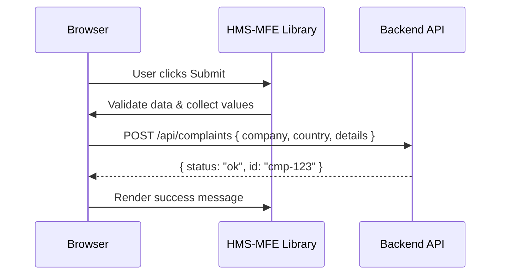

# Chapter 5: Frontend Interface

Welcome back! In [Chapter 4: Interface Layer](04_interface_layer_.md), we learned how HMS-OPS wraps backend workflows behind simple APIs. Now it’s time to build the user-facing portals themselves using the **HMS-MFE** library of reusable UI components. Think of it as a federal design system—consistent navigation, forms, tables, and accessibility baked in—so every agency site “feels” the same.

---

## 1. Motivation & Central Use Case

Imagine the U.S. Trade Representative portal where:

- **Citizens** file trade complaints.  
- **Agency staff** track each complaint’s status.  
- **Managers** review AI-generated resolution proposals.

Without a shared UI kit, every team builds slightly different buttons, forms, and layouts. That means more bugs, inconsistent styles, and extra work on accessibility. HMS-MFE solves this by providing:

- A **standardized design system** (colors, fonts, spacing).  
- **Prebuilt components** (NavBar, Form, DataTable, Chart).  
- **Accessibility features** (semantic HTML, ARIA, keyboard support).  
- **Theming & branding** to match any agency’s look.

---

## 2. Key Concepts

1. Component Library  
   - Prepackaged React/Vue widgets: `Page`, `NavBar`, `Form`, `TextInput`, `DataTable`, `Button`.  

2. Theming & Design Tokens  
   - Central color, typography, spacing values so every portal looks uniform.  

3. Accessibility  
   - Built-in ARIA labels, focus management, keyboard navigation.  

4. Composition  
   - Small widgets you snap together to build pages in minutes.  

5. Portal Variants  
   - **Citizen** portal (public forms)  
   - **Admin** console (tables, actions)  
   - **Manager** dashboard (charts, reports)  

---

## 3. Using the Frontend Interface

Let’s build a **Trade Complaint** page in under 20 lines of code:

```jsx
// File: TradeComplaintPage.jsx
import {
  Page, NavBar, Form, TextInput, Select, Button
} from 'hms-mfe'

export function TradeComplaintPage() {
  const handleSubmit = data => {
    // In reality: call Backend API and show confirmation
    console.log('Submitted:', data)
  }

  return (
    <Page title="Submit Trade Complaint">
      <NavBar items={['Home','File Complaint','Status']} />
      <Form onSubmit={handleSubmit}>
        <TextInput name="company" label="Company Name" required />
        <Select
          name="country" label="Foreign Country"
          options={['China','EU','Canada']}
        />
        <TextInput
          name="details" label="Complaint Details"
          multiline
        />
        <Button type="submit">Submit</Button>
      </Form>
    </Page>
  )
}
```

Explanation:

- `Page` sets up the standard header/footer and page title.  
- `NavBar` offers consistent navigation links.  
- `Form` handles field validation and submits a JS object.  
- `TextInput`, `Select`, and `Button` are styled, accessible inputs.

---

## 4. Under the Hood: What Happens on Submit

Here’s a simple sequence of events when a user clicks **Submit**:



1. **Validate & collect**: `<Form>` ensures required fields are filled.  
2. **POST**: data is sent to `/api/complaints`.  
3. **Response**: success payload returns an ID.  
4. **Notify**: library shows a toast or inline message.

---

## 5. Peek Inside HMS-MFE Components

### 5.1 Form.jsx

```jsx
// File: hms-mfe/Form.jsx
export function Form({ children, onSubmit }) {
  const handle = e => {
    e.preventDefault()
    const values = Object.fromEntries(new FormData(e.target))
    onSubmit(values)
  }
  return <form onSubmit={handle}>{children}</form>
}
```
> A simple wrapper: blocks native submit, gathers field values, calls your handler.

### 5.2 Button.jsx

```jsx
// File: hms-mfe/Button.jsx
export function Button(props) {
  return (
    <button
      {...props}
      className="hms-button"
      aria-pressed={props['aria-pressed']}
    >
      {props.children}
    </button>
  )
}
```
> Default styling and ARIA support keep buttons uniform and accessible.

---

## 6. Analogy & Takeaways

- Think of HMS-MFE like the **GSA’s standard web style guide** rolled into code:  
  - Instead of reinventing the menu or form layout, you import tested, branded components.  
  - Accessibility checks are baked in, not bolted on later.

- By composing these widgets, you spin up new portals in hours, not weeks—and every federal site stays on-brand and compliant.

---

## Conclusion

You’ve seen how the **Frontend Interface**—powered by HMS-MFE—lets you build citizen portals, admin consoles, and dashboards with consistent UI, accessibility, and theming. Next up: learn how to guide users through their goals using [Intent-Driven Navigation](06_intent_driven_navigation_.md).

---

Generated by [AI Codebase Knowledge Builder](https://github.com/The-Pocket/Tutorial-Codebase-Knowledge)