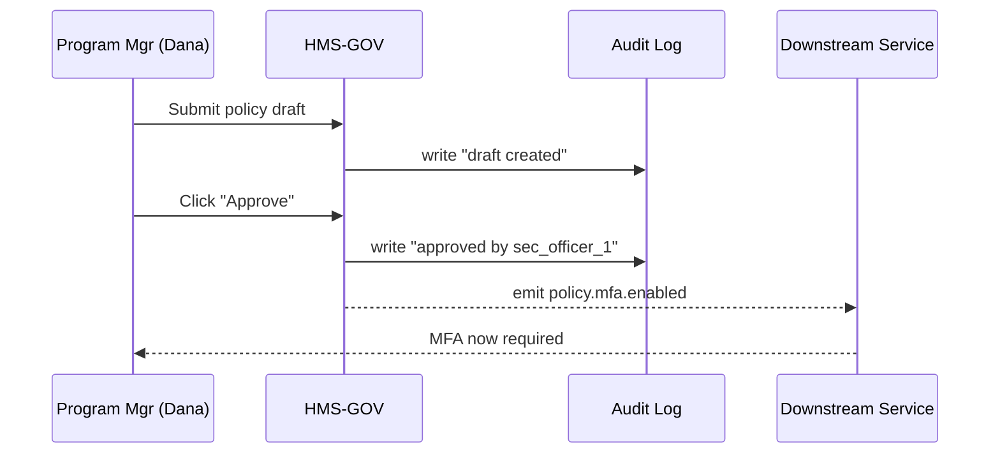

# Chapter 5: Governance Layer (HMS-GOV)

[← Back to Chapter 4: Modular Component Library](04_modular_component_library_.md)

---

## 1. Why Do We Need a “City Hall” for Software?

Meet Dana, the **Program Manager** at the **Office of Policy Development & Research (PD&R)**.  
Yesterday she noticed a security gap:

1. Citizens can file housing-grant forms without multi-factor authentication (MFA).  
2. Adding MFA will affect three agencies and two AI agents.  
3. Every change must be reviewed, approved, and logged for auditors.

If Dana emails engineers, versions get lost and auditors frown.  
Instead she opens **HMS-GOV**—a single, web-based “City Hall” where **policies are proposed, debated, approved, and enforced** across the whole HMS platform.

---

## 2. High-Level Map

```
+----------------------+
| HMS-GOV Dashboard    |
|  • Policy Drafts     |
|  • Approval Queue    |
|  • Audit Logs        |
|  • AI Watchdog       |
+----------------------+
        |  publishes
        v
+----------------------+
| Policy API (events)  |
+----------------------+
        |  consumed by
        v
+----------------------+     +----------------------+
|   HMS-MFE Frontend   | <-- | AI Agents & Services |
+----------------------+     +----------------------+
```

---

## 3. Key Concepts (Plain English)

| Term | What It Means | Analogy |
|------|---------------|---------|
| Policy Draft | A proposed rule (e.g., “Require MFA for housing-grant login”). | A new city ordinance on the council’s agenda. |
| Approval Queue | List of drafts awaiting signatures from authorized roles. | Stack of bills on the governor’s desk. |
| Audit Log | Tamper-proof history of who did what, when. | Court stenographer transcript. |
| AI Oversight Panel | Page showing AI suggestions & risk scores. | Advisory board briefing the council. |
| Policy Event | Machine-readable message like `policy.mfa.enabled`. | Press release sent to all departments. |

---

## 4. The MFA Use-Case in 3 Tiny Steps

### 4.1 Draft the Policy

```ts
// POST /policies
{
  "id": "mfa_2023_10",
  "title": "Enable MFA for Housing-Grant Filings",
  "description": "All citizen logins must pass MFA.",
  "status": "draft"
}
```

*What happens?*  
The draft appears on Dana’s dashboard with status “Awaiting Approval”.

---

### 4.2 Approve the Policy

```ts
// PATCH /policies/mfa_2023_10
{ "action": "approve", "approverId": "sec_officer_1" }
```

*Result:* Status flips to “active”; an **audit log** entry is created.

---

### 4.3 Event Gets Broadcast

```json
{
  "type": "policy.mfa.enabled",
  "payload": { "effectiveDate": "2023-10-12" }
}
```

HMS-MFE and AI agents subscribe and instantly enforce MFA. No code redeploy!

---

## 5. How It Works (No Heavy Code)



---

## 6. Under the Hood (Step-by-Step)

1. **REST Layer**: Accepts `/policies` CRUD requests.  
2. **RBAC Check**: Verifies the caller has `role=program_manager` (see [Chapter 3](03_role_based_access_control__rbac__.md)).  
3. **Policy Store**: Writes the draft to a versioned database table.  
4. **Approval Workflow**: Moves item to “queue” and pings required approvers.  
5. **Event Bus**: On final approval, publishes a `policy.*` event to Kafka/SNS.  
6. **Audit Trail**: Every transition logs to an immutable `audit_logs` table (covered deeper in [Compliance & Audit Trail Module](08_compliance___audit_trail_module_.md)).

---

## 7. Minimal Code Peek (≤ 20 Lines Each)

### 7.1 Policy Schema

```ts
// models/Policy.ts
export type Status = "draft" | "queued" | "active" | "rejected";

export interface Policy {
  id: string;
  title: string;
  description: string;
  status: Status;
  createdBy: string;
  approvals: string[];   // userIds
  timestamps: Record<Status, number>;
}
```

*Purpose:* A single TypeScript interface shared by frontend & backend.

---

### 7.2 Guarded Route

```ts
// routes/createPolicy.ts
import { can } from "../access/can";      // from RBAC chapter
import { save } from "../db/policies";

app.post("/policies", (req, res) => {
  if (!can(req.user.role, "create:policy")) return res.status(403).end();
  const draft = { ...req.body, status: "draft", createdBy: req.user.id };
  save(draft);
  res.json(draft);
});
```

*Highlights:* One line of RBAC keeps unauthorized users out.

---

### 7.3 Event Publisher

```ts
// workflows/onApproved.ts
import bus from "../infra/eventBus";

export function onApproved(policy) {
  if (policy.status !== "active") return;
  bus.publish(`policy.${policy.id}.enabled`, {
    effectiveDate: Date.now(),
  });
}
```

*Takeaway:* Publishing an event is only two lines—simple, yet powerful.

---

## 8. File Structure Glimpse

```
hms-gov/
  src/
    models/          // Policy.ts, AuditEntry.ts
    routes/          // createPolicy.ts, approvePolicy.ts
    workflows/       // onApproved.ts
    pages/           // Dashboard.vue, AuditLog.vue
    infra/
      eventBus.ts    // wraps Kafka or SNS
      db.ts          // tiny ORM wrapper
```

Each folder maps to a clear concern—easy for beginners to navigate.

---

## 9. Hands-On Exercise (5 min)

1. Run `npm start` inside `hms-gov`.  
2. `POST /login` with `"role":"program_manager"`.  
3. `POST /policies` (body as in 4.1).  
4. Check `/dashboard`—your draft appears.  
5. `PATCH /policies/<id>` to approve it.  
6. Watch the terminal: an event like `policy.mfa.enabled` prints.  
7. Open any HMS-MFE page—login now asks for MFA. 🎉

---

## 10. Common Pitfalls & Quick Fixes

| Problem | Symptom | Fix |
|---------|---------|-----|
| Missing approver signature | Policy stuck in “queued” | Verify `requiredApprovers` list in settings. |
| Silent event failures | Downstream never updates | Add retry & dead-letter queue in `eventBus.ts`. |
| Audit gaps | Auditors flag missing records | Never bypass `audit.write()`—wrap it in middleware. |

---

## 11. What You Learned

• HMS-GOV centralizes **policy drafting, approval, and auditing**.  
• A tiny **event** turns policy decisions into platform-wide behavior.  
• The layer leans on earlier abstractions: RBAC guards actions, and UI components come from the Library.

Ready to explore the ethics and principles that guide these policies?  
Continue to [Chapter 6: AI Governance Values Framework](06_ai_governance_values_framework_.md).

---

---

Generated by [AI Codebase Knowledge Builder](https://github.com/The-Pocket/Tutorial-Codebase-Knowledge)