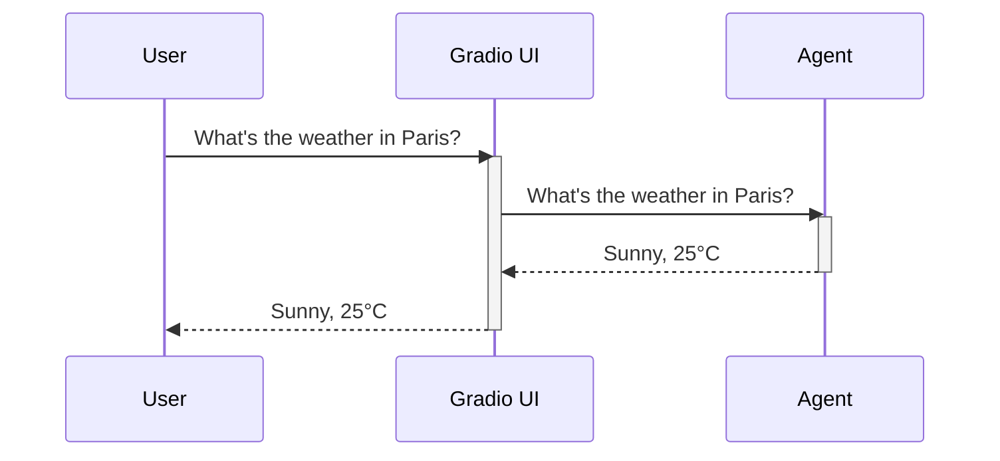

# Chapter 5: Gradio UI

In the previous chapter, [Memory](04_memory.md), we learned how an agent remembers past interactions. Now, let's explore how to easily interact with our agent using a visual interface. Imagine you want to give your agent tasks, upload files, and see its responses without writing any code. That's where the **Gradio UI** comes in. It's like a user-friendly order terminal for your agent.

## What is the Gradio UI?

The Gradio UI provides a visual interface for interacting with your `smolagents` agent.  It's like a messenger app where you can type your requests, upload files, and see the agent's responses in real-time.

## Using the Gradio UI

Let's launch a simple Gradio UI for our agent.

```python
from smolagents import CodeAgent, GradioUI, InferenceClientModel

# Create a simple agent (no tools for this example)
agent = CodeAgent(model=InferenceClientModel())

# Create and launch the Gradio UI
GradioUI(agent).launch()
```

This code creates a `CodeAgent` and then launches a Gradio UI for it. Running this code will open a web page in your browser where you can interact with the agent.  You can type a task in the text box and click "Submit". The agent's responses will appear in the chat window.

## Uploading Files with the Gradio UI

You can also upload files to your agent through the Gradio UI.  This is useful for tasks that involve processing documents or images.

```python
from smolagents import CodeAgent, GradioUI, InferenceClientModel

# Specify a folder for uploaded files
file_upload_folder = "./data"

# Create and launch the Gradio UI with file upload enabled
GradioUI(agent, file_upload_folder=file_upload_folder).launch()
```

This code specifies a folder (`./data`) where uploaded files will be stored.  The Gradio UI will now include a file upload button.  By default, it allows `.pdf`, `.docx`, and `.txt` files. You can customize the allowed file types.

## Inside the Gradio UI

Here's a simplified sequence diagram showing how you interact with an agent through the Gradio UI:



1. You type a task in the Gradio UI.
2. The Gradio UI sends the task to the [Agent](01_agent.md).
3. The agent processes the task and generates a response.
4. The Gradio UI displays the agent's response.

The `GradioUI` class in the `gradio_ui.py` file handles the interaction between the user and the agent.

```python
# Simplified code from gradio_ui.py
class GradioUI:
    def interact_with_agent(self, prompt, messages, session_state):
        # ...
        for msg in stream_to_gradio(session_state["agent"], task=prompt):
            # ...
            yield messages # Update the UI with the agent's response

    def launch(self, share=True, **kwargs):
        self.create_app().launch(debug=True, share=share, **kwargs)
```

The `interact_with_agent` method sends the user's prompt to the agent and streams the responses back to the UI. The `launch` method creates and launches the Gradio app.

## Conclusion

In this chapter, we learned about the `Gradio UI` and how it provides a visual interface for interacting with `smolagents` agents. We saw how to launch the UI, upload files, and understood the internal interaction flow. Next, we'll explore different [Agent Types](06_agent_types.md) and their specific capabilities.


---

Generated by [AI Codebase Knowledge Builder](https://github.com/The-Pocket/Tutorial-Codebase-Knowledge)