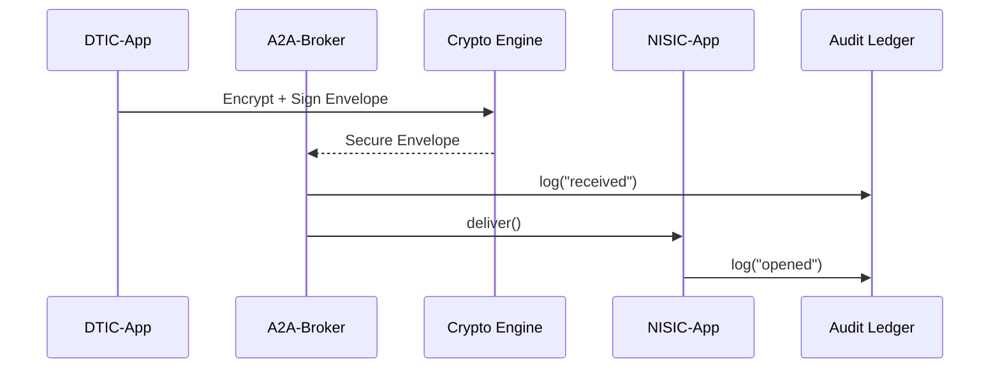

# Chapter 5: HMS-A2A (Inter-Agency Exchange)
*[← Back to Chapter 4: HMS-SVC](04_hms_svc__core_backend_services__.md)*  

---

## 1. Why Do We Need HMS-A2A?

Picture this:  
The **Defense Technical Information Center (DTIC)** has a fresh dataset from overseas drones that flag potential agricultural pests.  
The **National Invasive Species Information Center (NISIC)**—inside the Department of Agriculture—needs that data **today** to warn farmers, **but**:

* The file contains some classified fields.  
* DTIC stores it in a custom XML format; NISIC speaks JSON.  
* Congress requires a provable audit trail of who looked at what.

HMS-A2A is the **secure diplomatic pouch** that solves all three issues:

1. **Protocol** – agrees on HTTPS + message signatures.  
2. **Translation** – auto-converts XML ⇄ JSON via shared schemas.  
3. **Oversight** – writes an immutable log every time a byte moves.

In short: agencies can talk without leaky e-mails, rogue USB drives, or format headaches.

---

## 2. Key Concepts (Plain English)

| Term           | Analogy                                  | One-Sentence Meaning |
|----------------|-------------------------------------------|----------------------|
| Channel        | Direct phone line                        | Secure, authenticated TLS connection between two agencies. |
| Contract       | Prenuptial agreement                     | JSON document that lists *what* can be sent, *how often*, and *who* can open it. |
| Envelope       | Tamper-proof package                     | Encrypted payload + metadata (sender, schema version, signature). |
| Broker         | Switchboard                              | Light service that routes envelopes to the right channel(s). |
| Schema Registry| Multilingual dictionary                  | Holds canonical data shapes so XML, JSON, or CSV can map to one truth. |
| Audit Trail    | CCTV recording                           | Append-only log of every envelope movement, viewer, and transformation. |

---

## 3. The 5-Minute “Hello-A2A”

Goal: DTIC sends a **“Pest-Sensor Batch”** to NISIC once, encrypted and logged.

### 3.1 Define the Contract (one-time)

```python
# file: contract.py
from hms_a2a import Contract

dtic_to_nisic = Contract(
    id="pest_sensor_v1",
    sender="DTIC",
    receiver="NISIC",
    schema="pest_sensor_1.0.json",
    redact=["geo.classified_zone"],   # hide classified field
    cadence="on_demand"               # only when DTIC pushes
).save()
```
What it does  
1. Says **who** can talk (`DTIC` → `NISIC`).  
2. Links to the shared schema.  
3. Declares a redaction rule for classified GPS cells.  
4. Persists the contract in the Broker.  

### 3.2 Push the Data

```python
# file: send.py
from hms_a2a import Channel, Envelope
import xmltodict, json, pathlib

raw_xml = pathlib.Path("sensor_dump.xml").read_text()
payload = json.dumps(xmltodict.parse(raw_xml))      # XML ➜ JSON in one line

envelope = Envelope(
    contract_id="pest_sensor_v1",
    body=payload
)

Channel("DTIC").send(envelope)
print("Sent ✔")
```
What will happen  
• `Channel.send` looks up the contract, encrypts and signs the envelope, and ships it to the Broker.  
• Broker strips the `geo.classified_zone` field per contract.  
• Audit Trail logs: “DTIC sent `pest_sensor_v1`, size = 2.3 MB.”  

### 3.3 Receive at NISIC

```python
# file: receive.py
from hms_a2a import Channel

for env in Channel("NISIC").inbox(once=True):
    data = env.body               # already JSON, redacted & validated
    print("Pests rows:", len(data))
```
Result on console  
```
Pests rows: 1289
```

That’s it—no shared FTP server, no manual conversion. 🎉

---

## 4. What Happens Under the Hood?



1. **Crypto Engine** (built into the SDK) handles AES-256 encryption and RSA signatures.  
2. **Broker** enforces contract rules and stores the envelope until the receiver fetches it.  
3. **Audit Ledger** is a simple append-only table replicated to [HMS-DTA](06_hms_dta__data_lake___governance__.md) for analytics.  

---

## 5. Peek Inside the Source

### 5.1 Envelope Structure (simplified)

```python
# file: hms_a2a/envelope.py
class Envelope(BaseModel):
    contract_id: str
    body: str              # encrypted JSON string
    iv: str                # initialization vector
    sig: str               # RSA signature (base64)
```

Small but powerful—every message carries its own proof of authenticity.

### 5.2 Broker Contract Check

```python
# file: broker/validate.py
def allowed(envelope, contract):
    return (envelope.sender == contract.sender and
            envelope.receiver == contract.receiver and
            envelope.schema == contract.schema)
```

If validation fails, the Broker rejects the envelope and writes a 𝘥𝘦𝘯𝘪𝘢𝘭 record to the Audit Ledger.

### 5.3 Redaction Filter

```python
# file: broker/redact.py
def apply(body_json, rules):
    for path in rules:                 # e.g., ["geo.classified_zone"]
        delete_nested(body_json, path)
    return body_json
```

Only a few lines, yet it guarantees sensitive keys never leave DTIC servers.

---

## 6. Common Recipes

### 6.1 Subscribe to Multiple Agencies

```python
inbox = Channel("NISIC").inbox(filter={"schema": "pest_sensor*"})
for env in inbox:
    process(env.body)
```

### 6.2 Automatic Format Conversion

```python
Channel("FEMA").send(
    Envelope.from_csv("supplies.csv", schema="aid_supplies_2.0.csv")
)
```
`from_csv` looks up the schema registry and converts to the canonical JSON before encrypting.

---

## 7. FAQ & Troubleshooting

| Symptom | Probable Cause | Quick Fix |
|---------|----------------|-----------|
| “Contract not found” | ID typo | Run `a2a list-contracts` CLI to view valid IDs. |
| Receiver sees empty field | Redaction rule applied | Check `Contract.redact` list. |
| Signature mismatch error | Clock skew or tampered data | Verify both agency servers run NTP; inspect Audit Ledger. |
| Envelope stuck in Broker | Receiver not polling | Call `Channel("AGENCY").inbox()` every X minutes or enable webhook. |

---

## 8. What You Learned

You can now:

1. Draft an inter-agency **Contract**.  
2. Send and receive encrypted **Envelopes** over a secured **Channel**.  
3. Rely on an automatic **Audit Trail** for compliance.  

In the next chapter we’ll explore where all those envelopes—and every other data artifact—ultimately land for long-term governance and analytics: the **Data Lake & Governance layer**.  

→ *Continue to* [HMS-DTA (Data Lake & Governance)](06_hms_dta__data_lake___governance__.md)

---

Generated by [AI Codebase Knowledge Builder](https://github.com/The-Pocket/Tutorial-Codebase-Knowledge)