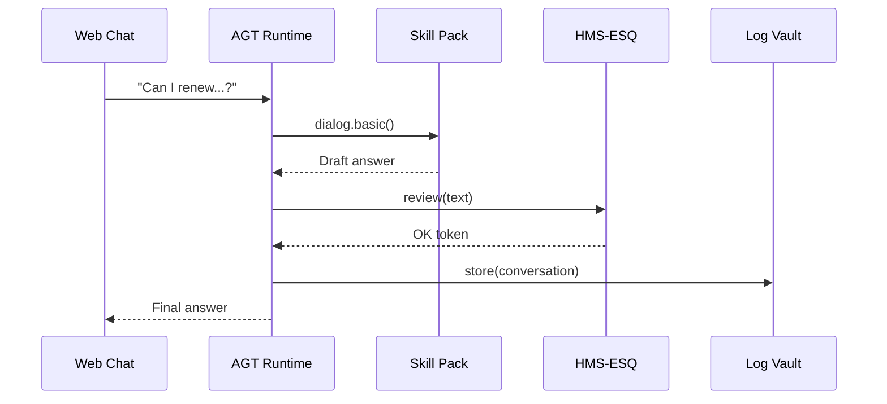

# Chapter 5: HMS-AGT Core Agent Framework
*(“How to spin-up a digital civil-servant in under five minutes”)*
  
[← Back to Chapter&nbsp;4: Compliance & Legal Reasoning (HMS-ESQ)](04_compliance___legal_reasoning__hms_esq__.md)

---

## 0. Why Do We Need AGT?

Picture this: A citizen opens the State Department website at 2 a.m. to renew a passport.  
Instead of waiting for office hours, they chat with a **digital clerk** who can:

1. Answer questions in plain language.  
2. Auto-fill forms from prior records.  
3. Check every step against privacy laws already vetted by [HMS-ESQ](04_compliance___legal_reasoning__hms_esq__.md).  

That indefatigable clerk is born inside **HMS-AGT**.  
AGT supplies the **blueprint** for all HMS agents, whether they triage FDA drug-recall emails or walk you through a small-business loan.

---

## 1. The One-Sentence Superpower

“AGT lets any developer launch, supervise, and retire a policy-compliant AI agent with three YAML lines and one function.”

---

## 2. Key Concepts (Learn These Once)

| Term | Kid-Friendly Analogy | One-Line Job |
|------|----------------------|--------------|
| Agent Template | “Paper doll” outline | Baseline persona (name, goals, permissions) |
| Skill Pack | Toolbox | Plug-in abilities (translate, search rules, send email) |
| Supervisory Contract | Employment agreement | Mapping between tasks & policy checks |
| Identity Token | Employee badge | Cryptographic ID used across HMS |
| Retirement Hook | Exit interview | Graceful shutdown + log archival |

Keep them in mind; we’ll wire them together in a moment.

---

## 3. Spinning-Up Your First Agent (15 Lines)

Below we create `passport-helper.yaml`, then launch it with Python.

### 3.1 YAML Template  

```yaml
# passport-helper.yaml
agent_template:
  name: "Passport Helper v1"
  description: "Guides citizens through DS-82 passport renewals"
  language: "en"
skills:
  - "dialog.basic"
  - "forms.auto_fill"
  - "policy.lookup"
supervisory_contract:
  on_task: "esq.review.v1"        # always pass text to HMS-ESQ
```

*What’s happening?*  
1. **Template** names the agent & default language.  
2. **Skill Pack** lists three built-in skills shipped with AGT.  
3. **Supervisory Contract** requires every outgoing text to be cleared by ESQ.

### 3.2 Launch Script  

```python
# launch_passport_helper.py
from hms_agt import AgentRuntime

agent = AgentRuntime("passport-helper.yaml")
resp = agent.chat("Can I renew if my passport expired two years ago?")
print(resp.text)
```

Expected console output (truncated):

```
Yes. Since your passport expired less than 5 years ago, you can use Form DS-82...
```

*Beginner Walk-through*  
1. `AgentRuntime` reads the YAML & builds the agent.  
2. User message triggers the **dialog.basic** skill.  
3. Before responding, text flows through HMS-ESQ (the contract) for compliance.  
4. Clean answer comes back to the citizen.

---

## 4. What Happens Under the Hood?



5 actors, 7 steps—simple and auditable.

---

## 5. A Tiny Peek at the Runtime (≤18 Lines)

```python
# hms_agt/runtime.py  (simplified)
class AgentRuntime:
    def __init__(self, yaml_path):
        cfg = load_yaml(yaml_path)
        self.skills = load_skills(cfg["skills"])
        self.contract = cfg["supervisory_contract"]["on_task"]

    def chat(self, user_msg):
        draft = self.skills["dialog.basic"](user_msg)
        approved = call_tool(self.contract, {"text": draft})
        log_event(user_msg, approved["text"])
        return SimpleNamespace(text=approved["text"])
```

Line-by-line:

1. `load_yaml` parses the template.  
2. `load_skills` dynamically imports each skill module.  
3. `self.contract` stores the ESQ call string.  
4. `chat` uses **dialog.basic** to craft an answer.  
5. `call_tool` sends that answer to ESQ via [HMS-MCP](02_model_context_protocol__hms_mcp__.md).  
6. `log_event` writes everything to the **Governance Log Vault** for audits.

---

## 6. Managing an Agent’s Life-Cycle

### 6.1 Supervising  
A GOV administrator can pause or resume an agent from the **Human-in-the-Loop Oversight Console (HMS-GOV)**—details in [Chapter&nbsp;13](13_human_in_the_loop_oversight_console__hms_gov__.md).

### 6.2 Updating Skills  
Need Spanish support? Just add `"translate.spanish"` to the `skills:` list and redeploy; no code changes required.

### 6.3 Retirement  
AGT automatically calls the **Retirement Hook** when you de-register the YAML.  
It:

1. Revokes the Identity Token.  
2. Flushes pending logs to [HMS-OPS](11_operational_nerve_center__hms_ops__.md).  
3. Notifies dependents via [HMS-A2A Messaging Bus](07_hms_a2a_inter_agency_messaging_bus_.md).

---

## 7. Common Pitfalls (and How AGT Helps)

Problem | Legacy Bot | AGT Solution
--------|------------|-------------
Hard-coded credentials | Scattered secrets | Identity Token managed centrally
No legal oversight | “Oops, we asked for SSN!” | Supervisory Contract enforces ESQ
Skills glued together | Monolithic code | Plug-and-play Skill Packs
Messy shutdown | Orphaned queues | Retirement Hook cleans up automatically

---

## 8. Recap & What’s Next

You learned how HMS-AGT:

• Turns a 10-line YAML template into a compliant digital clerk.  
• Uses Skill Packs for capabilities and Supervisory Contracts for guardrails.  
• Logs every interaction for future audits.

Ready to give your agent **specialized expertise**—like medical triage or federal procurement? Continue to [HMS-AGX Specialized Agent Extensions](06_hms_agx_specialized_agent_extensions_.md).

---

---

Generated by [AI Codebase Knowledge Builder](https://github.com/The-Pocket/Tutorial-Codebase-Knowledge)