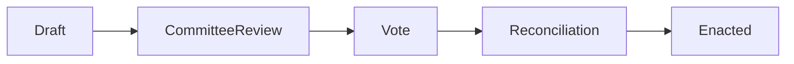

# Chapter 5: HMS-CDF (Legislative Engine)

In [Chapter 4: HMS-AGX (Knowledge Graph)](04_hms_agx__knowledge_graph__.md) we built a web of laws, programs, and context. Now we’ll automate the actual **legislative process**—from draft to final reconciliation—using **HMS-CDF**, our real-time Rust-based “parliamentary clerk.”

---

## 1. Why HMS-CDF?

Imagine a team drafting the **“Housing Accessibility Bill”**:

1. **Draft** the text.  
2. Send to **committee** for review.  
3. Hold a **vote**.  
4. **Reconcile** differences between versions.  

In a traditional parliament this can take months. HMS-CDF enforces each step in code, logs every change, and lets you move at **AI-speed** without skipping any formal stage.

**Use Case**:  
- Alice, a legislator, writes a first draft.  
- The engine records it, notifies reviewers, locks editing.  
- After committee edits, it auto-generates a vote packet.  
- Once passed, it executes reconciliation and archives minutes.

---

## 2. Key Concepts

1. **Bill**  
   A piece of proposed legislation: `id`, `title`, `content`, `current_stage`, `history`.
2. **Stage**  
   One of: `Draft`, `CommitteeReview`, `Vote`, `Reconciliation`, `Enacted`.
3. **Workflow**  
   The ordered steps a bill must follow.
4. **Record (Event)**  
   A timestamped log entry each time the bill moves stages.

---

## 3. Using HMS-CDF

### 3.1 Define a Workflow

```rust
// src/workflow.rs
pub enum Stage {
    Draft,
    CommitteeReview,
    Vote,
    Reconciliation,
    Enacted,
}

pub struct Workflow {
    pub stages: Vec<Stage>,
}

impl Workflow {
    pub fn standard() -> Self {
        Self { stages: vec![
            Stage::Draft,
            Stage::CommitteeReview,
            Stage::Vote,
            Stage::Reconciliation,
            Stage::Enacted,
        ]}
    }
}
```
_We define a “standard” 5-step workflow._

### 3.2 Create a New Bill

```rust
// src/bill.rs
use crate::workflow::Workflow;
pub struct Bill {
    pub id: String,
    pub title: String,
    pub content: String,
    pub workflow: Workflow,
    pub current: usize,      // index in workflow.stages
    pub history: Vec<String>,
}

impl Bill {
    pub fn new(id: &str, title: &str, content: &str) -> Self {
        let wf = Workflow::standard();
        Self {
            id: id.into(),
            title: title.into(),
            content: content.into(),
            workflow: wf,
            current: 0,
            history: vec!["Created".into()],
        }
    }
}
```
_A beginner sees: new bills start at stage 0 (“Draft”)._

### 3.3 Advance the Bill

```rust
// src/engine.rs
use crate::bill::Bill;

pub fn advance(bill: &mut Bill) {
    if bill.current + 1 < bill.workflow.stages.len() {
        bill.current += 1;
        bill.history.push(format!(
          "Advanced to {:?}", bill.workflow.stages[bill.current]
        ));
    }
}
```
_One line moves the bill to the next stage and logs it._

### 3.4 Check Status

```rust
// in your application code
let mut bill = Bill::new("HB001", "Housing Accessibility", "...");
println!("Stage: {:?}", bill.workflow.stages[bill.current]);
// Advance twice
advance(&mut bill);
advance(&mut bill);
println!("History: {:?}", bill.history);
```
_Output_:  
```
Stage: Draft
History: ["Created", "Advanced to CommitteeReview", "Advanced to Vote"]
```

---

## 4. Under the Hood: Workflow Flow

```mermaid
sequenceDiagram
  participant Alice as Legislator
  participant UI as Frontend
  participant CDF as HMS-CDF Engine
  participant DB as Database
  Alice->>UI: Click “Advance to Review”
  UI->>CDF: advance(bill_id)
  CDF->>DB: UPDATE bills SET current +=1; INSERT event
  DB-->>CDF: success
  CDF-->>UI: new stage & history
```

1. **Alice** requests a stage change.  
2. **UI** calls the CDF engine.  
3. **CDF** updates the bill row and writes an event to `history`.  
4. **CDF** returns the updated stage and log to the UI.

---

## 5. Inside HMS-CDF

### 5.1 Core Rust Modules

- **workflow.rs**: defines stages & sequences  
- **bill.rs**: holds state, history  
- **engine.rs**: contains rules for transitions  

### 5.2 Data Storage

Bills and events live in a database table:

```sql
-- bills table
CREATE TABLE bills (
  id TEXT PRIMARY KEY,
  title TEXT,
  content TEXT,
  current_stage INTEGER
);
-- events table
CREATE TABLE events (
  bill_id TEXT,
  timestamp DATETIME,
  message TEXT
);
```

The engine issues two SQL commands per transition:  
1. UPDATE `bills.current_stage`  
2. INSERT a new row in `events`

---

## 6. Visualizing the Workflow


Think of HMS-CDF as a **digital clerk** who stamps each stage, files the record, and rings the bell when it’s time to move on.

---

## 7. Conclusion & Next Steps

You’ve learned how **HMS-CDF** enforces formal legislative steps—draft, review, vote, and reconciliation—while keeping an immutable log of every move. This gives you an “automated parliamentary clerk” in code, letting you pass bills at AI-speed without skipping any procedural safeguards.

Up next, we’ll introduce policies and guardrails in our **[Chapter 6: AI Governance Framework](06_ai_governance_framework_.md)**.

---

Generated by [AI Codebase Knowledge Builder](https://github.com/The-Pocket/Tutorial-Codebase-Knowledge)