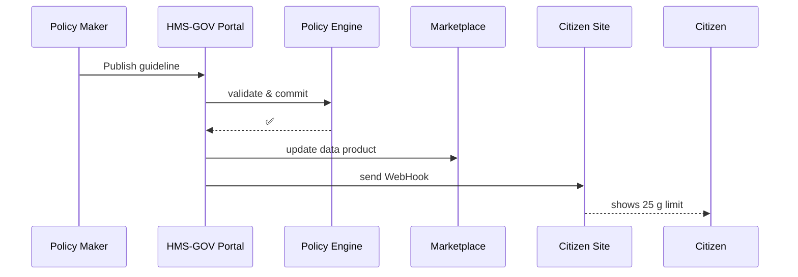

# Chapter 5: HMS-GOV Admin / Policy-Maker Portal

[← Back to Chapter 4: AI Representative Agent (HMS-AGT + AGX)](04_ai_representative_agent__hms_agt___agx__.md)

---

## 1. Why Do We Need a “Mission-Control Tower”?

Picture the **Center for Nutrition Policy & Promotion (CNPP)**.  
Last night a research paper showed that cutting *added sugar* in half could save billions in future health costs.  

CNPP’s policy makers must:

1. Draft a new guideline (“25 g / day, not 50 g”).  
2. Circulate it for review across USDA, FDA, and HHS.  
3. Publish it so every citizen-facing site, AI agent, and data feed updates **instantly**.

Without a central **mission-control tower**:

* Each agency would keep a separate spreadsheet.  
* AI agents might answer citizens with *old* numbers.  
* A typo could sneak into production with no audit trail.

The **HMS-GOV Portal** solves this by giving officials one dashboard to **see**, **approve**, and **override** every automated flow.

---

## 2. Key Concepts (Plain English Cheatsheet)

| Word | Think of It As |
|------|----------------|
| Dashboard | Real-time air-traffic radar for policies & processes. |
| Approval Queue | The “in-box” where drafts, budget requests, and AI actions wait for a human ✅ or ❌. |
| Policy Editor | Visual form (or YAML view) for changing rules, rates, limits. |
| Override Panel | Big red button that lets you pause or reroute an AI agent in trouble. |
| Propagation Engine | The delivery truck that pushes approved changes to citizen sites & APIs. |

Keep these five ideas in mind—everything else is just buttons around them.

---

## 3. Guided Walk-Through: Cutting Sugar in Half

We will play the role of a CNPP official updating the **Added Sugar Guideline**.

### 3.1 Open the Draft

1. Log in to `gov.hms.portal`.
2. Click **Nutrition Policies → Added Sugar Guideline**.
3. The **Policy Editor** shows:

```yaml
id: USDA-CNPP-003
title: Added Sugar Daily Limit
valueGram: 50   # grams per day
status: draft
```

(Yes, it really is just YAML under the hood!)

### 3.2 Edit & Save

Change `valueGram: 25`, add a note, then press **Save as Draft**.  
The update appears in the **Approval Queue** with tag `impact: high`.

### 3.3 Request Multi-Agency Review

```
[Request Approval]
 ↳ USDA Legal
 ↳ FDA Science Board
 ↳ HHS Communications
```

Each reviewer receives a notification. They can:

* Comment inline (e.g., “cite new study DOI here”)  
* Approve or Reject

When all required boxes turn green, the button **Publish & Propagate** lights up.

### 3.4 Publish

Click **Publish & Propagate**.

Toast message:  
`🎉 Guideline USDA-CNPP-003 published. Propagating to 12 downstream targets…`

Citizen nutrition sites, Alexa-style assistants, and marketplace data feeds now respond with *25 g* instantly.

---

## 4. Under the Hood (No Heavy Code)



Five moving parts—easy to keep in your head.

---

## 5. Tiny Peek at the Code

### 5.1 API Route to Approve a Draft (9 lines)

```ts
// hms-gov/src/routes/approve.ts
router.post('/draft/:id/approve', async (req, res) => {
  const { id } = req.params
  const draft = await db.getDraft(id)
  if (!draft) return res.status(404).send('Not found')

  await db.markApproved(id, req.user.email)
  await bus.publish('policy.approved', draft)  // ↖ triggers propagation
  res.send('OK')
})
```

What happens?  
1. Verify the draft exists.  
2. Record who approved.  
3. Emit an event; the **Propagation Engine** listens and fans out updates.

### 5.2 Propagate to Citizen Sites (12 lines)

```ts
// hms-gov/src/workers/propagate.ts
bus.on('policy.approved', async (draft) => {
  const targets = await db.listTargets(draft.id) // webhooks, skills…
  for (const t of targets) {
    await fetch(t.url, {          // simple HTTP push
      method: 'POST',
      body: JSON.stringify(draft)
    })
  }
})
```

Each target (micro-frontend widget, AI skill, open-data JSON file) updates itself on receipt.

---

## 6. Overriding an AI Agent (Emergency!)

An AGX agent is about to email *50 g* to 5 000 citizens because its cache is stale.

1. **Dashboard → Active Agents**  
2. Select **EmailResponder-CNPP**  
3. Click **Pause & Reroute**  
4. In the dialog choose:  
   `↳ Reroute to "get-latest-guideline" skill`  
5. Confirm. The agent replays pending actions with the fresh policy.

No shell access, no `ssh`, just two clicks.

---

## 7. How It Fits with the Rest of HMS

Component | Interaction
----------|------------
[HMS-AGT + AGX](04_ai_representative_agent__hms_agt___agx__.md) | Agents show up in the **Override Panel**; their plans can be paused or amended.
[HMS-MKT Marketplace](03_hms_mkt_agent___data_marketplace_.md) | Every published policy becomes a *data product* others can subscribe to.
[HMS-CDF Policy Governance Engine](09_hms_cdf_policy_governance_engine_.md) | Performs deep validation (conflict detection, impact scoring) before the portal allows a publish.
[Human-in-the-Loop Framework](14_human_in_the_loop__hitl__oversight_framework_.md) | Stores all approval clicks for auditing.

---

## 8. 60-Second Hands-On Lab

```bash
# 1. Run dev stack
npm run dev --workspace=hms-gov

# 2. Seed a draft
curl -X POST localhost:4000/draft \
     -d '{ "id": "USDA-CNPP-003", "valueGram": 25 }'

# 3. Approve it
curl -X POST localhost:4000/draft/USDA-CNPP-003/approve
```

Refresh the portal dashboard—you’ll see the draft disappear from the queue and *12 targets updated* counter tick up.

---

## 9. Recap

You just:

• Saw how the **HMS-GOV Portal** acts as the mission-control tower for rules and AI flows.  
• Edited a real policy draft, walked it through multi-agency approval, and published it.  
• Learned how a single event (`policy.approved`) propagates everywhere.  
• Used the Override Panel to keep AI aides on the right flight path.

Next we’ll design **bespoke forms and checklists** that policy makers fill in—without writing code—using the drag-and-drop [Protocol Builder UI](06_protocol_builder_ui_.md). 🎉

---

Generated by [AI Codebase Knowledge Builder](https://github.com/The-Pocket/Tutorial-Codebase-Knowledge)