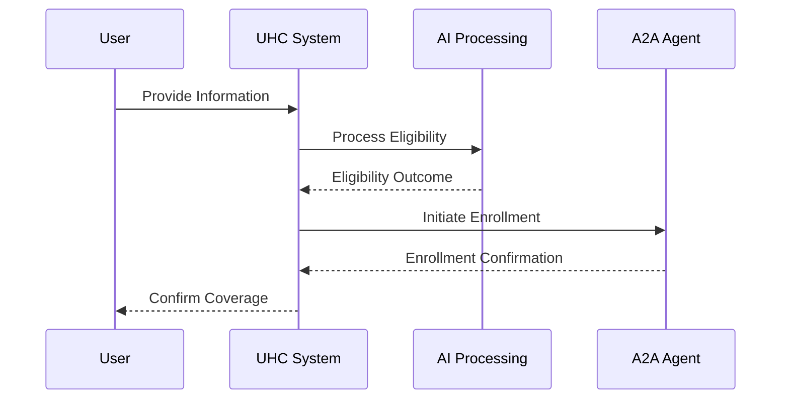

# Chapter 5: HMS-UHC

Welcome to Chapter 5 of our tutorial, where we explore `HMS-UHC`. If you've been following along, you're now familiar with how the previous concepts like [HMS-AGX](04_hms_agx_.md) and others work towards improving government services. Now let's see how `HMS-UHC` transforms traditional healthcare coverage processes into a streamlined experience using AI.

## What is HMS-UHC?

### Motivation and Use Case

Imagine you're visiting a traditional insurance office to check your healthcare coverage eligibility. The paperwork is tedious, the queues are long, and errors are common. What if there was an AI-powered office that could handle this efficiently?

`HMS-UHC` is like an advanced digital insurance office that utilizes AI to assist with healthcare coverage. It simplifies the way eligibility and enrollment are managed, ensuring you receive optimal health outcomes with the aid of [HMS-A2A](01_hms_a2a_.md) agents handling the administrative workload.

## Understanding Key Concepts

Let's break down `HMS-UHC` into a couple of key concepts to see how it operates:

### Key Concept 1: AI-Driven Processing

Think of `HMS-UHC` as a smart processor that replaces the need for countless human clerks. AI algorithms evaluate your eligibility quickly and accurately, ensuring you're covered appropriately.

### Key Concept 2: Simplified Enrollment

Once eligibility is determined, `HMS-UHC` uses intelligent agents of [HMS-A2A](01_hms_a2a_.md) to streamline the enrollment process. They automate form filling and document checks, ensuring you spend less time waiting and more time receiving care.

## How to Use HMS-UHC

Let's explore a simple example of using `HMS-UHC` to check eligibility and enroll for healthcare coverage.

```python
# Example usage of HMS-UHC to check eligibility
# Initialize the healthcare office system
uhc_system = HMS_UHC()

# Provide user information for eligibility check
user_info = {
    "name": "Alice Smith",
    "age": 30,
    "employment_status": "Employed",
    "existing_conditions": ["asthma"]
}

# Check eligibility and enroll user
uhc_system.check_eligibility_and_enroll(user_info)
```

### Explanation

- **Initialization**: We create an instance of `HMS-UHC` to represent our AI insurance office.
- **Provide User Information**: Personal data is needed to assess health coverage options.
- **Check and Enroll**: The system evaluates your data to ensure eligibility and initiates enrollment.

## Behind the Scenes

Curious about how `HMS-UHC` processes your information? Let's illustrate it with a sequence diagram.



### Step-by-Step Breakdown

1. **User Submission**: You submit your personal information to the system.
2. **AI Assessment**: The AI evaluates your details for healthcare coverage eligibility.
3. **Enrollment**: If eligible, [HMS-A2A](01_hms_a2a_.md) agents engage to automate the enrollment process.
4. **Confirmation**: You receive confirmation of your coverage.

### Internal Implementation

For a deeper understanding of `HMS-UHC`'s internal workings, let's peek into a simplified version of how the process is coded:

```plaintext
# Placeholder code for HMS-UHC operation
class HMS_UHC:
    def check_eligibility_and_enroll(self, user_info):
        # Step 1: Process eligibility using AI
        # Step 2: If eligible, proceed with A2A agent enrollment
        pass  # Detailed logic handled by AI and A2A systems
```

This snippet shows the process of eligibility checking and enrollment in a streamlined manner, leveraging AI and smart assistant agents for efficient handling.

---

## Conclusion

In this chapter, you've explored how `HMS-UHC` transforms the complex healthcare coverage process into a user-friendly experience through AI-driven processing and streamlined enrollment. By adopting these modern solutions, citizens gain better and faster access to health services.

Now that you've understood the basics of `HMS-UHC`, get ready to dive into our next topic: [AI Governance Framework](06_ai_governance_framework_.md), where we'll explore the structure that governs these smart systems. Keep learning and growing with us!

---

Generated by [AI Codebase Knowledge Builder](https://github.com/The-Pocket/Tutorial-Codebase-Knowledge)