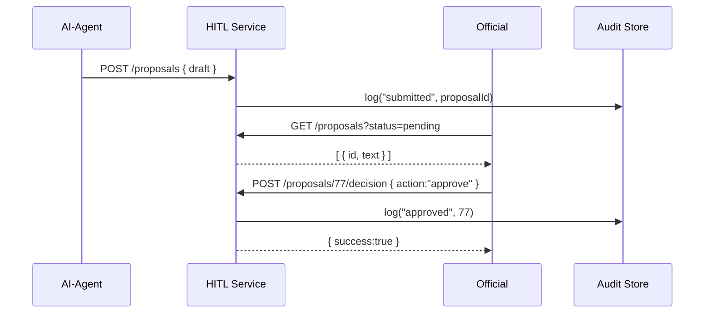
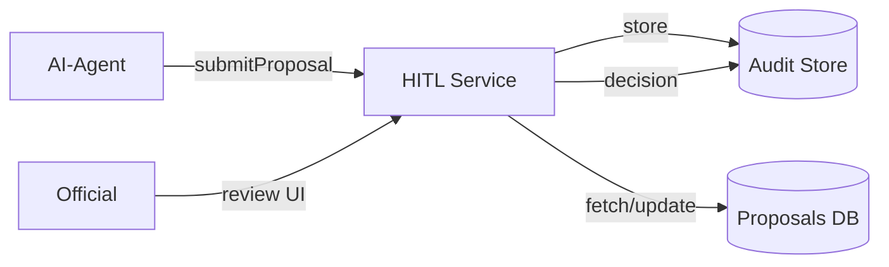

# Chapter 5: Human-in-the-Loop (HITL) Mechanism

In the last chapter we met our AI “consultant” in [AI Representative Agent (HMS-A2A)](04_ai_representative_agent__hms_a2a__.md). Now it’s time to add a human supervisor—just like a pilot who can override autopilot. The **Human-in-the-Loop (HITL) Mechanism** makes sure every AI proposal is reviewed, modified, and approved by a real person before going live.

---

## 1. Why HITL?

Imagine the U.S. Air Force wants to update flight-zone restrictions for training exercises. An AI agent drafts a new map based on weather and traffic data. But before issuing that map to pilots, safety officers must:

- Review the AI’s changes  
- Add comments or corrections  
- Approve or reject the update  

This keeps everyone accountable, preserves an audit trail, and ensures a human can always step in. That’s exactly what HITL provides.

---

## 2. Key Concepts

1. **AI Proposal**  
   A suggested change (e.g., “Expand Zone A by 5 miles north”).

2. **Review Queue**  
   A list of pending proposals waiting for official review.

3. **Reviewer (Human Official)**  
   A designated person who can modify, approve, or reject.

4. **Decision Actions**  
   - Approve: apply the update  
   - Reject: discard the suggestion  
   - Modify: adjust and then approve  

5. **Audit Trail**  
   Every step—submission, edits, decision—is logged for compliance.

---

## 3. Solving the Use Case

### 3.1 Submitting an AI Proposal

When the AI agent drafts a flight-zone update, it calls:

```js
// File: hitlService.js
async function submitProposal(proposal) {
  return fetch('/api/hitl/proposals', {
    method: 'POST',
    headers: {'Content-Type': 'application/json'},
    body: JSON.stringify(proposal)
  }).then(r => r.json());
}

// Example call:
submitProposal({
  draftId: 42,
  text: 'Expand Zone A north by 5 miles',
  source: 'HMS-A2A'
}).then(res => console.log('Proposal ID:', res.id));
```
This creates a new entry in the **Review Queue**.

### 3.2 Reviewing and Deciding

A safety officer can load pending proposals:

```js
// File: reviewController.js
async function loadPending() {
  return fetch('/api/hitl/proposals?status=pending')
    .then(r => r.json()); // returns an array of { id, text, createdAt }
}

async function decideProposal(id, action, notes) {
  return fetch(`/api/hitl/proposals/${id}/decision`, {
    method: 'POST',
    headers: {'Content-Type': 'application/json'},
    body: JSON.stringify({ action, notes })
  });
}

// Usage:
loadPending().then(list => showList(list));
```
- `action` can be `"approve"`, `"reject"`, or `"modify"`.  
- `notes` let the reviewer explain changes.

---

## 4. What Happens Step-by-Step?



1. AI submits a draft.  
2. HITL logs “submitted.”  
3. Official fetches pending items.  
4. Official decides and posts the decision.  
5. HITL logs the outcome.  

---

## 5. Under the Hood

### 5.1 Architecture Overview



- **HITL Service** sits between AI, Officials, and the Audit Store.  
- It ensures every action is persisted and traceable.

### 5.2 Core Code Sketch

```js
// File: hitlRoutes.js (Express.js example)
const express = require('express');
const router = express.Router();

// Submit a new proposal
router.post('/proposals', async (req, res) => {
  const prop = await db.createProposal(req.body);
  await audit.log('submitted', prop.id);
  res.json({ id: prop.id });
});

// List pending proposals
router.get('/proposals', (req, res) => {
  return res.json(db.find({ status: req.query.status }));
});

// Record a decision
router.post('/proposals/:id/decision', async (req, res) => {
  await db.updateProposal(req.params.id, req.body);
  await audit.log(req.body.action, req.params.id, req.body.notes);
  res.json({ success: true });
});

module.exports = router;
```

- **db.createProposal** saves the draft.  
- **db.find** retrieves based on `status`.  
- **audit.log** writes an entry to the **Audit Store**.

---

## Conclusion

You’ve learned how the **HITL Mechanism** ensures human oversight over AI proposals:

- AI submits drafts  
- Officials review, modify, and decide  
- Every step is logged for full accountability  

Next up, we’ll see how decisions and policies get enforced by the **[Policy and Process Engine](06_policy_and_process_engine_.md)**.

---

Generated by [AI Codebase Knowledge Builder](https://github.com/The-Pocket/Tutorial-Codebase-Knowledge)