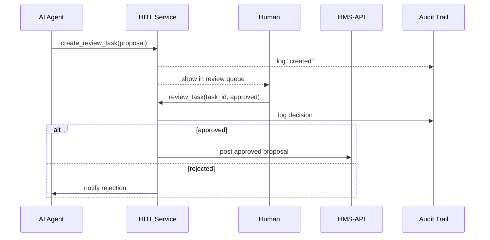

# Chapter 5: Human-in-the-Loop (HITL) Oversight

In [Chapter 4: Specialized AI Agents (HMS-A2A)](04_specialized_ai_agents__hms_a2a__.md), we saw how AI agents draft policy text and resource plans automatically. Now it’s time to bring in a **real person** to inspect and approve those AI-generated proposals before they go live. Welcome to **Human-in-the-Loop (HITL) Oversight**!

---

## 5.1 Why HITL Oversight?

Imagine the National Archives wants to update its “Document Retention Policy” using an AI agent. The agent can draft new schedules quickly—but we need a policy manager to review that draft. This is like having a quality-control inspector on an assembly line:

- **AI does the heavy lifting**: drafts text, crunches numbers, suggests next steps.  
- **Human reviews**: checks for context, fairness, legal concerns, and approves or sends back for edits.  

Without HITL, AI might slip through biased or incorrect changes. With it, we preserve **accountability**, **trust**, and a clear **audit trail**.

---

## 5.2 Key Concepts

1. **Review Queue**  
   A list of AI proposals waiting for human review (think “inbox” for your policy team).

2. **Review Task**  
   Each task bundles the AI output, its type (e.g., “PolicyUpdate”), and metadata (who requested it, when).

3. **Approval Actions**  
   The reviewer can **approve** or **reject** (with comments). Approved items proceed to production; rejections go back to the AI or author.

4. **Audit Trail**  
   Every decision is logged (who approved/rejected, when, and why). This record keeps us compliant and transparent.

---

## 5.3 Using HITL Oversight

Below is a minimal example showing how an AI proposal becomes a review task and how a human approves it.

```python
# 1. Initialize the HITL module
from hms_mcp.hitl import HitlOversight
hitl = HitlOversight()

# 2. AI agent generates a policy draft
from hms_mcp.agents.policy_draft_agent import PolicyDraftAgent
agent = PolicyDraftAgent()
draft = agent.analyze({"topic": "data_retention"})

# 3. Create a review task
task = hitl.create_review_task(
    task_type="PolicyUpdate",
    proposal=draft,
    metadata={"requester": "archives_admin"}
)
print(task.id, task.status)  # e.g., "task-42", "pending"

# 4. Human reviewer lists pending tasks
pending = hitl.get_pending_tasks()
print([t.id for t in pending])  # ["task-42", ...]

# 5. Reviewer approves the draft
hitl.review_task(
    task_id=task.id,
    approved=True,
    comments="Looks good. Publish on Monday."
)
print("Review completed.")
```

Explanation:
- We start **HitlOversight**, which manages review tasks.
- The **PolicyDraftAgent** makes a draft, then we wrap it in a review task.
- A human lists pending tasks, picks one, and calls `review_task(...)` with approval or rejection.

---

## 5.4 What Happens Under the Hood

Here’s a simplified overview of the flow when a human approves an AI proposal:



1. **AI Agent** sends its proposal to the **HITL Service**.  
2. **HITL** logs creation and surfaces the task in a human **review queue**.  
3. The **Human** approves or rejects.  
4. **HITL** logs the decision, then either pushes the approved proposal to the [Backend API (HMS-API)](03_backend_api__hms_api___hms_svc__.md) or sends feedback back to the AI.  

---

## 5.5 Inside the Code

Let’s peek at the minimal files powering HITL oversight.

#### File: hms_mcp/hitl.py

```python
# hms_mcp/hitl.py
from .services.hitl_service import HitlService

class HitlOversight:
    def __init__(self):
        self.service = HitlService()

    def create_review_task(self, task_type, proposal, metadata):
        return self.service.create(task_type, proposal, metadata)

    def get_pending_tasks(self):
        return self.service.list_pending()

    def review_task(self, task_id, approved, comments):
        return self.service.process_review(task_id, approved, comments)
```

This class is a thin wrapper around our service layer.

#### File: hms_mcp/services/hitl_service.py

```python
# services/hitl_service.py
from .db import Database
from .audit_trail import AuditTrail
from .api_client import ApiClient

class HitlService:
    def __init__(self):
        self.db = Database()
        self.audit = AuditTrail()
        self.api = ApiClient()

    def create(self, ttype, proposal, meta):
        task = {"id": self.db.next_id(), "type": ttype,
                "proposal": proposal, "meta": meta, "status": "pending"}
        self.db.insert("hitl_tasks", task)
        self.audit.record(task["id"], "created", meta)
        return task

    def list_pending(self):
        return self.db.query("hitl_tasks", status="pending")

    def process_review(self, task_id, approved, comments):
        # 1. Update status & log
        status = "approved" if approved else "rejected"
        self.db.update("hitl_tasks", task_id, {"status": status})
        self.audit.record(task_id, status, {"comments": comments})
        # 2. Take action
        task = self.db.get("hitl_tasks", task_id)
        if approved:
            self.api.post("/approved-proposals", task["proposal"])
        else:
            # Notify AI or author (omitted)
            pass
        return {"task_id": task_id, "status": status}
```

- **create** saves the task and logs creation.  
- **list_pending** returns tasks in “pending” state.  
- **process_review** updates status, logs decision, then either calls external API or notifies the AI.

---

## 5.6 Summary & Next Steps

In this chapter, you learned how **Human-in-the-Loop (HITL) Oversight**:

- Queues AI proposals for human review.  
- Lets reviewers **approve** or **reject** with comments.  
- Logs every action for accountability.  
- Integrates with [HMS-API](03_backend_api__hms_api___hms_svc__.md) to publish approved items.

Next up: we’ll explore the [Management Layer](06_management_layer_.md), where administrators configure system roles, SLA rules, and dashboard views to keep everything running smoothly.

---

Generated by [AI Codebase Knowledge Builder](https://github.com/The-Pocket/Tutorial-Codebase-Knowledge)