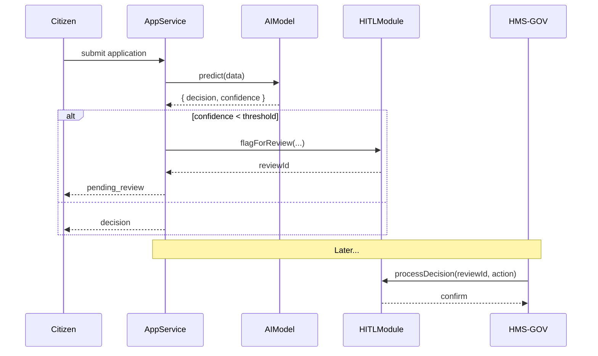

# Chapter 5: Human-In-The-Loop (HITL)

Welcome back! In [Chapter 4: AI Governance Framework](04_ai_governance_framework_.md) we learned how to enforce policies and audit AI at runtime. Now we’ll introduce a final guardrail—**Human-In-The-Loop (HITL)**—so that sensitive or high-stakes AI suggestions always get a human stamp of approval before they go live.

---

## 1. Motivation: Why HITL?

Imagine an AI model that flags possible fraud in unemployment claims. Even with strong governance, a fully automated “deny” could wrongly cut off benefits for someone in need.  
With **HITL**, the AI first makes a proposal—then a human case manager reviews that proposal, tweaks any parameters, and makes the final decision. It’s like having an ethics board or committee review every automated suggestion before it affects real people.

**Use Case**:  
A citizen applies for housing assistance.  
1. The AI model `HousingSupportModel` scores the application.  
2. If the score is uncertain or above a “review” threshold, we **flag** it.  
3. A human reviewer in **HMS-GOV** examines the data, overrides or adjusts the recommendation, and issues the final approval.

---

## 2. Key Concepts

1. **AI Proposal**  
   The output (e.g. “approve”, “deny”, “needs review”) generated by an AI model.

2. **Flagging**  
   When the model’s confidence is low or the case is high-impact, we save a **review record** instead of acting automatically.

3. **Review Dashboard**  
   A screen in **HMS-GOV** listing all flagged items for human decision-makers.

4. **Override & Tuning**  
   Humans can change the suggested decision, adjust thresholds, or add notes.

5. **Final Approval**  
   Once reviewed, the system records the human’s choice as the official outcome.

---

## 3. How to Use HITL in Your Code

Let’s walk through a minimal flow in two parts: flagging for review, then processing the human decision.

### 3.1 Flagging for Review

```js
// lib/hitl/flag.js
async function flagForReview({ modelName, data, suggestion }) {
  // Save a review record (pseudo-DB call)
  return await Review.create({
    model: modelName,
    payload: data,
    suggested: suggestion,
    status: 'pending'
  });
}
module.exports = flagForReview;
```
Above, we save the AI suggestion so a human can later see it.

```js
// services/applicationService.js
const flagForReview = require('../lib/hitl/flag');
const model = require('../models/HousingSupportModel');

async function handleApplication(appData) {
  const suggestion = await model.predict(appData);
  if (suggestion.confidence < 0.8) {
    await flagForReview({
      modelName: model.name,
      data: appData,
      suggestion: suggestion.decision
    });
    return { status: 'pending_review' };
  }
  return { status: suggestion.decision };
}
```
Here, low-confidence scores go into **pending_review** rather than auto-approve/deny.

### 3.2 Processing Human Decisions

```js
// lib/hitl/process.js
async function processDecision(reviewId, finalDecision, comment) {
  const review = await Review.findByPk(reviewId);
  review.final = finalDecision;
  review.comment = comment;
  review.status = 'completed';
  await review.save();
  // (Optionally notify other services)
}
module.exports = processDecision;
```
```js
// hms-gov/controllers/reviewController.js
router.post('/reviews/:id/decide', async (req, res) => {
  const { id } = req.params;
  const { action, note } = req.body;
  await processDecision(id, action, note);
  res.send({ message: 'Review recorded' });
});
```
In **HMS-GOV**, human reviewers call this endpoint to record their final decision.

---

## 4. Under the Hood: Sequence of a HITL Flow

Here’s what happens step-by-step when an application needs human review:



1. **Citizen** submits data to **AppService**.  
2. **AIModel** suggests a decision with confidence.  
3. If confidence is low, we **flag** via **HITLModule** and reply `pending_review`.  
4. A human uses **HMS-GOV** to call `processDecision`, completing the loop.

---

## 5. Internal Implementation Details

Let’s peek at a simplified `HITLModule` file structure:

```
lib/hitl/
├── flag.js         # creates review records
└── process.js      # records human decisions
```

flag.js:
```js
// lib/hitl/flag.js
const { Review } = require('../models');  // ORM model
async function flagForReview({ modelName, data, suggestion }) {
  return Review.create({ model: modelName, payload: data,
                         suggested: suggestion, status: 'pending' });
}
module.exports = flagForReview;
```

process.js:
```js
// lib/hitl/process.js
const { Review } = require('../models');
async function processDecision(id, finalDecision, comment) {
  const review = await Review.findByPk(id);
  review.final = finalDecision;
  review.comment = comment;
  review.status = 'completed';
  await review.save();
}
module.exports = processDecision;
```

- **Review** is a simple database model storing `model`, `payload`, `suggested`, `final`, `status`, and `comment`.
- This keeps all review logic in one module, cleanly separated from your services.

---

## 6. Conclusion

You’ve just learned how to add a **Human-In-The-Loop** step so that every AI recommendation requiring extra care gets a real person’s approval. We saw how to:

- Flag low-confidence or high-impact AI proposals  
- Save them in a **Review** record  
- Provide endpoints in **HMS-GOV** for humans to override or confirm decisions  

Next up, we’ll explore how citizen-facing services talk to our backend in [Chapter 6: HMS-API (Backend API)](06_hms_api__backend_api__.md).

---

Generated by [AI Codebase Knowledge Builder](https://github.com/The-Pocket/Tutorial-Codebase-Knowledge)