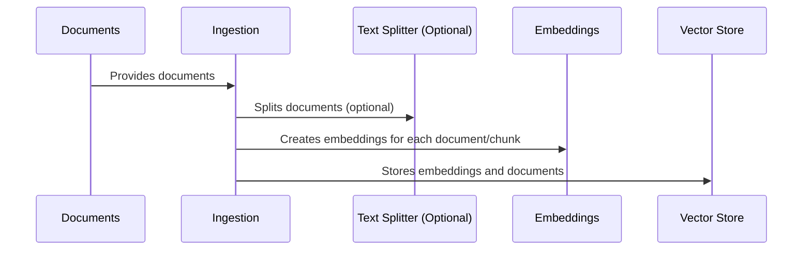

# Chapter 5: Ingestion

In the previous chapter, [Embeddings](04_embeddings_.md), we learned how text is transformed into numerical vectors that capture their meaning. Now, let's explore how we add these meaning vectors and their associated documents to our "meaning library," the [Vector Store](03_vector_store_.md). This process is called *Ingestion*.

Imagine you're building a chatbot to answer questions about your company's internal documentation.  You have a lot of documents, and you want the chatbot to be able to find and use the relevant information quickly. Ingestion is how you get all that information into the chatbot's "brain."

## What is Ingestion?

Ingestion is the process of adding new documents to the [Vector Store](03_vector_store_.md).  It involves taking new documents, converting them into meaning vectors using [Embeddings](04_embeddings_.md), and storing them in the Vector Store so they can be retrieved later when you ask questions.  Think of it like adding new books to a library, where each book is carefully cataloged and organized for easy retrieval.

## How Ingestion Works

Let's break down the ingestion process step-by-step:

1. **Gather Documents:** First, we collect all the documents we want to add to the chatbot's knowledge base. These could be text files, web pages, or any other source of text data.

2. **Split Documents (Optional):**  Sometimes, documents are too long to be processed efficiently. We can split them into smaller chunks, like paragraphs or sections, to make them more manageable.

3. **Create Embeddings:**  Each document (or chunk) is converted into a meaning vector using an [Embeddings](04_embeddings_.md) model.

4. **Store in Vector Store:** Finally, these meaning vectors, along with the original text and any relevant metadata (like the document title or source), are stored in the [Vector Store](03_vector_store_.md).



## Ingestion in Code

```python
# backend/ingest.py (simplified)
from langchain.indexes import index
# ... other imports ...

def ingest_docs():
    # ... code to load documents ...

    docs_transformed = text_splitter.split_documents(docs)
    # ... code to add metadata ...

    indexing_stats = index(
        docs_transformed, record_manager, vectorstore, cleanup="full"
    )
    # ... code to log indexing statistics ...
```

This simplified code snippet shows the core of the ingestion process. The `index` function takes the transformed documents, a `record_manager` (for handling document updates), and the `vectorstore` as input and handles the process of adding them to the Vector Store.

## Looking Under the Hood: `index`

When the `index` function is called:

1. **Check for existing documents:** The `record_manager` checks if these documents have already been ingested. This prevents duplicates.
2. **Create Embeddings:** If a document is new or has been updated, its embedding is created using the specified [Embeddings](04_embeddings_.md) model.
3. **Store in Vector Store:** The embeddings, along with the document content and metadata, are stored in the [Vector Store](03_vector_store_.md).
4. **Cleanup (Optional):** The `cleanup="full"` argument ensures that any documents removed from the input are also removed from the Vector Store, keeping it up-to-date.

```python
# backend/ingest.py (simplified)
from langchain_weaviate import WeaviateVectorStore
# ... other imports ...

def ingest_docs():
    # ... other code ...
    vectorstore = WeaviateVectorStore(
        client=weaviate_client, # Connect to Weaviate
        index_name=WEAVIATE_DOCS_INDEX_NAME, # Index name
        # ... other arguments ...
    )
    # ... call index function ...
```

This code snippet shows how a `WeaviateVectorStore` is initialized and used in the ingestion process.

## Conclusion

Ingestion is the crucial first step in building a powerful chatbot. By adding relevant documents to the [Vector Store](03_vector_store_.md), we provide the chatbot with the knowledge it needs to answer user questions effectively.  Now that we understand how to add information to our chatbot, let's explore how we analyze and rephrase user questions in the next chapter: [Query Analysis/Rephrasing](06_query_analysis_rephrasing_.md).


---

Generated by [AI Codebase Knowledge Builder](https://github.com/The-Pocket/Tutorial-Codebase-Knowledge)