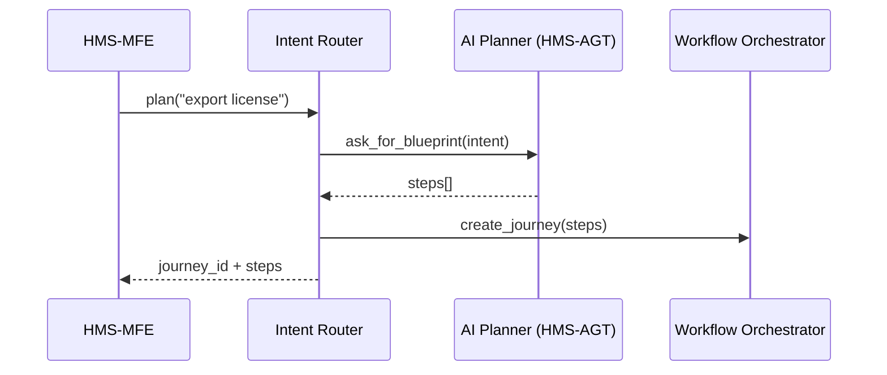

# Chapter 5: Intent-Driven Navigation & AI-Guided Journeys
*(coming from [Micro-Frontend Interface Layer (HMS-MFE)](04_micro_frontend_interface_layer__hms_mfe__.md))*  

---

## 1 · Why Does This Exist?

> “I just want a **Small-Business Export License**.  
> Which form? Which agency? How many log-ins?”

Today a citizen (or small-business owner) must know the *org-chart of government* before they can even start.  
Intent-Driven Navigation flips that burden:

1. The user states a plain-language **intent** –  
   “I need a business export license.”
2. HMS-NFO automatically builds a **Journey Blueprint** –  
   the exact forms, fees, documents, and AI helpers—no guesswork.
3. The Micro-Frontend layer loads only the bricks needed for *this* journey.  
   No dead ends, no duplicate questions, and no agency-hopping.

Think of it as **GPS for Government Paperwork**.  
You tell the system *where you want to go*; it plans the route, keeps you on track, and re-routes when something changes.

---

## 2 · Key Concepts (in Plain English)

| Term | Beginner Analogy | Why It Matters |
|------|------------------|----------------|
| Intent | “Destination” in a GPS app | The user’s high-level goal |
| Journey Blueprint | Turn-by-turn directions | Ordered list of steps & forms |
| Step | A single screen or task | e.g., *Upload Corporate Charter* |
| Guardrail | Speed limit sign | Prevents illegal or invalid actions |
| AI Helper | Co-driver giving tips | Suggests answers, pre-fills data |

---

## 3 · 3-Minute Quick-Start

Below we request a journey, inspect the plan, and render the first step—**all under 20 lines**.

```javascript
// export_license.js  (run inside any <script type="module">)
import { IntentRouter } from "https://cdn.hms.gov/journey/sdk.js";
import { bus } from "https://cdn.hms.gov/mfe/event-bus.js";

const intent = "Get a business export license";
const journey = await IntentRouter.plan(intent);        // 1️⃣ ask for plan

console.log(journey.steps.map(s => s.title));           // 2️⃣ peek

bus.emit("journey:start", journey);                     // 3️⃣ tell UI
```

Explanation  
1. `plan()` ships the user’s intent to the cloud; a JSON *Journey Blueprint* returns.  
2. We print the ordered step titles—helpful in dev tools.  
3. The Micro-Frontend event bus notifies bricks (`<hms-form>`, `<hms-upload>`, etc.) to render step #1.

Typical console output:

```
[
  "Verify Company Identity",
  "Export Control Classification",
  "Pay Application Fee",
  "Schedule Compliance Interview"
]
```

---

## 4 · What Happens Behind the Curtain?



Five actors, one clear flow:

1. **UI** calls the **Intent Router** with the plain sentence.  
2. **AI Planner** (inside [AI Agent Framework](06_ai_agent_framework__hms_agt___hms_agx__.md)) does the heavy thinking—classification, legal checks, personalization.  
3. The **Workflow Orchestrator** stores the journey and tracks progress.  
4. UI receives the ready-to-use blueprint.

---

## 5 · Peek Inside the AI Planner (Simplified)

```python
# hms_agt/intent_planner.py
INTENT_MAP = {
    "export license": ["company_id_form",
                       "eccn_questionnaire",
                       "payment_widget",
                       "interview_scheduler"]
}

def plan(intent: str):
    key = next(k for k in INTENT_MAP if k in intent.lower())
    return [{"id": s, "title": TITLE[s]} for s in INTENT_MAP[key]]
```

Even in production the core idea stays the same:  
• Match keywords (or embeddings) ➜ look up a **recipe** ➜ return the steps.

---

## 6 · Wiring the UI: 10-Line Example

```html
<!-- journey_view.html -->
<body>
  <hms-step-renderer id="step"></hms-step-renderer>

  <script type="module">
    import "./export_license.js";          // previous snippet
    import { bus } from "https://cdn.hms.gov/mfe/event-bus.js";

    bus.on("journey:start", j => load(j.steps[0]));

    function load(step){
       document.getElementById("step")
               .setAttribute("src", `/steps/${step.id}.json`);
    }
  </script>
</body>
```

After we emit `journey:start`, the first step auto-loads; navigation buttons inside `<hms-step-renderer>` will emit `journey:next`, `journey:prev`, etc.—all handled by the same event bus.

---

## 7 · Guardrails in Action

Suppose the user enters a destination country under export embargo.  
The AI Helper intercepts the answer and shows:

```
⚠ The selected destination (Northland) is under U.S. embargo.
Please review 15 C.F.R. §746 before proceeding.
```

Behind the scenes this check is powered by [Legal Reasoning & Compliance Engine](03_legal_reasoning___compliance_engine__hms_esq__.md); the journey pauses until the user changes the answer or files an exception.

---

## 8 · Frequently Asked Newbie Questions

**Q: Is every journey pre-programmed?**  
A: No. Recipes are templates, but the AI Planner can add/remove steps based on real-time data—e.g., skip *“Verify Company Identity”* if the user already did it last month.

**Q: Can I author my own recipes?**  
A: Yes—upload a YAML file in [Governance Portal (HMS-GOV)](01_governance_portal__hms_gov__.md) or call `IntentRouter.register()` during dev.

**Q: What if two agencies own steps in the same journey?**  
A: The Workflow Orchestrator splits ownership; each agency sees only its own step dashboards.

---

## 9 · Hands-On Exercise

1. Clone the demo repo:  
   `git clone https://github.com/hms-nfo/journey-demo && cd journey-demo`
2. Run `npm run dev` and open `http://localhost:3000`.
3. Type **“I need to renew my passport”** in the intent box.  
   Watch how the blueprint changes compared to the export license flow.  
4. Break a guardrail (enter an invalid birth date) and notice how the journey flags the error without leaving the page.

---

## 10 · How This Connects to Other Chapters

• **Forms & UI** – Steps render via the bricks you met in [Micro-Frontend Interface Layer (HMS-MFE)](04_micro_frontend_interface_layer__hms_mfe__.md).  
• **AI Agents** – Personalization & reasoning rely on [AI Agent Framework (HMS-AGT / HMS-AGX)](06_ai_agent_framework__hms_agt___hms_agx__.md).  
• **Workflow Tracking** – Status and audit data live in [Activity & Workflow Orchestrator (HMS-ACT / HMS-OMS)](08_activity___workflow_orchestrator__hms_act___hms_oms__.md).  
• **Oversight** – Officials can pause or modify a journey through [Human-in-the-Loop Oversight (HITL)](07_human_in_the_loop_oversight__hitl__.md).

---

## 11 · Summary & What’s Next

You learned how **Intent-Driven Navigation** lets a user declare *what* they need, while HMS-NFO handles *how* to get there:

1. Plain-language intent → AI-generated Journey Blueprint.  
2. Micro-Frontends auto-render the right steps in the right order.  
3. Guardrails and AI Helpers keep the trip legal and efficient.

In the next chapter we’ll dive deeper into the brains behind the planner—the autonomous (but controllable) agents that make these decisions: [AI Agent Framework (HMS-AGT / HMS-AGX)](06_ai_agent_framework__hms_agt___hms_agx__.md).

---

Generated by [AI Codebase Knowledge Builder](https://github.com/The-Pocket/Tutorial-Codebase-Knowledge)