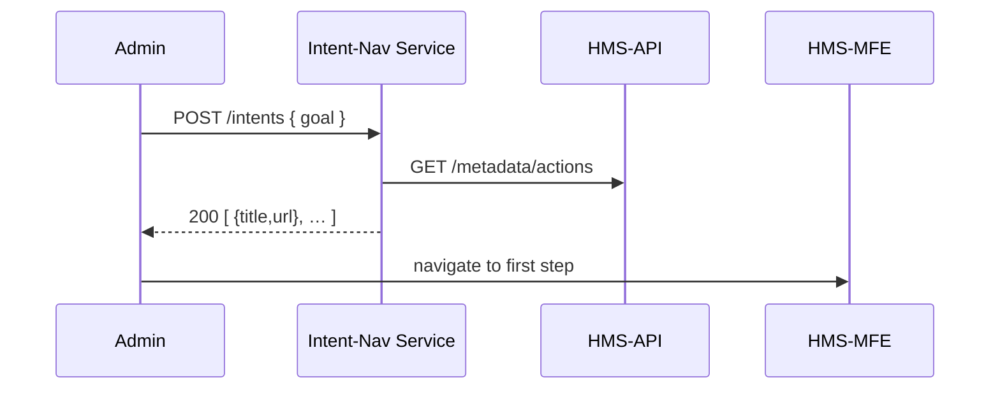

# Chapter 5: Intent-Driven Navigation

In [Chapter 4: Frontend Interface Layer (HMS-MFE / HMS-GOV)](04_frontend_interface_layer__hms_mfe___hms_gov__.md) we learned how citizens and officials use portals. Now we’ll add a “GPS for policy-making”—**Intent-Driven Navigation**—that turns high-level goals into step-by-step actions.

---

## 1. Motivation & Central Use Case

Imagine you’re an administrator in the Office of Immigrant and Employee Rights. Your goal is “optimize citizen feedback response.” Instead of hunting through menus, you type that sentence and the system:

1. Identifies the right dashboards (feedback volume, response time).  
2. Opens the exact forms (draft response, assign case).  
3. Shows relevant data points (pending messages, SLA deadlines).

This saves time and ensures consistency—just like a GPS guiding you turn by turn.

---

## 2. Key Concepts

1. **Intent Interpreter**  
   Reads a user’s goal and maps it to internal tasks (dashboards, forms).

2. **Action Graph**  
   A simple list or flow chart of steps to reach the goal.

3. **Guidance Engine**  
   Presents each step in the UI, highlights fields, and fetches needed data.

---

## 3. Using Intent-Driven Navigation

Here’s a minimal Python example showing an admin sending an intent and getting back a plan:

```python
from hms_nav import interpret_intent

# Admin states their objective
intent = "optimize citizen feedback response"

# System returns a list of steps
plan = interpret_intent(intent)

for i, step in enumerate(plan):
    print(f"Step {i+1}: {step['title']} -> {step['url']}")
```

When you run this, you might see:

```
Step 1: View Citizen Feedback Dashboard -> /dashboard/feedback
Step 2: Open Response Form             -> /forms/feedback-response
```

Each `url` tells HMS-MFE or HMS-GOV what page to load next.

---

## 4. What Happens Under the Hood



1. **Admin** submits a goal.  
2. **Intent-Nav Service** fetches available actions from **HMS-API**.  
3. It builds and returns a plan.  
4. The portal (**HMS-MFE**) navigates to step 1.

---

## 5. Inside Intent-Driven Navigation

### a) Simple Intent Interpreter  
File: `hms_nav/service.py`

```python
# hms_nav/service.py
def interpret_intent(text):
    # (1) Basic keyword matching
    if "feedback" in text:
        return [
            {"title": "View Citizen Feedback Dashboard",
             "url": "/dashboard/feedback"},
            {"title": "Open Response Form",
             "url": "/forms/feedback-response"}
        ]
    return []
```

Explanation:
- We look for keywords (here “feedback”) to pick a preset plan.
- In the real system, this could call an NLP model or policy database.

### b) Navigating Steps  
File: `hms_nav/next_step.py`

```python
# hms_nav/next_step.py
def get_next_step(plan, current):
    # Return the step after the current index
    return plan[current+1] if current+1 < len(plan) else None
```

Explanation:
- Keeps track of where you are and hands you the next action.

---

## 6. Summary

In this chapter, you learned how to:

- Turn a high-level goal into an actionable plan  
- Use the **Intent Interpreter**, **Action Graph**, and **Guidance Engine**  
- Write minimal code to send an intent and receive steps  
- See the step-by-step flow in a sequence diagram  

Next up, we’ll add human reviews into the loop in  
[Chapter 6: Human-in-the-Loop Workflow](06_human_in_the_loop_workflow_.md).

---

Generated by [AI Codebase Knowledge Builder](https://github.com/The-Pocket/Tutorial-Codebase-Knowledge)