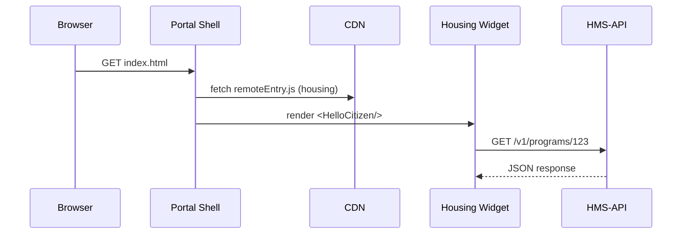

# Chapter 5: Interface Layer (HMS-MFE / GOV Portals)

*(jumped in from [Backend API Gateway (HMS-API / HMS-SVC)](04_backend_api_gateway__hms_api___hms_svc__.md))*  

---

## 0 — What Just Happened?

In the last chapter you built a **secure highway** (the API Gateway).  
Now someone has to drive on it!

* Citizens open `housing.gov` to apply for *Affordable Housing 2030*.  
* HUD officials open `ops.housing.gov` to approve or reject the application.

Both screens must:

1. Look like they belong to the same government family.  
2. Update independently so Housing does not block Treasury.  
3. Respect accessibility & language mandates.

That is the job of the **Interface Layer**—a collection of **micro-frontends (MFEs)** assembled into two major portals:

```
Citizens  ➜  HMS-MFE   (public portal)
Officials ➜  HMS-GOV   (internal portal)
```

Think LEGO bricks that always match color and size.

---

## 1 — Why Do We Need Micro-Frontends?

Story time:

> Monday 10 AM: The Federal Register publishes a new line—  
> “Add mold test disclaimer to lead-paint forms.”

• **Policy team** wants the text live by lunch.  
• **Engineering** cannot redeploy the whole portal.  
• **Design** insists typography stays WCAG-AA compliant.

With MFEs each slice is its **own Git repo, build pipeline, and release schedule**.  
HUD can ship the disclaimer without waiting for EPA or Treasury.

---

## 2 — Key Ideas in Plain English

| Term | Think of it as… |
|------|----------------|
| Micro-frontend (MFE) | A single LEGO brick—“Affordable Housing Application” or “Payment History Widget.” |
| Portal Shell | The LEGO base plate—loads MFEs and shares header/footer. |
| Design Tokens | Federal color swatches & fonts (e.g., `primary = #005EA2`). |
| Frame Contracts | “LEGO sizes”—rules each MFE must follow (A11y, layout grid). |
| Content Source | Where editors change wording that shows up in the MFE. |

Keep these five words handy; they will pop up repeatedly.

---

## 3 — 60-Second “Hello, Citizen” Walk-Through

Below is *everything* needed to publish a **Hello Citizen** widget.

```jsx
// affordable-housing/HelloCitizen.jsx  (<= 20 lines)
import React from "react";
import { Button } from "@hms-utl/ui";         // shared component

export default function HelloCitizen() {
  return (
    <section>
      <h1 tabIndex="0">Welcome to Affordable Housing 2030</h1>
      <Button
        onClick={() => alert("Application started!")}
        label="Start Application"
      />
    </section>
  );
}
```

Explanation:  
1. Imports `Button` from the **Shared Utilities Library** (see [Shared Utilities Library](20_shared_utilities_library__hms_utl__.md)).  
2. Adds `tabIndex="0"` so screen-reader users land on the heading first.  
3. Emits an alert—later you’ll replace this with a call to `/v1/programs`.

### Exposing it via Module Federation

```js
// affordable-housing/webpack.config.js  (<= 15 lines)
module.exports = {
  plugins: [
    new ModuleFederationPlugin({
      name: "housing",
      filename: "remoteEntry.js",
      exposes: {
        "./HelloCitizen": "./HelloCitizen.jsx",
      },
      shared: ["react", "react-dom", "@hms-utl/ui"],
    }),
  ],
};
```

Now publish `remoteEntry.js` to the portal CDN.

---

## 4 — How Does the Portal Shell Load It?

```js
// shell/loadRemote.js  (<= 15 lines)
export async function inject(url, scope, module) {
  await __webpack_init_sharing__("default");
  const container = await window.loadRemote(url, scope); // helper util
  await container.init(__webpack_share_scopes__.default);
  const factory = await container.get(module);
  return factory();
}
```

Shell usage:

```js
const Hello = await inject(
  "https://cdn.gov/housing/remoteEntry.js",
  "housing",
  "./HelloCitizen"
);
root.render(<Hello />);
```

Result: The citizen sees the **Hello Citizen** widget without the portal doing a full redeploy.

---

## 5 — Design Tokens: One Federal Font, Many Bricks

```scss
/* tokens/_colors.scss  (<= 10 lines) */
$primary-500: #005ea2;   // used by every agency header
$state-success: #1c7c54;

.button-primary {
  background: $primary-500;
  color: #fff;
}
```

All MFEs import the same SCSS so colors stay consistent.  
When accessibility reviewers darken `$primary-500` for contrast, **every brick updates** at next build.

---

## 6 — Accessibility & Language Hooks

```jsx
// useLang.js  (<= 8 lines)
import { useEffect } from "react";
export function useLang() {
  useEffect(() => {
    document.documentElement.lang = navigator.language.startsWith("es")
      ? "es"
      : "en";
  }, []);
}
```

Example in a widget:

```jsx
function MyWidget() {
  useLang();                     // now screen-readers know the page language
  /* … */
}
```

---

## 7 — What Happens Under the Hood?



Five steps, three seconds—no full page reloads.

---

## 8 — Where Does the Code Live?

```
hms-interface/
 ├─ shell/                 (header, footer, router)
 ├─ mfe-housing/           (citizen UI)
 ├─ mfe-housing-admin/     (internal HUD dashboard)
 ├─ mfe-education/         (Goldwater Scholarships)
 └─ shared-tokens/         (design tokens & UI kit)
```

Each folder can be its **own** Git repository; the shell just points to the compiled `remoteEntry.js` on the CDN.

---

## 9 — Adding a New UI Slice (Step-by-Step)

1. `npx create-hms-mfe my-widget` (scaffold).  
2. Import `@hms-utl/ui` for shared buttons.  
3. Define `webpack.config.js` with `ModuleFederationPlugin`.  
4. Push to `cdn.gov/my-widget/remoteEntry.js`.  
5. PR a **one-line JSON entry** in `shell/mfe-manifest.json`.  
6. Done — citizens instantly see it after cache bust.

---

## 10 — Government Analogy Cheat-Sheet

Software Thing | Real-World Counterpart
---------------|-----------------------
Portal Shell   | Lobby of a federal building
MFE Widget     | Individual agency service desk
Design Tokens  | The color of the carpet & signage mandated by GSA
Accessibility Hook | Wheelchair ramp in the lobby
Module Federation | Removable kiosks that plug into a common power socket

---

## 11 — Common Beginner Pitfalls

1. **“It works locally but not on the portal.”**  
   • Confirm `remoteEntry.js` is on **HTTPS** and CORS enabled.

2. **Design token mismatch.**  
   • Never import custom colors—extend the SCSS map instead.

3. **Widget breaks screen-reader flow.**  
   • All interactive elements need `aria-label` or visible text.

4. **Orphaned content edits.**  
   • Keep public strings in CMS (e.g., Contentful) so policy makers can update text without redeploying code.

---

## 12 — Mini-Exercise

1. Clone `hms-interface/mfe-housing`.  
2. Add a **Spanish translation** for the “Start Application” button.  
3. Publish the new `remoteEntry.js`.  
4. Change your browser language to Spanish — confirm the portal switches automatically.  
5. Check Lighthouse; aim for **A11y score ≥ 95**.

---

## 13 — Recap & What’s Next

You just learned how the **Interface Layer**:

* Breaks the portal into **independent LEGO bricks** (MFEs).  
* Shares **design tokens** and **accessibility hooks** so every brick looks and feels federal.  
* Lets policy text go live in minutes, not sprints.

Next, see how HMS keeps external vendors (banks, payroll systems, etc.) up-to-date through event streams in [External System Sync Bus](06_external_system_sync_bus_.md).

---

Generated by [AI Codebase Knowledge Builder](https://github.com/The-Pocket/Tutorial-Codebase-Knowledge)