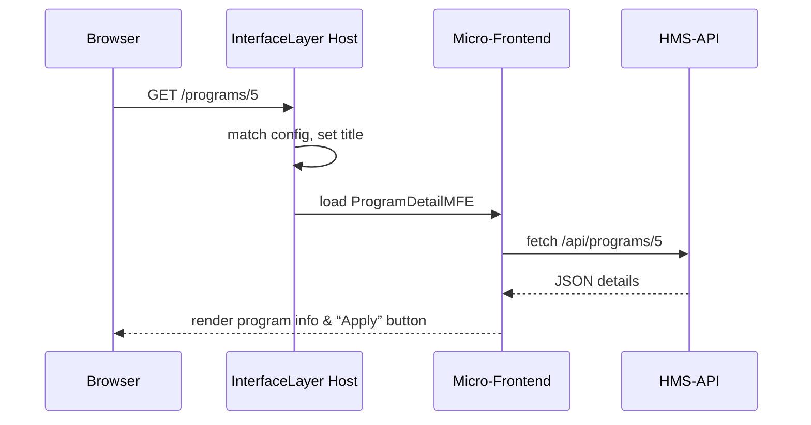

# Chapter 5: Interface Layer

In [Chapter 4: Frontend Interface (HMS-MFE / HMS-GOV)](04_frontend_interface__hms_mfe___hms_gov__.md) we built individual micro-frontends and a basic portal. Now we’ll stitch them together with the **Interface Layer**—the signage, forms, and help desks of our digital service center.

## Why an Interface Layer?

Imagine you walk into a busy government services building:

- Signs point you to “Driver’s License” or “Tax Services.”  
- Forms are on tables by the walls.  
- Help desks guide you when you’re stuck.

The **Interface Layer** is that lobby. It:

- Aggregates UI components and micro-frontends  
- Defines navigation, page layout, and user journeys  
- Directs citizens and admins to the right “desk” for each task  

**Central Use Case**  
> A citizen wants to apply for the “Barry Goldwater Scholarship.” They should:  
> 1. See “Available Programs” on the home page  
> 2. Click “Goldwater Scholarship” to open its details  
> 3. Click “Apply Now” and be guided through the application flow  

The Interface Layer wires together those screens into a smooth journey.

---

## Key Concepts

1. **Interface Registry**  
   A simple config mapping URLs to micro-frontends and page titles.

2. **Host Container**  
   A React (or other) shell that reads the registry and renders each micro-frontend.

3. **Navigation & Layout**  
   Shared header, footer, breadcrumbs, and sidebars.

4. **User Journeys**  
   Sequences of pages tied by buttons and links (e.g., “Next Step →”).

---

## Quick Start: Defining Your Interface Registry

Create a lightweight config that tells your host which micro-frontend to load on each route.

```js
// File: src/config/interfaceLayerConfig.js
export default [
  {
    path:      '/',                     // home page
    title:     'Programs',
    mfName:    'ProgramListMFE'
  },
  {
    path:      '/programs/:id',         // details page
    title:     'Program Details',
    mfName:    'ProgramDetailMFE'
  },
  {
    path:      '/programs/:id/apply',   // application flow
    title:     'Apply Now',
    mfName:    'ApplicationMFE'
  }
];
```
*Explanation:*  
Each entry links a URL pattern to a micro-frontend by name. We’ll use this to wire up routes and navigation.

---

## Using the Interface Layer in React

Below is a minimal host container that:

1. Reads the registry  
2. Sets the page `title`  
3. Dynamically renders the right micro-frontend

```js
// File: src/InterfaceLayer.jsx
import React from 'react';
import { useRoutes } from 'react-router-dom';
import config from './config/interfaceLayerConfig';
import MicroFrontend from './components/MicroFrontend';

export default function InterfaceLayer() {
  const routes = config.map(c => ({
    path: c.path,
    element: (
      <>
        <h1>{c.title}</h1>
        <MicroFrontend name={c.mfName}/>
      </>
    )
  }));
  return useRoutes(routes);
}
```
*Explanation:*  
• `useRoutes` from React Router turns `config` into actual routes.  
• For each route, we render a heading and a `<MicroFrontend>` placeholder.

---

## What Happens Step-by-Step



---

## Under the Hood: Dynamic Micro-Frontend Loader

Here’s a super-simple `MicroFrontend` component:

```js
// File: src/components/MicroFrontend.jsx
import React, { useEffect, useState } from 'react';

export default function MicroFrontend({ name }) {
  const [Component, setComponent] = useState(null);

  useEffect(() => {
    import(`../mfes/${name}/bootstrap.js`)
      .then(m => setComponent(() => m.default));
  }, [name]);

  return Component ? <Component /> : <div>Loading…</div>;
}
```
*Explanation:*  
1. We dynamically `import()` the remote entry for the given `name`.  
2. Once loaded, we render its default export.  
3. Shows “Loading…” until the micro-frontend is ready.

---

## Summary

In this chapter you learned how the **Interface Layer**:

- Acts like signage and help desks in a service center  
- Uses an **Interface Registry** to map URLs → micro-frontends  
- Provides a **Host Container** that sets page titles, layout, and loads each MFE dynamically  
- Guides citizens through user journeys (browse, view details, apply)

Next up, we’ll add intelligence to our portal with the [AI Representative Agent](06_ai_representative_agent_.md).

---

Generated by [AI Codebase Knowledge Builder](https://github.com/The-Pocket/Tutorial-Codebase-Knowledge)