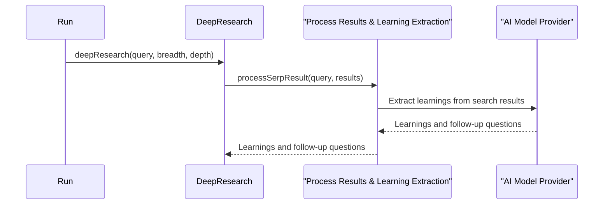

# Chapter 5: Learning Extraction

In the previous chapter, [SERP Query Generation](04_serp_query_generation_.md), we learned how the Deep Research Agent generates intelligent search queries. Now, let's explore how it extracts valuable information from the search results using *Learning Extraction*.

Imagine you're reading several articles about the health benefits of apples. You wouldn't memorize every word, but you'd take away key points like "Apples are rich in antioxidants" and "Apples can improve heart health."  Learning Extraction does something similar: it summarizes the most important information from search results into concise "learnings."

## What is Learning Extraction?

Learning Extraction is the process of identifying and summarizing the most important information from a set of search results.  It's like taking notes on the most relevant parts of a textbook chapter.  These extracted learnings are then used to deepen the research and ultimately generate a final report.

## Using Learning Extraction

Let's continue with our apple example.  If the Deep Research Agent searches for "health benefits of apples," Learning Extraction might produce the following learnings:

- Apples are a good source of fiber, which aids digestion.
- Apples contain antioxidants that may protect against chronic diseases.
- Eating apples regularly may lower the risk of heart disease.

These concise learnings capture the essence of the search results without overwhelming the user with unnecessary details.

## Inside the Deep Research Agent with Learning Extraction

Here's a simplified sequence diagram showing how Learning Extraction fits into the research process:



1. The `deepResearch` function calls `processSerpResult`.
2. `processSerpResult` sends the search results to the [AI Model Provider](08_ai_model_provider_.md) for learning extraction.
3. The AI model analyzes the search results and extracts key learnings.
4. These learnings, along with any generated follow-up questions, are returned to `deepResearch`.

## Diving Deeper into `processSerpResult`

The `processSerpResult` function is where the magic of Learning Extraction happens. Here's a simplified version:

```typescript
// src/deep-research.ts
async function processSerpResult({ query, result }) {
  const contents = compact(result.data.map(item => item.markdown)); // Get content from search results

  // ... (Uses AI to extract learnings and follow-up questions from the contents)
  const res = await generateObject({
    // ... (parameters for the AI model, including the search result contents)
    prompt: `Given the following contents from a SERP search..., generate a list of learnings...`,
    // ... (schema to structure the output)
  });
  return res.object;
}
```

This function takes the search results as input. It extracts the content from each result and sends it to the `generateObject` function from the [AI Model Provider](08_ai_model_provider_.md).  The prompt instructs the AI to extract concise and informative learnings from the provided content. The `generateObject` function also uses a schema to ensure the output is structured correctly, including both the learnings and follow-up questions for [Follow-up Question Generation](06_follow_up_question_generation_.md).

## Conclusion

This chapter explained how Learning Extraction helps the Deep Research Agent distill valuable information from search results into concise learnings.  These learnings form the building blocks for deeper research and the final report. In the next chapter, [Follow-up Question Generation](06_follow_up_question_generation_.md), we'll learn how the agent generates follow-up questions to delve deeper into the research topic.


---

Generated by [AI Codebase Knowledge Builder](https://github.com/The-Pocket/Tutorial-Codebase-Knowledge)