# Chapter 5: Management Layer (HMS-MGT / HMS-SVC)
*(“The City Staff Who Make the Policies Work”)*  

[← Back to Chapter 4: Role-Based Access Control (RBAC) & Multi-Tenant Security](04_role_based_access_control__rbac____multi_tenant_security_.md)

---

## 1. Motivation — The “National Vaccination Roll-out” Story  

The Centers for Disease Control (CDC) is about to launch a **nation-wide COVID booster campaign**.

1. **Microservices involved:** scheduling, reminders, billing, inventory, analytics.  
2. **Agencies involved:** CDC, Department of Veterans Affairs (VA), dozens of state health departments.  
3. **Constraints:**  
   • HIPAA privacy rules (handled by [Chapter 3](03_data_privacy___compliance_engine_.md)).  
   • Tenant isolation (handled by [Chapter 4](04_role_based_access_control__rbac____multi_tenant_security_.md)).  
   • **Still missing:** *Who* coordinates 60+ services, *where* is the newest container image, and *how* do we tune CPU / memory without rewriting code?

That missing glue is the **Management Layer**—HMS-MGT (control plane APIs) plus HMS-SVC (light-weight agents that run next to every microservice).

Without it, each agency would tweak YAMLs by hand, restart pods at midnight, and pray nothing breaks.

---

## 2. Big Picture in One Sentence  

HMS-MGT turns *approved policies* into **live service configurations**, pushes them to HMS-SVC sidecars, and watches that everything stays healthy.

---

## 3. Key Concepts (Beginner Edition)

| Nickname | What it Really Is | City-Hall Analogy |
|----------|------------------|-------------------|
| Service Catalog | List of every deployable microservice + version | Phone book of all departments |
| Config Template | YAML with “gaps” (`{{cpu}}`, `{{url}}`) that HMS-MGT fills | Blank city form with yellow sticky notes |
| Release Planner | Decides when and where a new image rolls out | Event planner scheduling road repairs |
| Resource Allocator | Sets CPU, RAM, autoscale rules per tenant | Budget office assigning staff |
| HMS-SVC Agent | Tiny container that watches for new configs and hot-reloads the app | Floor manager changing shift schedules |
| SLA Monitor Hook | Emits latency & error stats back to dashboard | Complaint hotline tallying calls |

---

## 4. A 3-Step “Hello MGT” Walk-Through  

Scenario: The **Indian Arts and Crafts Board (IACB)** wants to raise API rate limits for its *Artist Registry* service from 50 req/s to 200 req/s before a holiday market.

### 4.1 Draft a Config Patch (YAML)

`artist_registry_patch.yml`

```yaml
service: ARTIST_REGISTRY_API
version_selector: ">=2.1.0"        # applies to all 2.1+ images
changes:
  rate_limit_rps: 200              # new throttle
  replicas: 6                      # autoscaler min pods
tenant: IACB
window:
  start: "2024-11-20T00:00Z"
  end:   "2024-12-05T00:00Z"
```

What it means  
• Target service & versions.  
• Two knobs to change (`rate_limit_rps`, `replicas`).  
• Only inside the IACB tenant.  
• Time-boxed for two weeks.

### 4.2 Submit to HMS-MGT

```python
import requests, yaml
patch = yaml.safe_load(open("artist_registry_patch.yml"))

r = requests.post(
    "https://mgt.hms/api/patch",
    json=patch,
    timeout=5
)
print(r.json())            # 👉 {"patch_id": 784, "status": "QUEUED"}
```

Explanation  
1. We send JSON; HMS-MGT stores it and runs safety checks (quota limits, conflicts).  
2. Status **QUEUED** → **APPLIED** after guardrails pass.

### 4.3 What Happens Next (Observed)

* • Within 30 seconds the service scales from 3 → 6 pods.*  
* • Rate-limit headers now show `X-RPS-Limit: 200`.*  
* • HMS-MGT logs the who/what/when; HMS-SVC sidecars reload Nginx config automatically.*

No code changes, no redeploy, no 2 AM outage. 🎉

---

## 5. Runtime Flow (5 Actors)

```mermaid
sequenceDiagram
participant Dev as IACB Dev
participant MGT as HMS-MGT
participant GOV as HMS-GOV
participant SVC as HMS-SVC Sidecar
participant POD as Artist Registry Pod

Dev->>MGT: Submit patch 784
MGT->>GOV: Is it policy-compliant?
GOV-->>MGT: ✅ Yes
MGT->>SVC: stream patch 784
SVC->>POD: hot-reload config
POD-->>SVC: ok
SVC-->>MGT: status APPLIED
```



Note how **Governance Layer** still approves the patch, keeping Olga from Chapter 1 safe.

---

## 6. Under the Hood — Tiny Code Peeks

### 6.1 Patch Validator (`mgt/validator.py` — 13 lines)

```python
def validate(patch):
    if patch["changes"]["rate_limit_rps"] > 1000:
        raise ValueError("Exceeds platform cap")
    if patch["window"]["end"] <= patch["window"]["start"]:
        raise ValueError("Bad time window")
    return True
```

Called before HMS-MGT sends anything downstream.

### 6.2 Streaming to Sidecars (`mgt/bus.py` — 11 lines)

```python
import json, redis   # using Redis pub/sub for brevity

def publish(patch):
    chan = f"cfg::{patch['tenant']}"
    redis.Redis().publish(chan, json.dumps(patch))
```

Every HMS-SVC agent subscribes to its tenant’s channel.

### 6.3 Sidecar Hot Reload (`svc/agent.py` — 18 lines)

```python
import os, redis, json, subprocess

TENANT = os.getenv("TENANT")

def apply(patch):
    conf = f"/etc/service/conf.yml"
    with open(conf, "r+") as f:
        data = yaml.safe_load(f)
        data.update(patch["changes"])
        f.seek(0); yaml.safe_dump(data, f); f.truncate()
    subprocess.call(["pkill", "-HUP", "nginx"])   # reload

sub = redis.Redis().pubsub()
sub.subscribe(f"cfg::{TENANT}")

for msg in sub.listen():
    if msg["type"] == "message":
        apply(json.loads(msg["data"]))
```

• Listens on Redis, writes to a local config file, sends a *HUP* to reload.

### 6.4 Folder Map (Partial)

```
hms-mgt/
 ├─ api/           # REST endpoints
 ├─ validator.py
 └─ bus.py
hms-svc/
 └─ agent.py       # shipped as sidecar container
```

Everything else (auth, logging) re-uses previous chapters.

---

## 7. How Does It Interact with Other Layers?

• **Governance Layer** — must sign every patch ([Chapter 2](02_governance_layer__hms_gov__.md)).  
• **RBAC** — only users with `role: release_manager` may POST patches ([Chapter 4](04_role_based_access_control__rbac____multi_tenant_security_.md)).  
• **Mesh & Discovery** — HMS-MGT records final endpoint locations and feeds them to the upcoming [Microservice Mesh & Service Discovery](06_microservice_mesh___service_discovery_.md).  
• **Monitoring Dashboard** — SLA Monitor Hooks send latency stats to [Chapter 16](16_monitoring___metrics_dashboard_.md).

---

## 8. Tips & Gotchas

1. **Keep patches small** – one service at a time = easier rollbacks.  
2. **Use time windows** – auto-expire risky experiments.  
3. **Name versions semantically** – `2.1.0-cdc-boosters` beats `latest`.  
4. **Never bypass GOV checks** – hot-fixes at 5 pm often become 2 am incidents.  
5. **Watch resource quotas** – a huge replica bump can starve other tenants.

---

## 9. Recap  

You learned:

1. Why the Management Layer exists (turning policy into live configs).  
2. How to draft, submit, and see a config patch take effect.  
3. The quick code path: validate → publish → sidecar reload.  
4. How HMS-MGT cooperates with governance, RBAC, and the upcoming service mesh.

Ready to see **how services actually find each other** once they’re managed and live? Jump to [Chapter 6: Microservice Mesh & Service Discovery](06_microservice_mesh___service_discovery_.md).

---

---

Generated by [AI Codebase Knowledge Builder](https://github.com/The-Pocket/Tutorial-Codebase-Knowledge)