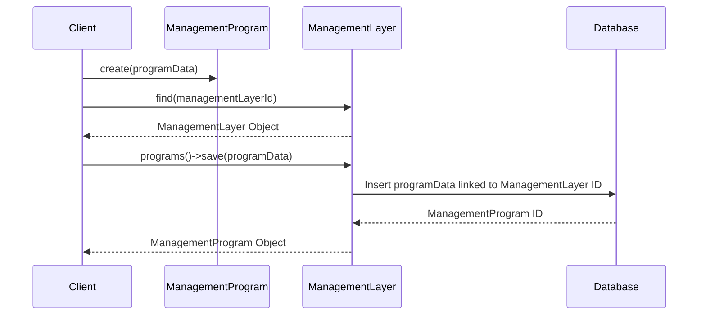

# Chapter 5: ManagementProgram

In the previous chapter, [ManagementLayer](04_managementlayer.md), we learned how Sunnyside Elementary manages its after-school programs in general.  Now, let's focus on a *specific* program, like the "Chess Club."  This is where `ManagementProgram` comes in.

## What problem does ManagementProgram solve?

Imagine Sunnyside Elementary wants to track the details of its Chess Club.  They need to know who's enrolled, when the club meets, what resources it uses (like chessboards and a classroom), and what the goals of the club are.  `ManagementProgram` represents a specific initiative within the [ManagementLayer](04_managementlayer.md), like a project within a company. It helps organize and track all the information related to a specific program.

## Key Concepts

1. **Belongs to a ManagementLayer:**  Just like a project belongs to a department within a company, a `ManagementProgram` belongs to a [ManagementLayer](04_managementlayer.md).

2. **Properties:**  `ManagementProgram` has properties that describe the program, such as its name, description, status (e.g., "active," "completed"), and the resources it needs.

3. **Outcomes:**  It also tracks the intended outcomes of the program, like "Improve students' chess skills" or "Foster a sense of community." We'll learn more about outcomes in the chapter on [SystemOutcome](10_systemoutcome.md).

## Using ManagementProgram: Sunnyside's Chess Club

Let's create a `ManagementProgram` for Sunnyside Elementary's Chess Club.

```php
// Simplified example - see ManagementProgram.php for full implementation
use App\Models\ManagementProgram;
use App\Models\ManagementLayer;

$managementLayer = ManagementLayer::find(1); // Assuming Sunnyside's ManagementLayer has ID 1

$chessClub = new ManagementProgram([
    'name' => 'Chess Club',
    'description' => 'Learn and play chess!',
    'status' => 'active',
    'target_outcome' => 'Improve students\' chess skills'
]);

$managementLayer->programs()->save($chessClub);
```

This code creates a new `ManagementProgram` representing the Chess Club. We link it to Sunnyside Elementary's `ManagementLayer`.  This adds a new program to the school's management system.

## Internal Implementation

When you call `save` on the `programs` relationship, it creates a new entry in the database representing the `ManagementProgram` and links it to the corresponding `ManagementLayer`.



The code for saving the `ManagementProgram` leverages the relationship defined in `Gov/Entities/ManagementLayer.php`:

```php
// Gov/Entities/ManagementLayer.php (simplified)
public function programs(): HasMany
{
    return $this->hasMany(ManagementProgram::class);
}
```

And in `Gov/Entities/ManagementProgram.php`:

```php
// Gov/Entities/ManagementProgram.php (simplified)
public function managementLayer(): BelongsTo
{
    return $this->belongsTo(ManagementLayer::class);
}
```

These code snippets define the relationship between the `ManagementLayer` and the `ManagementProgram`.

## Conclusion

In this chapter, we learned about `ManagementProgram`, which represents a specific initiative within a [ManagementLayer](04_managementlayer.md). We saw how to create a `ManagementProgram` for Sunnyside Elementary's Chess Club. In the next chapter, [GovernanceLayer](06_governancelayer.md), we'll explore how rules and policies guide the operation of these programs.


---

Generated by [AI Codebase Knowledge Builder](https://github.com/The-Pocket/Tutorial-Codebase-Knowledge)