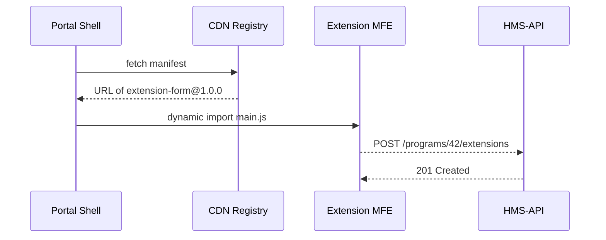

# Chapter 5: Micro-Frontend Experience Layer (HMS-MFE)

*(Just arrived from [Governance Interface (HMS-GOV Portal)](04_governance_interface__hms_gov_portal__.md)? Excellent—now we’ll see **how the screens themselves are built and shipped**.)*

---

## 1. Why Do We Need “Lego-Brick” Front-Ends?

Imagine the Department of Labor suddenly receives **millions of unemployment claims** after a natural disaster.  
They must add a new “Disaster Relief” application screen *today*, but the main website is frozen in a 6-week release cycle.

With **HMS-MFE** each screen (or even each **button**) is its own tiny, independently deployable web app—like Lego bricks you can snap on without reopening the whole toy set.  
Result: the Disaster team publishes their new brick before lunch, while the rest of the site keeps humming.

---

## 2. One Central Use-Case

> “Add a new ‘Request Extension’ form to the Veterans Housing Subsidy portal—without touching any other code.”

We’ll build and ship that form in <20 lines of code.

---

## 3. Key Concepts (Plain English)

| Term | What it means | Tiny Analogy |
|------|---------------|--------------|
| **Component Brick** | Self-contained UI (button, form, chart) | A single Lego block |
| **Micro-Frontend (MFE)** | Mini web app that hosts one or many bricks | One wall section in a Lego castle |
| **Shell / Host** | The parent web page that *loads* MFEs | Lego base-plate |
| **CDN Registry** | URL list of all bricks & versions | Instruction booklet |
| **Run-Time Composition** | Host decides which brick & version to load at runtime | Swapping a red brick for a blue one after castle is built |

Keep these five in your toolbox; we’ll use each.

---

## 4. Hands-On: Publish Your First Brick

### 4.1 Code the Brick (React, 12 lines)

```jsx
// RequestExtensionForm.jsx  (in mfe-extension-form/src/)
export default function RequestExtensionForm({programId}) {
  const submit = async e => {
    e.preventDefault();
    await fetch(`/api/programs/${programId}/extensions`, {
      method: 'POST', body: new FormData(e.target)
    });
    alert('Extension requested!');
  };
  return (
    <form onSubmit={submit}>
      <label>Reason <input name="reason" required/></label>
      <button>Send</button>
    </form>
  );
}
```

What’s happening?  
1. User fills a reason.  
2. On *submit* we call HMS-API to create an “extension” record.  
3. A simple alert confirms success.

### 4.2 Wrap as an MFE (single-spa, 6 lines)

```js
// src/index.js
import Form from './RequestExtensionForm';
import {registerApplication, start} from 'single-spa';

registerApplication('hms-extension-form', () => import('./RequestExtensionForm'), 
  () => window.location.pathname.includes('/extensions'));

start();
```

• `registerApplication` tells the shell: “Load me when URL contains `/extensions`.”  
• `start()` boots the micro-frontend runtime.

### 4.3 Publish to the CDN Registry (bash, 3 lines)

```bash
npm run build               # outputs static files
aws s3 sync dist/ s3://hms-cdn/form@1.0.0
curl -X POST https://cdn-registry.hms.gov \
     -d '{"name":"extension-form","ver":"1.0.0","url":"https://cdn.../main.js"}'
```

The registry now knows where to fetch version `1.0.0` of our brick.

### 4.4 Tell the Host to Use It (host config, 4 lines)

```json
// portal-manifest.json  (simplified)
{
  "extension-form": {
    "prod": "https://cdn.../form@1.0.0/main.js",
    "flag": "disaster_relief_enabled"
  }
}
```

When the **feature flag** `disaster_relief_enabled` turns on, the shell pulls the brick—no site redeploy!

---

## 5. What Happens at Runtime?



Only 4 network hops—quick and safe.

---

## 6. Under the Hood (File Peek)

```
mfe-extension-form/
├─ src/
│  ├─ RequestExtensionForm.jsx
│  └─ index.js
└─ single-spa-config.js   # build output points here
```

No coupling to any other portal folder.  
If tomorrow the Disaster team needs a hotfix, they redeploy **only `mfe-extension-form`**.

---

## 7. Integrating With Other HMS Pieces

1. **Data** → Talk to [Backend API Gateway](03_backend_api_gateway__hms_api___hms_svc__.md) through `/api/...`.  
2. **Auth** → The Host injects the citizen’s JWT into every `fetch()` call.  
3. **Feature Flags** → Governance officials toggle flags in [Governance Interface](04_governance_interface__hms_gov_portal__.md).  
4. **Metrics** → Each brick records load time to [Metrics & Monitoring](12_metrics___monitoring__hms_ops__.md).

---

## 8. Versioning & Rollback Tips

* Use semantic versions: `1.0.1` for hotfixes, `1.1.0` for new fields.  
* Keep **two** last versions in CDN; host can rollback by editing only `portal-manifest.json`.  
* Never break contract with HMS-API endpoints—treat them like public law.

---

## 9. Accessibility & Design System

All bricks share the **HMS-UI kit**:

```js
import {HmsButton} from '@hms/ui-kit';
```

• Color palette meets WCAG 2.1 AA.  
• Keyboard-navigable by default.  
• Logos auto-switch for Army, HUD, or Goldwater Foundation via `agencyTheme` prop.

---

## 10. Summary

You learned how **HMS-MFE** lets any agency:

1. Write a tiny UI brick.  
2. Publish it independently.  
3. Let the portal shell load the brick at runtime.  
4. Ship new citizen experiences in hours, not sprints.

In the next chapter we’ll meet the **AI Representative Agents** that help these bricks *think* for themselves: [AI Representative Agent (HMS-AGT / HMS-AGX)](06_ai_representative_agent__hms_agt___hms_agx__.md)

Happy brick-building!

---

Generated by [AI Codebase Knowledge Builder](https://github.com/The-Pocket/Tutorial-Codebase-Knowledge)