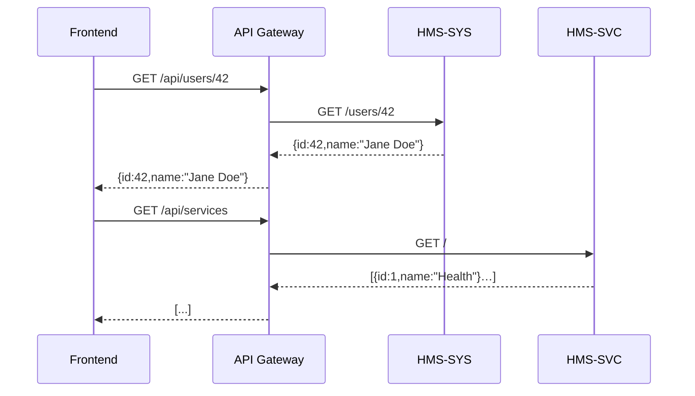

# Chapter 5: Microservices Architecture

Welcome back! In [Chapter 4: Backend API](04_backend_api_.md) we built a single Express service that handled policies. Now we’ll learn how to split that into multiple, independently deployable services—our **Microservices Architecture**.

## Why Microservices Matter

Imagine a federal benefits platform where:

- The **User System** (HMS-SYS) manages logins and profiles.
- The **Service Catalog** (HMS-SVC) lists programs (health, housing).
- The **Payment Engine** (HMS-ACH) handles ACH transfers.
- The **Account Connector** (HMS-A2A) links external bank accounts.

If all these lived in one monolith, a bug in payments could bring down user logins. By splitting them:

- Each team can deploy its own service on its own schedule.
- A failure in HMS-ACH won’t take down HMS-SYS.
- You can pick the right tech for each domain.

Think of it like separate agency divisions—Finance, Health, Administration—each with its own secure office, but all working together under one government umbrella.

## Key Concepts

1. **Service Boundary**  
   Each microservice owns its data and logic (e.g., HMS-SVC owns program listings).

2. **Independent Deployments**  
   Teams can ship updates to one service without redeploying the entire platform.

3. **API Gateway**  
   A façade that routes incoming requests to the right microservice.

4. **Fault Isolation**  
   Crashes in one service don’t cascade to others.

5. **Technology Heterogeneity**  
   HMS-ACH might use Java, while HMS-SYS uses Node.js—each picks the best tool.

## 1. Anatomy of Our Microservices

Here’s a minimal folder structure:

```
hms-mfe/
  gateway/       ← API Gateway
  hms-sys/       ← User System service
  hms-svc/       ← Service Catalog service
  hms-ach/       ← ACH Payment service
  hms-a2a/       ← Account-to-Account service
```

Each folder holds a small Express app (or any framework) and runs on its own port.

## 2. Example: HMS-SYS Service

Let’s create the **User System** service (`hms-sys/index.js`):

```js
// hms-sys/index.js
const express = require('express')
const app = express()
app.use(express.json())

app.get('/users/:id', (req, res) => {
  // Imagine fetching user profile from a database
  res.json({ id: req.params.id, name: 'Jane Doe' })
})

app.listen(3001, () => console.log('HMS-SYS running on 3001'))
```

Explanation:
- Listens on port **3001**.
- Exposes `GET /users/:id` to fetch profile data.

You’d create **hms-svc**, **hms-ach**, **hms-a2a** similarly, each on its own port (3002, 3003, 3004).

## 3. API Gateway: One Front Door

An API Gateway routes requests to each service. Here’s a tiny example using `http-proxy-middleware` (`gateway/index.js`):

```js
// gateway/index.js
const express = require('express')
const { createProxyMiddleware } = require('http-proxy-middleware')
const app = express()

app.use('/api/users',  createProxyMiddleware({ target: 'http://localhost:3001', changeOrigin: true }))
app.use('/api/services',createProxyMiddleware({ target: 'http://localhost:3002' }))
app.use('/api/payments',createProxyMiddleware({ target: 'http://localhost:3003' }))
app.use('/api/accounts',createProxyMiddleware({ target: 'http://localhost:3004' }))

app.listen(3000, () => console.log('Gateway listening on 3000'))
```

Explanation:
- Calls to `/api/users/...` forward to HMS-SYS.
- `/api/services/...` to HMS-SVC, and so on.
- Your frontend only talks to port **3000**.

## 4. Request Flow

Here’s what happens when the frontend fetches a user profile and a service list:



1. Frontend calls Gateway at `/api/users/42`.  
2. Gateway proxies to HMS-SYS on port 3001.  
3. HMS-SYS returns user data.  
4. Gateway passes it back to the frontend.

Same story for services, payments, and accounts.

## 5. Under the Hood

### Step-by-Step Flow
1. **Client** issues an HTTP request to the Gateway.  
2. **Gateway** matches the URL and forwards to the correct service.  
3. **Microservice** processes the logic and responds.  
4. **Gateway** relays the response back to the client.

### Internal Code Structure

Each microservice folder looks like:

```
hms-xyz/
  index.js     ← entry point
  package.json
  src/
    controllers/
    models/
    routes.js  ← defines endpoints
```

Inside `routes.js`, you’d group endpoints:

```js
// hms-sys/src/routes.js
const router = require('express').Router()

router.get('/:id', async (req, res) => {
  // fetch from DB...
  res.json({ id: req.params.id, name: '...' })
})

module.exports = router
```

And `index.js` wires it up:

```js
// hms-sys/index.js
const express = require('express')
const userRoutes = require('./src/routes')
const app = express()
app.use(express.json())
app.use('/users', userRoutes)
app.listen(3001)
```

This pattern repeats with different ports and routes in each service.

## Summary

In this chapter you learned how to:

- Break a monolithic API into multiple microservices (HMS-SYS, HMS-SVC, HMS-ACH, HMS-A2A).  
- Use an **API Gateway** to route requests.  
- Achieve scalability, fault isolation, and technology flexibility.  

Next up: let’s build an **intelligent agent** to help users navigate all these services—see [Chapter 6: AI Representative Agent](06_ai_representative_agent_.md).

---

Generated by [AI Codebase Knowledge Builder](https://github.com/The-Pocket/Tutorial-Codebase-Knowledge)