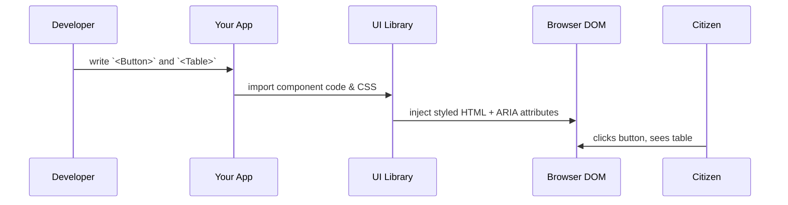

# Chapter 5: Modular UI Component Library

Now that you’ve built a working frontend in [Chapter 4: Frontend Interface (HMS-MFE / HMS-GOV)](04_frontend_interface__hms_mfe___hms_gov__.md), it’s time to extract all the buttons, tables, form fields, and other UI bits you’ve been copy-pasting into a **Modular UI Component Library**. Just like a government stationery set—pens, letterhead, envelopes—this library makes sure every HMS portal looks and feels the same, is accessible, and is easy to maintain.

---

## 1. Motivation & Central Use Case

Imagine three different federal agencies each building an online form:

- Department of Agriculture’s subsidy application  
- EPA’s pollution-reporting form  
- Small Business Administration’s loan request  

If each team styles buttons, inputs, and tables differently, citizens get confused (“Why does this button look different here?”) and developers spend time redoing the same work.  

**With a Modular UI Component Library**, you get:  
- Consistent look & feel (colors, fonts, spacing)  
- Built-in accessibility (ARIA labels, keyboard support)  
- Reusable components (Button, Table, FormField)  
- Simple theming to match agency branding  

---

## 2. Key Concepts

1. Reusable Components  
   Pre-built bits you import: `<Button>`, `<Table>`, `<TextInput>`.  

2. Theming & Tokens  
   Central CSS variables (colors, fonts, spacing) so every component shares the same design.  

3. Accessibility (a11y)  
   Each component includes proper ARIA attributes, focus outlines, and keyboard navigation out of the box.  

4. Documentation & Playground  
   A simple site showing how to use each component, with live examples and props tables.

---

## 3. Using the Library

Below is a minimal example showing how to render a Submit button and a data table in a React app.

```jsx
// App.jsx
import { Button, Table } from '@hms/ui-library';

export default function App() {
  const rows = [
    { id: 1, name: 'Alice', status: 'Pending' },
    { id: 2, name: 'Bob',   status: 'Approved' }
  ];

  return (
    <div>
      <Button onClick={()=>alert('Submitted!')}>
        Submit Application
      </Button>

      <Table
        columns={['ID','Name','Status']}
        data={rows.map(r=>[r.id, r.name, r.status])}
      />
    </div>
  );
}
```

Explanation:
- We import `Button` and `Table` from our library.  
- `<Button>` applies consistent styling and a focus outline.  
- `<Table>` automatically adds headers, zebra stripes, and responsive layout.

---

## 4. Under the Hood: Step-by-Step Flow

Before we dive into code, here’s what happens when you use a component:



1. **Developer** writes code using library components.  
2. **App** bundles JS and CSS from the **UI Library**.  
3. **Library** outputs standardized HTML, CSS classes, and ARIA labels.  
4. **Browser** renders the elements; **User** interacts safely and consistently.

---

## 5. Internal Implementation Details

Let’s peek at how our Button and Table work under the hood.

### 5.1 File Structure

```
ui-library/
├─ src/
│  ├─ components/
│  │  ├─ Button.jsx
│  │  └─ Table.jsx
│  └─ theme.css
└─ package.json
```

### 5.2 theme.css

```css
:root {
  --primary-color: #004085;    /* Government blue */
  --button-padding: 0.5rem 1rem;
  --font-family: Arial, sans-serif;
}

.hms-button {
  background: var(--primary-color);
  color: white;
  padding: var(--button-padding);
  border: none;
  border-radius: 4px;
  font-family: var(--font-family);
  cursor: pointer;
}
.hms-button:focus {
  outline: 2px solid #002752;
}
```

Explanation:
- CSS variables define your branding tokens.  
- `.hms-button` uses those tokens for styling and focus outlines.

### 5.3 Button.jsx

```jsx
// src/components/Button.jsx
import React from 'react';
import '../theme.css';

export function Button({ onClick, children }) {
  return (
    <button className="hms-button" onClick={onClick}>
      {children}
    </button>
  );
}
```

- We apply the `hms-button` class for consistent styles.  
- All accessibility and theming come from `theme.css`.

### 5.4 Table.jsx

```jsx
// src/components/Table.jsx
import React from 'react';
import '../theme.css';

export function Table({ columns, data }) {
  return (
    <table className="hms-table">
      <thead>
        <tr>{columns.map(c=> <th key={c}>{c}</th>)}</tr>
      </thead>
      <tbody>
        {data.map((row,i) =>
          <tr key={i}>
            {row.map((cell,j)=><td key={j}>{cell}</td>)}
          </tr>
        )}
      </tbody>
    </table>
  );
}
```

And in `theme.css` you’d add `.hms-table`, zebra stripes, responsive rules, etc.

---

## 6. Summary & Next Steps

You’ve learned how to:

- Create a **Modular UI Component Library** for consistent, accessible government portals.  
- Use simple React components (`<Button>`, `<Table>`) with shared theming.  
- Peek under the hood at CSS variables, ARIA support, and component code.  

Next up, we’ll add smart routing so your users jump to the right page by intent in [Chapter 6: Intent-Driven Navigation](06_intent_driven_navigation_.md).

---

Generated by [AI Codebase Knowledge Builder](https://github.com/The-Pocket/Tutorial-Codebase-Knowledge)