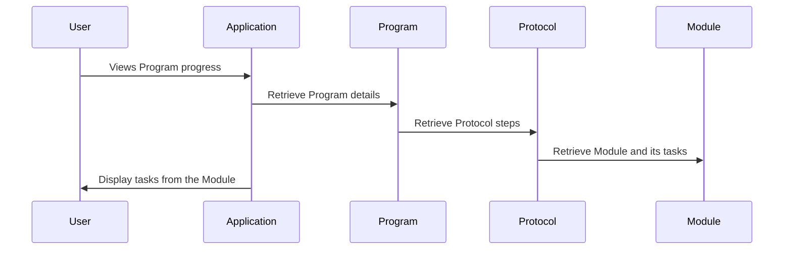

# Chapter 5: Module

In the previous chapter, [Task](04_task.md), we learned about the individual actions within a [Protocol](03_protocol.md).  This chapter introduces the concept of a "Module," a way to group related tasks together, like a sub-recipe within a larger recipe.

## What is a Module?

Imagine you're building a complex [Protocol](03_protocol.md) for a "Weight Loss Program."  This protocol might include several different aspects, like nutrition, exercise, and mindfulness.  Instead of listing every single task individually, you can group related tasks into modules. For example, you could have a "Nutrition Module" that contains tasks like "Eat 5 servings of vegetables daily" and "Drink 8 glasses of water."  This makes your protocols more organized and reusable.

## Key Concepts

* **Grouping:** Modules group related [Tasks](04_task.md) together.
* **Reusability:**  A Module can be used in multiple [Protocols](03_protocol.md).  For example, the "Nutrition Module" could be part of both a "Weight Loss Protocol" and a "General Wellness Protocol."
* **Organization:** Modules help break down complex protocols into smaller, more manageable chunks.

## Using a Module

Let's create a "Nutrition Module" for our "Weight Loss Protocol."

```php
// Create a new module
$module = new ProtocolModule();
$module->name = "Nutrition Module";
$module->description = "Guidelines for healthy eating";
$module->save();

// Add tasks to the module (simplified)
$task1 = new Task();
$task1->description = "Eat 5 servings of vegetables daily";
$module->addTask($task1); // Simplified - actual implementation may vary

$task2 = new Task();
$task2->description = "Drink 8 glasses of water";
$module->addTask($task2); // Simplified - actual implementation may vary
```

This code creates a new "Nutrition Module" and adds two tasks to it.  The `addTask` function (simplified here) would handle the database operations to link the tasks to the module.  Then, this module can be added as a step within the "Weight Loss Protocol."

## Under the Hood

When a user enrolls in a [Program](02_program.md) that uses a [Protocol](03_protocol.md) containing a module, the application retrieves the module and its associated tasks.



### Internal Implementation

The `Protocol` model manages the modules (and tasks) through the `chain` relationship, which uses the `ProtocolChain` model.

```php
// Inside the Protocol model (simplified)
public function chain()
{
    return $this->hasMany(ProtocolChain::class);
}
```

The `ProtocolChain` model then links to the `ProtocolModule`:

```php
// Inside the ProtocolChain model (simplified)
public function module()
{
    return $this->belongsTo(ProtocolModule::class);
}
```

This structure allows modules to be inserted as steps within a protocol.  The `ProtocolModule` model itself (located in `app/Models/Tenant/Protocol/ProtocolModule.php` and `app/Models/Core/Protocol/ProtocolModule.php`) stores the module's details, such as its name and description.  The relationship between `ProtocolModule` and `Task` is managed through the `ProtocolChain` model, which acts as a bridge to connect steps in the protocol to either tasks or modules.

## Conclusion

In this chapter, we explored the concept of a Module, a way to group related [Tasks](04_task.md) within a [Protocol](03_protocol.md).  We learned how modules promote reusability and organization. In the next chapter, we'll learn about the [Frontend CMS](06_frontend_cms.md).


---

Generated by [AI Codebase Knowledge Builder](https://github.com/The-Pocket/Tutorial-Codebase-Knowledge)